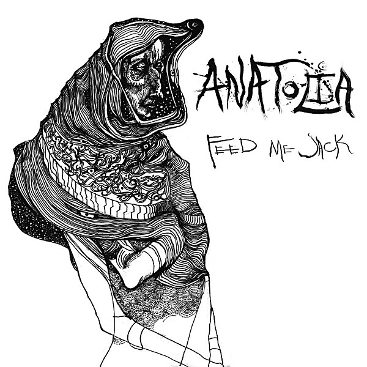

# Anatolia

By **Feed Me Jack**

## Album Data

- **Catalog:** Beets
- **Format:** Digital, Album
- **Album:** Anatolia
- **Artist:** Feed Me Jack
- **Albumartist:** Feed Me Jack
- **Genre:** Indie Rock
- **MusicBrainz Album Artist ID:** [0f78da28-41ed-4b68-be02-17d50443c7de](https://musicbrainz.org/artist/0f78da28-41ed-4b68-be02-17d50443c7de)
- **MusicBrainz Album ID:** [0cb438b8-33e7-4e33-93dd-0a1ff9da4b16](https://musicbrainz.org/release/0cb438b8-33e7-4e33-93dd-0a1ff9da4b16)
- **MusicBrainz Release Group ID:** [e0c08665-cef9-42c7-9acc-4f4040444ab7](https://musicbrainz.org/release-group/e0c08665-cef9-42c7-9acc-4f4040444ab7)
- **Year:** 2013
- **Catalog #:** 
- **Label:** 
- **Total Tracks:** 05

## Album Tracks

### Track 01 - Good Day Sunshine

- **Artist:** Feed Me Jack
- **Format:** ALAC
- **Genre:** Indie Rock
- **Length:** 3:00
- **MusicBrainz Track ID:** [9123e4ca-3e9d-470f-92c2-5de46dec0ad4](https://musicbrainz.org/recording/9123e4ca-3e9d-470f-92c2-5de46dec0ad4)
- **Title:** Good Day Sunshine
- **Track:** 01
- **Year:** 2015

### Track 02 - Reelin' in the Years

- **Artist:** Feed Me Jack
- **Format:** ALAC
- **Genre:** Indie Rock
- **Length:** 3:36
- **MusicBrainz Track ID:** [f1eae4bc-f192-4967-8bfc-68d7fdde2d41](https://musicbrainz.org/recording/f1eae4bc-f192-4967-8bfc-68d7fdde2d41)
- **Title:** Reelin' in the Years
- **Track:** 02
- **Year:** 2015

### Track 03 - Burndt Jamb

- **Artist:** Feed Me Jack
- **Format:** ALAC
- **Genre:** Indie Rock
- **Length:** 3:05
- **MusicBrainz Track ID:** [e887f6aa-79eb-4e4e-ba01-012ebe319a0f](https://musicbrainz.org/recording/e887f6aa-79eb-4e4e-ba01-012ebe319a0f)
- **Title:** Burndt Jamb
- **Track:** 03
- **Year:** 2015

### Track 05 - Twice

- **Artist:** Feed Me Jack
- **Format:** ALAC
- **Genre:** Indie Rock
- **Length:** 3:55
- **MusicBrainz Track ID:** [4f0d00d5-3cef-45a1-b21e-d18d128287e9](https://musicbrainz.org/recording/4f0d00d5-3cef-45a1-b21e-d18d128287e9)
- **Title:** Twice
- **Track:** 05
- **Year:** 2015

### Track 04 - Fersherlude

- **Artist:** Feed Me Jack feat. Nikki Nice
- **Format:** ALAC
- **Genre:** Indie Rock
- **Length:** 1:13
- **MusicBrainz Track ID:** [8d12245e-a136-4b82-b4d4-951dcdbb7cc4](https://musicbrainz.org/recording/8d12245e-a136-4b82-b4d4-951dcdbb7cc4)
- **Title:** Fersherlude
- **Track:** 04
- **Year:** 2015

## See also

- [Covers](Covers.md)
