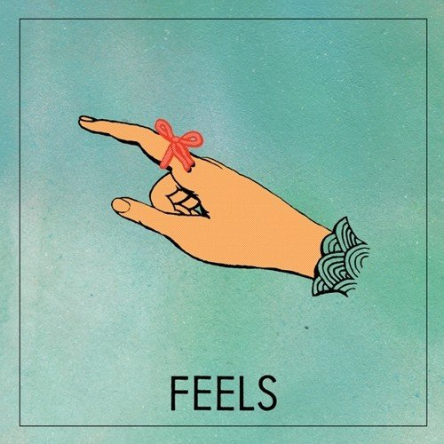

# Feels

By **FEELS**

## Album Data

- **Catalog:** Beets
- **Format:** Digital, Album
- **Album:** Feels
- **Artist:** Feels
- **Albumartist:** FEELS
- **Genre:** Noise Rock
- **MusicBrainz Album Artist ID:** [ebd84786-b513-41ce-8109-8355f17571e7](https://musicbrainz.org/artist/ebd84786-b513-41ce-8109-8355f17571e7)
- **MusicBrainz Album ID:** [366d33fd-2487-4345-b0e1-c8bf27a7178a](https://musicbrainz.org/release/366d33fd-2487-4345-b0e1-c8bf27a7178a)
- **MusicBrainz Release Group ID:** [c2f4cdf7-1cc7-46ec-a743-0e46b9cd84a8](https://musicbrainz.org/release-group/c2f4cdf7-1cc7-46ec-a743-0e46b9cd84a8)
- **Year:** 2016
- **Catalog #:** 
- **Label:** Castle Face Records
- **Total Tracks:** 09

## Album Tracks

### Track 01 - Close My Eyes

- **Artist:** FEELS
- **Format:** MP3
- **Genre:** Noise Rock
- **Length:** 3:51
- **MusicBrainz Track ID:** [76f2c073-3d94-4664-a665-dbe3c8773617](https://musicbrainz.org/recording/76f2c073-3d94-4664-a665-dbe3c8773617)
- **Title:** Close My Eyes
- **Track:** 01
- **Year:** 2016

### Track 02 - Slippin'

- **Artist:** FEELS
- **Format:** MP3
- **Genre:** Noise Rock
- **Length:** 3:08
- **MusicBrainz Track ID:** [a7ae0d5b-048d-471d-9221-6742633427da](https://musicbrainz.org/recording/a7ae0d5b-048d-471d-9221-6742633427da)
- **Title:** Slippin'
- **Track:** 02
- **Year:** 2016

### Track 03 - Play It Cool

- **Artist:** FEELS
- **Format:** MP3
- **Genre:** Noise Rock
- **Length:** 2:14
- **MusicBrainz Track ID:** [91c0229e-2783-455f-9a0f-f6ea88db1d12](https://musicbrainz.org/recording/91c0229e-2783-455f-9a0f-f6ea88db1d12)
- **Title:** Play It Cool
- **Track:** 03
- **Year:** 2016

### Track 04 - Today

- **Artist:** FEELS
- **Format:** MP3
- **Genre:** Noise Rock
- **Length:** 3:02
- **MusicBrainz Track ID:** [af0f8a9d-5d0f-4efe-9c81-a263104a6e4b](https://musicbrainz.org/recording/af0f8a9d-5d0f-4efe-9c81-a263104a6e4b)
- **Title:** Today
- **Track:** 04
- **Year:** 2016

### Track 05 - Tell Me

- **Artist:** FEELS
- **Format:** MP3
- **Genre:** Noise Rock
- **Length:** 3:58
- **MusicBrainz Track ID:** [33e58b5c-cb03-4c99-a75f-058b58f097ee](https://musicbrainz.org/recording/33e58b5c-cb03-4c99-a75f-058b58f097ee)
- **Title:** Tell Me
- **Track:** 05
- **Year:** 2016

### Track 06 - Unicorn

- **Artist:** FEELS
- **Format:** MP3
- **Genre:** Noise Rock
- **Length:** 1:58
- **MusicBrainz Track ID:** [93ca60db-c4c2-4ba1-afc6-aeecc6aedd0a](https://musicbrainz.org/recording/93ca60db-c4c2-4ba1-afc6-aeecc6aedd0a)
- **Title:** Unicorn
- **Track:** 06
- **Year:** 2016

### Track 07 - Bird's Eye

- **Artist:** FEELS
- **Format:** MP3
- **Genre:** Noise Rock
- **Length:** 3:25
- **MusicBrainz Track ID:** [a13addb6-cb06-4111-a67a-b6165f3c719a](https://musicbrainz.org/recording/a13addb6-cb06-4111-a67a-b6165f3c719a)
- **Title:** Bird's Eye
- **Track:** 07
- **Year:** 2016

### Track 08 - Small Talk

- **Artist:** FEELS
- **Format:** MP3
- **Genre:** Noise Rock
- **Length:** 4:36
- **MusicBrainz Track ID:** [5c38c7a9-a79c-4a42-8c4d-205e67328004](https://musicbrainz.org/recording/5c38c7a9-a79c-4a42-8c4d-205e67328004)
- **Title:** Small Talk
- **Track:** 08
- **Year:** 2016

### Track 09 - Running's Fun

- **Artist:** FEELS
- **Format:** MP3
- **Genre:** Noise Rock
- **Length:** 3:20
- **MusicBrainz Track ID:** [fc7a81ea-5e35-4b13-98e3-b93d3a3c9968](https://musicbrainz.org/recording/fc7a81ea-5e35-4b13-98e3-b93d3a3c9968)
- **Title:** Running's Fun
- **Track:** 09
- **Year:** 2016

