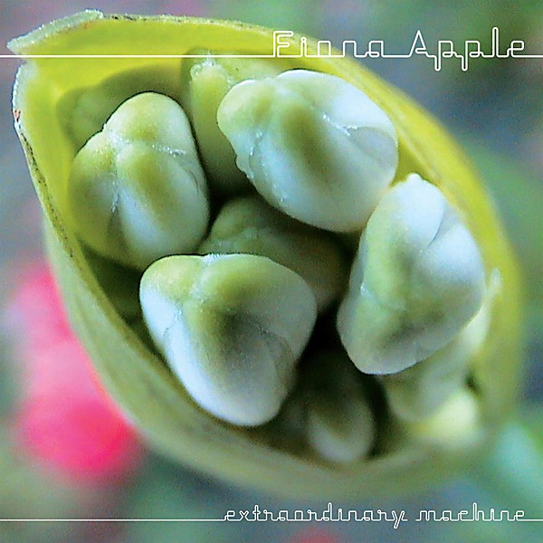

# Extraordinary Machine

By **Fiona Apple**

## Album Data

- **Catalog:** Beets
- **Format:** Digital, Album
- **Album:** Extraordinary Machine
- **Artist:** Fiona Apple
- **Albumartist:** Fiona Apple
- **Genre:** Rock
- **MusicBrainz Album Artist ID:** [a9ee533f-8871-4f62-a6bb-91eb264abc90](https://musicbrainz.org/artist/a9ee533f-8871-4f62-a6bb-91eb264abc90)
- **MusicBrainz Album ID:** [d27b2085-99b5-3556-8d9c-b6396fa1d81a](https://musicbrainz.org/release/d27b2085-99b5-3556-8d9c-b6396fa1d81a)
- **MusicBrainz Release Group ID:** [81c98a74-56ba-355e-8d63-83e12a63dace](https://musicbrainz.org/release-group/81c98a74-56ba-355e-8d63-83e12a63dace)
- **Year:** 2005
- **Catalog #:** 483750 2
- **Label:** Columbia
- **Total Tracks:** 10

## Album Tracks

### Track 01 - Sleep to Dream

- **Artist:** Fiona Apple
- **Format:** ALAC
- **Genre:** Alternative Rock
- **Length:** 4:10
- **MusicBrainz Track ID:** [33d3a492-4bb4-4500-9c02-4260e0f87755](https://musicbrainz.org/recording/33d3a492-4bb4-4500-9c02-4260e0f87755)
- **Title:** Sleep to Dream
- **Track:** 01
- **Year:** 1996

### Track 02 - Sullen Girl

- **Artist:** Fiona Apple
- **Format:** ALAC
- **Genre:** Rock
- **Length:** 3:54
- **MusicBrainz Track ID:** [0dc9d2b0-5b2c-4e62-a7ad-ff5b9106f31b](https://musicbrainz.org/recording/0dc9d2b0-5b2c-4e62-a7ad-ff5b9106f31b)
- **Title:** Sullen Girl
- **Track:** 02
- **Year:** 1996

### Track 03 - Shadowboxer

- **Artist:** Fiona Apple
- **Format:** ALAC
- **Genre:** Rock
- **Length:** 5:24
- **MusicBrainz Track ID:** [6db0efa0-46e0-4f27-94ce-6803513787be](https://musicbrainz.org/recording/6db0efa0-46e0-4f27-94ce-6803513787be)
- **Title:** Shadowboxer
- **Track:** 03
- **Year:** 1996

### Track 04 - Criminal

- **Artist:** Fiona Apple
- **Format:** ALAC
- **Genre:** Rock
- **Length:** 5:43
- **MusicBrainz Track ID:** [3c8f28a3-a1bb-4827-9f77-8d86edcd3248](https://musicbrainz.org/recording/3c8f28a3-a1bb-4827-9f77-8d86edcd3248)
- **Title:** Criminal
- **Track:** 04
- **Year:** 1996

### Track 05 - Slow Like Honey

- **Artist:** Fiona Apple
- **Format:** ALAC
- **Genre:** Downtempo
- **Length:** 5:57
- **MusicBrainz Track ID:** [15f7eef7-338e-4916-9959-c6ae768d2f2f](https://musicbrainz.org/recording/15f7eef7-338e-4916-9959-c6ae768d2f2f)
- **Title:** Slow Like Honey
- **Track:** 05
- **Year:** 1996

### Track 06 - The First Taste

- **Artist:** Fiona Apple
- **Format:** ALAC
- **Genre:** Bossa Nova
- **Length:** 4:46
- **MusicBrainz Track ID:** [8dc890c2-994b-4dc8-8228-bff4ea622609](https://musicbrainz.org/recording/8dc890c2-994b-4dc8-8228-bff4ea622609)
- **Title:** The First Taste
- **Track:** 06
- **Year:** 1996

### Track 07 - Never Is a Promise

- **Artist:** Fiona Apple
- **Format:** ALAC
- **Genre:** Rock
- **Length:** 5:54
- **MusicBrainz Track ID:** [dcf58245-319c-4f02-a3d6-ebd6f43ec289](https://musicbrainz.org/recording/dcf58245-319c-4f02-a3d6-ebd6f43ec289)
- **Title:** Never Is a Promise
- **Track:** 07
- **Year:** 1996

### Track 08 - The Child Is Gone

- **Artist:** Fiona Apple
- **Format:** ALAC
- **Genre:** Rock
- **Length:** 4:14
- **MusicBrainz Track ID:** [20260478-b7df-477d-bdad-d257ab13bbd2](https://musicbrainz.org/recording/20260478-b7df-477d-bdad-d257ab13bbd2)
- **Title:** The Child Is Gone
- **Track:** 08
- **Year:** 1996

### Track 09 - Pale September

- **Artist:** Fiona Apple
- **Format:** ALAC
- **Genre:** Rock
- **Length:** 5:50
- **MusicBrainz Track ID:** [7fddd1e8-e168-46b7-b93e-9355a7ff0427](https://musicbrainz.org/recording/7fddd1e8-e168-46b7-b93e-9355a7ff0427)
- **Title:** Pale September
- **Track:** 09
- **Year:** 1996

### Track 10 - Carrion

- **Artist:** Fiona Apple
- **Format:** ALAC
- **Genre:** Downtempo
- **Length:** 5:45
- **MusicBrainz Track ID:** [ed922c9f-aff8-4e9b-a23f-63d618fa6a5f](https://musicbrainz.org/recording/ed922c9f-aff8-4e9b-a23f-63d618fa6a5f)
- **Title:** Carrion
- **Track:** 10
- **Year:** 1996

## See also

- [Tidal](Tidal.md)
- [When The Pawn](When_The_Pawn.md)
- [Roon: Extraordinary Machine](../../Roon/Fiona_Apple/Extraordinary_Machine.md)
- [Roon: Fetch The Bolt Cutters](../../Roon/Fiona_Apple/Fetch_The_Bolt_Cutters.md)
- [Roon: Tidal](../../Roon/Fiona_Apple/Tidal.md)
