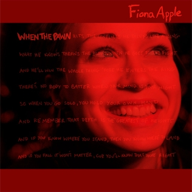

# When The Pawn

By **Fiona Apple**

## Album Data

- **Catalog:** Beets
- **Format:** Digital, Album
- **Album:** When The Pawn
- **Artist:** Fiona Apple
- **Albumartist:** Fiona Apple
- **Genre:** Rock
- **MusicBrainz Album Artist ID:** 
- **MusicBrainz Album ID:** 
- **MusicBrainz Release Group ID:** 
- **Year:** 1999
- **Catalog #:** 
- **Label:** 
- **Total Tracks:** 00

## Album Tracks

### Track 00 - Limp

- **Artist:** Fiona Apple
- **Format:** AAC
- **Genre:** Alternative Rock
- **Length:** 3:29
- **MusicBrainz Track ID:** 
- **Title:** Limp
- **Track:** 00
- **Year:** 1999

### Track 00 - Love Ridden

- **Artist:** Fiona Apple
- **Format:** AAC
- **Genre:** Rock
- **Length:** 3:22
- **MusicBrainz Track ID:** 
- **Title:** Love Ridden
- **Track:** 00
- **Year:** 1998

### Track 00 - Paper Bag

- **Artist:** Fiona Apple
- **Format:** AAC
- **Genre:** Rock
- **Length:** 3:39
- **MusicBrainz Track ID:** 
- **Title:** Paper Bag
- **Track:** 00
- **Year:** 1999

## See also

- [Extraordinary Machine](Extraordinary_Machine.md)
- [Tidal](Tidal.md)
- [Roon: Extraordinary Machine](../../Roon/Fiona_Apple/Extraordinary_Machine.md)
- [Roon: Fetch The Bolt Cutters](../../Roon/Fiona_Apple/Fetch_The_Bolt_Cutters.md)
- [Roon: Tidal](../../Roon/Fiona_Apple/Tidal.md)
