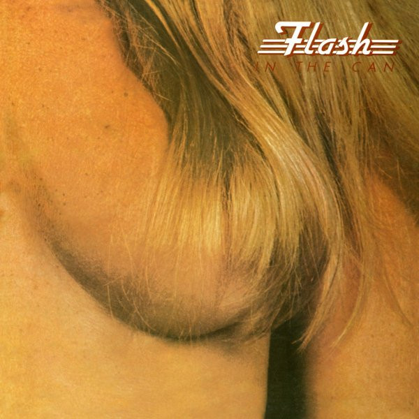

# In the Can

By **Flash**

## Album Data

- **Catalog:** Beets
- **Format:** Digital, Album
- **Album:** In the Can
- **Artist:** Flash
- **Albumartist:** Flash
- **Genre:** Progressive Rock
- **MusicBrainz Album Artist ID:** [a497b759-12b7-4867-ae3d-75f33e789ae0](https://musicbrainz.org/artist/a497b759-12b7-4867-ae3d-75f33e789ae0)
- **MusicBrainz Album ID:** [588a2ed2-2aa5-3164-9d20-8b85100dd2cd](https://musicbrainz.org/release/588a2ed2-2aa5-3164-9d20-8b85100dd2cd)
- **MusicBrainz Release Group ID:** [bfdd4058-2ff9-3d16-bfc3-2316a270eed9](https://musicbrainz.org/release-group/bfdd4058-2ff9-3d16-bfc3-2316a270eed9)
- **Year:** 1993
- **Catalog #:** S21 56841
- **Label:** One Way Records
- **Total Tracks:** 05

## Album Tracks

### Track 01 - Lifetime

- **Artist:** Flash
- **Format:** ALAC
- **Genre:** Progressive Rock
- **Length:** 10:30
- **MusicBrainz Track ID:** [9f69e34e-0c8e-43d6-868c-754caf8a6aa0](https://musicbrainz.org/recording/9f69e34e-0c8e-43d6-868c-754caf8a6aa0)
- **Title:** Lifetime
- **Track:** 01
- **Year:** 1993

### Track 02 - Monday Morning Eyes

- **Artist:** Flash
- **Format:** ALAC
- **Genre:** Progressive Rock
- **Length:** 5:21
- **MusicBrainz Track ID:** [51318082-409f-49cd-8c87-f0550227ca76](https://musicbrainz.org/recording/51318082-409f-49cd-8c87-f0550227ca76)
- **Title:** Monday Morning Eyes
- **Track:** 02
- **Year:** 1993

### Track 03 - Black and White

- **Artist:** Flash
- **Format:** ALAC
- **Genre:** Progressive Rock
- **Length:** 12:27
- **MusicBrainz Track ID:** [1c6e6469-8336-4bcb-883a-0f9cc5f65de3](https://musicbrainz.org/recording/1c6e6469-8336-4bcb-883a-0f9cc5f65de3)
- **Title:** Black and White
- **Track:** 03
- **Year:** 1993

### Track 04 - Stop That Banging

- **Artist:** Flash
- **Format:** ALAC
- **Genre:** Progressive Rock
- **Length:** 1:54
- **MusicBrainz Track ID:** [87b073fb-9b8b-4546-81bf-af1905e79a9d](https://musicbrainz.org/recording/87b073fb-9b8b-4546-81bf-af1905e79a9d)
- **Title:** Stop That Banging
- **Track:** 04
- **Year:** 1993

### Track 05 - There No More

- **Artist:** Flash
- **Format:** ALAC
- **Genre:** Progressive Rock
- **Length:** 11:01
- **MusicBrainz Track ID:** [80925881-f9bd-47bb-9351-f375529eb822](https://musicbrainz.org/recording/80925881-f9bd-47bb-9351-f375529eb822)
- **Title:** There No More
- **Track:** 05
- **Year:** 1993

## See also

- [Flash](Flash.md)
- [Roon: Flash In The Can](../../Roon/Flash/Flash_In_The_Can.md)
- [Roon: Flash](../../Roon/Flash/Flash.md)
- [Roon: Out Of Our Hands](../../Roon/Flash/Out_Of_Our_Hands.md)
