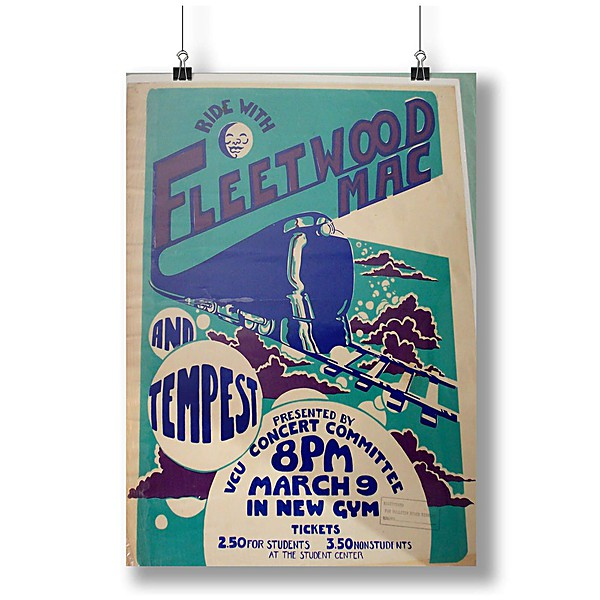

# Fillmore West 1.4.70

By **Fleetwood Mac**

## Album Data

- **Catalog:** Beets
- **Format:** Digital, Album
- **Album:** Fillmore West 1.4.70
- **Artist:** Fleetwood Mac
- **Albumartist:** Fleetwood Mac
- **Genre:** Soft Rock
- **MusicBrainz Album Artist ID:** 
- **MusicBrainz Album ID:** 
- **MusicBrainz Release Group ID:** 
- **Year:** 1970
- **Catalog #:** MS 2225
- **Label:** Reprise Records
- **Total Tracks:** 11

## Album Tracks

### Track 01 - Monday Morning

- **Artist:** Fleetwood Mac
- **Format:** MP3
- **Genre:** Soft Rock
- **Length:** 2:45
- **MusicBrainz Track ID:** [6f6d1c99-4400-4a3d-a232-2f92b607ae43](https://musicbrainz.org/recording/6f6d1c99-4400-4a3d-a232-2f92b607ae43)
- **Title:** Monday Morning
- **Track:** 01
- **Year:** 1975

### Track 02 - Warm Ways

- **Artist:** Fleetwood Mac
- **Format:** MP3
- **Genre:** Soft Rock
- **Length:** 3:47
- **MusicBrainz Track ID:** [7f4fb646-0631-40b3-8996-2ca53e17ee14](https://musicbrainz.org/recording/7f4fb646-0631-40b3-8996-2ca53e17ee14)
- **Title:** Warm Ways
- **Track:** 02
- **Year:** 1975

### Track 03 - Blue Letter

- **Artist:** Fleetwood Mac
- **Format:** MP3
- **Genre:** Soft Rock
- **Length:** 2:38
- **MusicBrainz Track ID:** [d4674932-9f7d-4562-94ee-1dd01a17a73e](https://musicbrainz.org/recording/d4674932-9f7d-4562-94ee-1dd01a17a73e)
- **Title:** Blue Letter
- **Track:** 03
- **Year:** 1975

### Track 04 - Rhiannon

- **Artist:** Fleetwood Mac
- **Format:** MP3
- **Genre:** Soft Rock
- **Length:** 4:09
- **MusicBrainz Track ID:** [8d99aab3-a64c-4bfa-9bdf-1dc72a9e9fb1](https://musicbrainz.org/recording/8d99aab3-a64c-4bfa-9bdf-1dc72a9e9fb1)
- **Title:** Rhiannon
- **Track:** 04
- **Year:** 1975

### Track 05 - Over My Head

- **Artist:** Fleetwood Mac
- **Format:** MP3
- **Genre:** Soft Rock
- **Length:** 3:27
- **MusicBrainz Track ID:** [223560d5-c613-4bb2-b66c-22607d47fcd0](https://musicbrainz.org/recording/223560d5-c613-4bb2-b66c-22607d47fcd0)
- **Title:** Over My Head
- **Track:** 05
- **Year:** 1975

### Track 06 - Crystal

- **Artist:** Fleetwood Mac
- **Format:** MP3
- **Genre:** Soft Rock
- **Length:** 5:00
- **MusicBrainz Track ID:** [f56947e6-caab-4540-80cf-cfc40562584e](https://musicbrainz.org/recording/f56947e6-caab-4540-80cf-cfc40562584e)
- **Title:** Crystal
- **Track:** 06
- **Year:** 1975

### Track 07 - Say You Love Me

- **Artist:** Fleetwood Mac
- **Format:** MP3
- **Genre:** Soft Rock
- **Length:** 4:10
- **MusicBrainz Track ID:** [7c1d1ede-42a9-4100-9ba9-a1de43d8f6f7](https://musicbrainz.org/recording/7c1d1ede-42a9-4100-9ba9-a1de43d8f6f7)
- **Title:** Say You Love Me
- **Track:** 07
- **Year:** 1975

### Track 08 - Landslide

- **Artist:** Fleetwood Mac
- **Format:** MP3
- **Genre:** Soft Rock
- **Length:** 3:15
- **MusicBrainz Track ID:** [d00f3915-f2a8-43c5-8669-39e26665112f](https://musicbrainz.org/recording/d00f3915-f2a8-43c5-8669-39e26665112f)
- **Title:** Landslide
- **Track:** 08
- **Year:** 1975

### Track 09 - World Turning

- **Artist:** Fleetwood Mac
- **Format:** MP3
- **Genre:** Soft Rock
- **Length:** 4:18
- **MusicBrainz Track ID:** [562bd89d-c75f-453b-a47c-2ca8f82c2175](https://musicbrainz.org/recording/562bd89d-c75f-453b-a47c-2ca8f82c2175)
- **Title:** World Turning
- **Track:** 09
- **Year:** 1975

### Track 10 - Sugar Daddy

- **Artist:** Fleetwood Mac
- **Format:** MP3
- **Genre:** Soft Rock
- **Length:** 4:07
- **MusicBrainz Track ID:** [4a4ba1af-dae3-4575-8dfd-72e3bbde907f](https://musicbrainz.org/recording/4a4ba1af-dae3-4575-8dfd-72e3bbde907f)
- **Title:** Sugar Daddy
- **Track:** 10
- **Year:** 1975

### Track 11 - I'm So Afraid

- **Artist:** Fleetwood Mac
- **Format:** MP3
- **Genre:** Hard Rock
- **Length:** 4:18
- **MusicBrainz Track ID:** [a8ae0197-d85d-4dc3-81a9-5f9b552b57ea](https://musicbrainz.org/recording/a8ae0197-d85d-4dc3-81a9-5f9b552b57ea)
- **Title:** I'm So Afraid
- **Track:** 11
- **Year:** 1975

## See also

- [Fleetwood Mac - Live](Fleetwood_Mac_-_Live.md)
- [Fleetwood Mac](Fleetwood_Mac.md)
- [Live at the Boston Tea Party, Part One](Live_at_the_Boston_Tea_Party__Part_One.md)
- [Live at the Boston Tea Party, Part Two](Live_at_the_Boston_Tea_Party__Part_Two.md)
- [Live At The Boston Tea Party, Pt. 3](Live_At_The_Boston_Tea_Party__Pt_3.md)
- [Live at The Marquee](Live_at_The_Marquee.md)
- [Madison Blues [Disc 2]](Madison_Blues_[Disc_2].md)
- [Madison Blues Live](Madison_Blues_Live.md)
- [Mystery to Me](Mystery_to_Me.md)
- [Rumours](Rumours.md)
- [Shrine ’69](Shrine_’69.md)
- [The Best Of Peter Green`s Fleetwood Mac](The_Best_Of_Peter_Green`s_Fleetwood_Mac.md)
- [CD: ](../../CD/Fleetwood_Mac/Fleetwood_Mac.md)
- [CD: Mystery To Me](../../CD/Fleetwood_Mac/Mystery_To_Me.md)
- [Roon: Bare Trees](../../Roon/Fleetwood_Mac/Bare_Trees.md)
- [Roon: Fleetwood Mac](../../Roon/Fleetwood_Mac/Fleetwood_Mac.md)
- [Roon: Mystery to Me](../../Roon/Fleetwood_Mac/Mystery_to_Me.md)
- [Roon: Rumours (2001 Remaster)](../../Roon/Fleetwood_Mac/Rumours_2001_Remaster.md)
- [Roon: The Dance (Live at Warner Brothers Studios in Burbank, CA 5/23/97)](../../Roon/Fleetwood_Mac/The_Dance_Live_at_Warner_Brothers_Studios_in_Burbank__CA_5-23-97.md)
- [Roon: Then Play On (2013 Remaster; Expanded Edition)](../../Roon/Fleetwood_Mac/Then_Play_On_2013_Remaster;_Expanded_Edition.md)
- [Roon: Tusk (2015 Remaster)](../../Roon/Fleetwood_Mac/Tusk_2015_Remaster.md)
- [Vinyl: Don't Stop / Never Going Back Again](../../Vinyl/Fleetwood_Mac/Dont_Stop_-_Never_Going_Back_Again.md)
- [Vinyl: ](../../Vinyl/Fleetwood_Mac/Fleetwood_Mac.md)
- [Vinyl: In Concert](../../Vinyl/Fleetwood_Mac/In_Concert.md)
- [Vinyl: Jumping At Shadows](../../Vinyl/Fleetwood_Mac/Jumping_At_Shadows.md)
- [Vinyl: Rumours](../../Vinyl/Fleetwood_Mac/Rumours.md)
