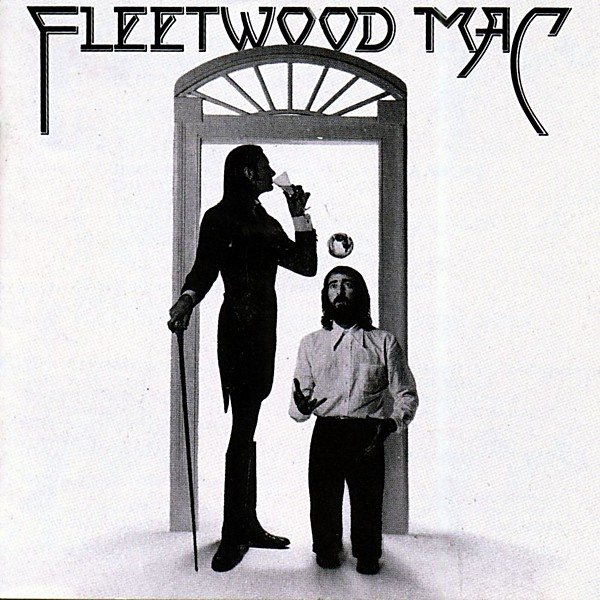

# Fleetwood Mac

By **Fleetwood Mac**

## Album Data

- **Catalog:** Beets
- **Format:** Digital, Album
- **Album:** Fleetwood Mac
- **Artist:** Fleetwood Mac
- **Albumartist:** Fleetwood Mac
- **Genre:** Soft Rock
- **MusicBrainz Album Artist ID:** [bd13909f-1c29-4c27-a874-d4aaf27c5b1a](https://musicbrainz.org/artist/bd13909f-1c29-4c27-a874-d4aaf27c5b1a)
- **MusicBrainz Album ID:** [833cd8ce-3748-4a8f-80f5-5c31d9bcb261](https://musicbrainz.org/release/833cd8ce-3748-4a8f-80f5-5c31d9bcb261)
- **MusicBrainz Release Group ID:** [6b5d9bf1-f496-34b5-9488-7df2533d6208](https://musicbrainz.org/release-group/6b5d9bf1-f496-34b5-9488-7df2533d6208)
- **Year:** 1975
- **Catalog #:** 
- **Label:** 
- **Total Tracks:** 10

## Album Tracks

### Track 01 - Got To Move

- **Artist:** Fleetwood Mac
- **Format:** ALAC
- **Genre:** Hard Rock
- **Length:** 4:28
- **MusicBrainz Track ID:** 
- **Title:** Got To Move
- **Track:** 01
- **Year:** 1999

### Track 02 - I Held My Baby Last Night

- **Artist:** Fleetwood Mac
- **Format:** ALAC
- **Genre:** Hard Rock
- **Length:** 5:04
- **MusicBrainz Track ID:** 
- **Title:** I Held My Baby Last Night
- **Track:** 02
- **Year:** 1999

### Track 03 - My Baby's Sweeter

- **Artist:** Fleetwood Mac
- **Format:** ALAC
- **Genre:** Swing
- **Length:** 3:21
- **MusicBrainz Track ID:** 
- **Title:** My Baby's Sweeter
- **Track:** 03
- **Year:** 1999

### Track 04 - My Baby's Good To Me

- **Artist:** Fleetwood Mac
- **Format:** ALAC
- **Genre:** Pop Rock
- **Length:** 4:40
- **MusicBrainz Track ID:** 
- **Title:** My Baby's Good To Me
- **Track:** 04
- **Year:** 1999

### Track 05 - Don't Know Which Way To Go

- **Artist:** Fleetwood Mac
- **Format:** ALAC
- **Genre:** British Blues
- **Length:** 6:11
- **MusicBrainz Track ID:** 
- **Title:** Don't Know Which Way To Go
- **Track:** 05
- **Year:** 1999

### Track 06 - Buzz Me

- **Artist:** Fleetwood Mac
- **Format:** ALAC
- **Genre:** Rock
- **Length:** 3:40
- **MusicBrainz Track ID:** 
- **Title:** Buzz Me
- **Track:** 06
- **Year:** 1999

### Track 07 - The Worried Dream

- **Artist:** Fleetwood Mac
- **Format:** ALAC
- **Genre:** Soft Rock
- **Length:** 5:40
- **MusicBrainz Track ID:** 
- **Title:** The Worried Dream
- **Track:** 07
- **Year:** 1999

### Track 08 - The World Keeps On Turning

- **Artist:** Fleetwood Mac
- **Format:** ALAC
- **Genre:** Rock
- **Length:** 3:39
- **MusicBrainz Track ID:** 
- **Title:** The World Keeps On Turning
- **Track:** 08
- **Year:** 1999

### Track 09 - How Blue Can You Get

- **Artist:** Fleetwood Mac
- **Format:** ALAC
- **Genre:** Electric Blues
- **Length:** 3:51
- **MusicBrainz Track ID:** 
- **Title:** How Blue Can You Get
- **Track:** 09
- **Year:** 1999

### Track 10 - Bleeding Heart

- **Artist:** Fleetwood Mac
- **Format:** ALAC
- **Genre:** Rock
- **Length:** 4:24
- **MusicBrainz Track ID:** 
- **Title:** Bleeding Heart
- **Track:** 10
- **Year:** 1999

## See also

- [Fillmore West 1.4.70](Fillmore_West_1470.md)
- [Fleetwood Mac - Live](Fleetwood_Mac_-_Live.md)
- [Live at the Boston Tea Party, Part One](Live_at_the_Boston_Tea_Party__Part_One.md)
- [Live at the Boston Tea Party, Part Two](Live_at_the_Boston_Tea_Party__Part_Two.md)
- [Live At The Boston Tea Party, Pt. 3](Live_At_The_Boston_Tea_Party__Pt_3.md)
- [Live at The Marquee](Live_at_The_Marquee.md)
- [Madison Blues [Disc 2]](Madison_Blues_[Disc_2].md)
- [Madison Blues Live](Madison_Blues_Live.md)
- [Mystery to Me](Mystery_to_Me.md)
- [Rumours](Rumours.md)
- [Shrine ’69](Shrine_’69.md)
- [The Best Of Peter Green`s Fleetwood Mac](The_Best_Of_Peter_Green`s_Fleetwood_Mac.md)
- [CD: ](../../CD/Fleetwood_Mac/Fleetwood_Mac.md)
- [CD: Mystery To Me](../../CD/Fleetwood_Mac/Mystery_To_Me.md)
- [Roon: Bare Trees](../../Roon/Fleetwood_Mac/Bare_Trees.md)
- [Roon: Fleetwood Mac](../../Roon/Fleetwood_Mac/Fleetwood_Mac.md)
- [Roon: Mystery to Me](../../Roon/Fleetwood_Mac/Mystery_to_Me.md)
- [Roon: Rumours (2001 Remaster)](../../Roon/Fleetwood_Mac/Rumours_2001_Remaster.md)
- [Roon: The Dance (Live at Warner Brothers Studios in Burbank, CA 5/23/97)](../../Roon/Fleetwood_Mac/The_Dance_Live_at_Warner_Brothers_Studios_in_Burbank__CA_5-23-97.md)
- [Roon: Then Play On (2013 Remaster; Expanded Edition)](../../Roon/Fleetwood_Mac/Then_Play_On_2013_Remaster;_Expanded_Edition.md)
- [Roon: Tusk (2015 Remaster)](../../Roon/Fleetwood_Mac/Tusk_2015_Remaster.md)
- [Vinyl: Don't Stop / Never Going Back Again](../../Vinyl/Fleetwood_Mac/Dont_Stop_-_Never_Going_Back_Again.md)
- [Vinyl: ](../../Vinyl/Fleetwood_Mac/Fleetwood_Mac.md)
- [Vinyl: In Concert](../../Vinyl/Fleetwood_Mac/In_Concert.md)
- [Vinyl: Jumping At Shadows](../../Vinyl/Fleetwood_Mac/Jumping_At_Shadows.md)
- [Vinyl: Rumours](../../Vinyl/Fleetwood_Mac/Rumours.md)
