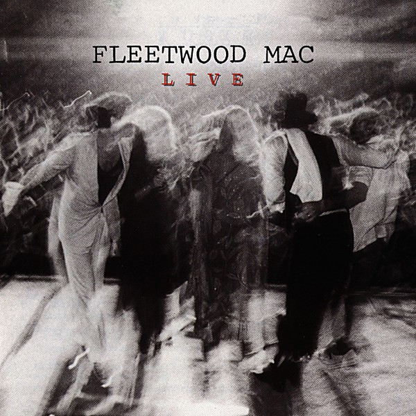

# Fleetwood Mac - Live

By **Fleetwood Mac**

## Album Data

- **Catalog:** Beets
- **Format:** Digital, Album
- **Album:** Fleetwood Mac - Live
- **Artist:** Fleetwood Mac
- **Albumartist:** Fleetwood Mac
- **Genre:** Soft Rock
- **MusicBrainz Album Artist ID:** 
- **MusicBrainz Album ID:** 
- **MusicBrainz Release Group ID:** 
- **Year:** 1999
- **Catalog #:** 
- **Label:** 
- **Total Tracks:** 08

## Album Tracks

### Track 01 - Black Magic Woman

- **Artist:** Fleetwood Mac
- **Format:** ALAC
- **Genre:** Rock
- **Length:** 6:54
- **MusicBrainz Track ID:** [4837c6e7-2cfa-4636-b021-5b7f2508bcf3](https://musicbrainz.org/recording/4837c6e7-2cfa-4636-b021-5b7f2508bcf3)
- **Title:** Black Magic Woman
- **Track:** 01
- **Year:** 1998

### Track 02 - Jumping at Shadows

- **Artist:** Fleetwood Mac
- **Format:** ALAC
- **Genre:** Hard Rock
- **Length:** 4:48
- **MusicBrainz Track ID:** [ef8c5d36-b3e4-41ef-891b-618a38bf0b41](https://musicbrainz.org/recording/ef8c5d36-b3e4-41ef-891b-618a38bf0b41)
- **Title:** Jumping at Shadows
- **Track:** 02
- **Year:** 1998

### Track 03 - Like it This Way

- **Artist:** Fleetwood Mac
- **Format:** ALAC
- **Genre:** Hard Rock
- **Length:** 4:34
- **MusicBrainz Track ID:** [98b1a856-8b45-4340-9261-b71e89b6adf9](https://musicbrainz.org/recording/98b1a856-8b45-4340-9261-b71e89b6adf9)
- **Title:** Like it This Way
- **Track:** 03
- **Year:** 1998

### Track 04 - Only You

- **Artist:** Fleetwood Mac
- **Format:** ALAC
- **Genre:** Rock
- **Length:** 5:07
- **MusicBrainz Track ID:** [94728043-8c5d-41bc-9c4a-20874c41c725](https://musicbrainz.org/recording/94728043-8c5d-41bc-9c4a-20874c41c725)
- **Title:** Only You
- **Track:** 04
- **Year:** 1998

### Track 05 - Rattlesnake Shake

- **Artist:** Fleetwood Mac
- **Format:** ALAC
- **Genre:** Progressive Rock
- **Length:** 24:39
- **MusicBrainz Track ID:** [5cc37fae-7f0e-4637-9a58-e0e4a737dbd4](https://musicbrainz.org/recording/5cc37fae-7f0e-4637-9a58-e0e4a737dbd4)
- **Title:** Rattlesnake Shake
- **Track:** 05
- **Year:** 1998

### Track 06 - I Can’t Hold Out

- **Artist:** Fleetwood Mac
- **Format:** ALAC
- **Genre:** Soft Rock
- **Length:** 6:35
- **MusicBrainz Track ID:** [8972ac9a-31a6-419a-b932-2ab36274c4a5](https://musicbrainz.org/recording/8972ac9a-31a6-419a-b932-2ab36274c4a5)
- **Title:** I Can’t Hold Out
- **Track:** 06
- **Year:** 1998

### Track 07 - Got to Move

- **Artist:** Fleetwood Mac
- **Format:** ALAC
- **Genre:** Hard Rock
- **Length:** 3:48
- **MusicBrainz Track ID:** [71de4a22-4a88-4f81-a506-576e782eee9f](https://musicbrainz.org/recording/71de4a22-4a88-4f81-a506-576e782eee9f)
- **Title:** Got to Move
- **Track:** 07
- **Year:** 1998

### Track 08 - The Green Manalishi

- **Artist:** Fleetwood Mac
- **Format:** ALAC
- **Genre:** Psychedelic Rock
- **Length:** 12:55
- **MusicBrainz Track ID:** [cac8ef32-fa89-4e8a-9ac6-444365d0cc33](https://musicbrainz.org/recording/cac8ef32-fa89-4e8a-9ac6-444365d0cc33)
- **Title:** The Green Manalishi
- **Track:** 08
- **Year:** 1998

## See also

- [Fillmore West 1.4.70](Fillmore_West_1470.md)
- [Fleetwood Mac](Fleetwood_Mac.md)
- [Live at the Boston Tea Party, Part One](Live_at_the_Boston_Tea_Party__Part_One.md)
- [Live at the Boston Tea Party, Part Two](Live_at_the_Boston_Tea_Party__Part_Two.md)
- [Live At The Boston Tea Party, Pt. 3](Live_At_The_Boston_Tea_Party__Pt_3.md)
- [Live at The Marquee](Live_at_The_Marquee.md)
- [Madison Blues [Disc 2]](Madison_Blues_[Disc_2].md)
- [Madison Blues Live](Madison_Blues_Live.md)
- [Mystery to Me](Mystery_to_Me.md)
- [Rumours](Rumours.md)
- [Shrine ’69](Shrine_’69.md)
- [The Best Of Peter Green`s Fleetwood Mac](The_Best_Of_Peter_Green`s_Fleetwood_Mac.md)
- [CD: ](../../CD/Fleetwood_Mac/Fleetwood_Mac.md)
- [CD: Mystery To Me](../../CD/Fleetwood_Mac/Mystery_To_Me.md)
- [Roon: Bare Trees](../../Roon/Fleetwood_Mac/Bare_Trees.md)
- [Roon: Fleetwood Mac](../../Roon/Fleetwood_Mac/Fleetwood_Mac.md)
- [Roon: Mystery to Me](../../Roon/Fleetwood_Mac/Mystery_to_Me.md)
- [Roon: Rumours (2001 Remaster)](../../Roon/Fleetwood_Mac/Rumours_2001_Remaster.md)
- [Roon: The Dance (Live at Warner Brothers Studios in Burbank, CA 5/23/97)](../../Roon/Fleetwood_Mac/The_Dance_Live_at_Warner_Brothers_Studios_in_Burbank__CA_5-23-97.md)
- [Roon: Then Play On (2013 Remaster; Expanded Edition)](../../Roon/Fleetwood_Mac/Then_Play_On_2013_Remaster;_Expanded_Edition.md)
- [Roon: Tusk (2015 Remaster)](../../Roon/Fleetwood_Mac/Tusk_2015_Remaster.md)
- [Vinyl: Don't Stop / Never Going Back Again](../../Vinyl/Fleetwood_Mac/Dont_Stop_-_Never_Going_Back_Again.md)
- [Vinyl: ](../../Vinyl/Fleetwood_Mac/Fleetwood_Mac.md)
- [Vinyl: In Concert](../../Vinyl/Fleetwood_Mac/In_Concert.md)
- [Vinyl: Jumping At Shadows](../../Vinyl/Fleetwood_Mac/Jumping_At_Shadows.md)
- [Vinyl: Rumours](../../Vinyl/Fleetwood_Mac/Rumours.md)
