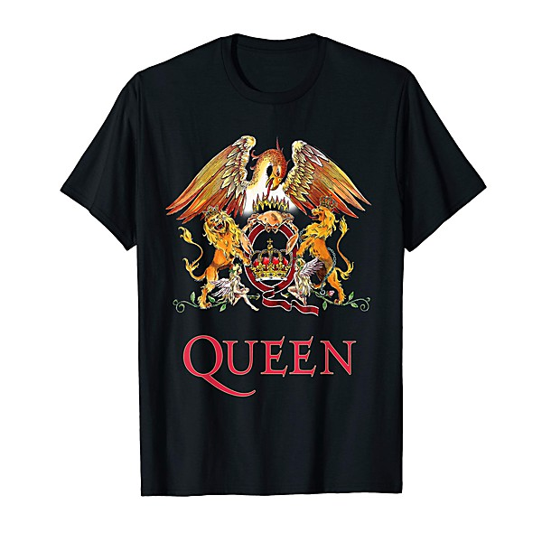

# Live at The Marquee

By **Fleetwood Mac**

## Album Data

- **Catalog:** Beets
- **Format:** Digital, Album
- **Album:** Live at The Marquee
- **Artist:** Fleetwood Mac
- **Albumartist:** Fleetwood Mac
- **Genre:** Blues
- **MusicBrainz Album Artist ID:** [bd13909f-1c29-4c27-a874-d4aaf27c5b1a](https://musicbrainz.org/artist/bd13909f-1c29-4c27-a874-d4aaf27c5b1a)
- **MusicBrainz Album ID:** [a3166f87-4410-4dfb-a029-3fc03d943e96](https://musicbrainz.org/release/a3166f87-4410-4dfb-a029-3fc03d943e96)
- **MusicBrainz Release Group ID:** [fcd0d9ed-f328-48d0-999b-2c793afc4158](https://musicbrainz.org/release-group/fcd0d9ed-f328-48d0-999b-2c793afc4158)
- **Year:** 1992
- **Catalog #:** 
- **Label:** 
- **Total Tracks:** 13

## Album Tracks

### Track 01 - Madison Blues

- **Artist:** Fleetwood Mac
- **Format:** AAC
- **Genre:** Rock
- **Length:** 4:10
- **MusicBrainz Track ID:** 
- **Title:** Madison Blues
- **Track:** 01
- **Year:** 0000

### Track 02 - Purple Dancer

- **Artist:** Fleetwood Mac
- **Format:** AAC
- **Genre:** Soft Rock
- **Length:** 7:36
- **MusicBrainz Track ID:** 
- **Title:** Purple Dancer
- **Track:** 02
- **Year:** 0000

### Track 03 - Open The Door

- **Artist:** Fleetwood Mac
- **Format:** AAC
- **Genre:** Soft Rock
- **Length:** 3:04
- **MusicBrainz Track ID:** 
- **Title:** Open The Door
- **Track:** 03
- **Year:** 0000

### Track 04 - Preaching Blues

- **Artist:** Fleetwood Mac
- **Format:** AAC
- **Genre:** British Blues
- **Length:** 3:41
- **MusicBrainz Track ID:** 
- **Title:** Preaching Blues
- **Track:** 04
- **Year:** 0000

### Track 05 - Dust My Broom

- **Artist:** Fleetwood Mac
- **Format:** AAC
- **Genre:** Psychedelic Rock
- **Length:** 3:27
- **MusicBrainz Track ID:** 
- **Title:** Dust My Broom
- **Track:** 05
- **Year:** 0000

### Track 06 - Get Like You Used To Be

- **Artist:** Fleetwood Mac
- **Format:** AAC
- **Genre:** Blues
- **Length:** 3:49
- **MusicBrainz Track ID:** 
- **Title:** Get Like You Used To Be
- **Track:** 06
- **Year:** 0000

### Track 07 - Don't Go Please To Stay

- **Artist:** Fleetwood Mac
- **Format:** AAC
- **Genre:** Soft Rock
- **Length:** 3:15
- **MusicBrainz Track ID:** 
- **Title:** Don't Go Please To Stay
- **Track:** 07
- **Year:** 0000

### Track 08 - Station Man

- **Artist:** Fleetwood Mac
- **Format:** AAC
- **Genre:** British Blues
- **Length:** 6:27
- **MusicBrainz Track ID:** 
- **Title:** Station Man
- **Track:** 08
- **Year:** 0000

### Track 09 - I'm On My Way

- **Artist:** Fleetwood Mac
- **Format:** AAC
- **Genre:** Soft Rock
- **Length:** 4:57
- **MusicBrainz Track ID:** 
- **Title:** I'm On My Way
- **Track:** 09
- **Year:** 0000

### Track 10 - Jailhouse Rock

- **Artist:** Fleetwood Mac
- **Format:** AAC
- **Genre:** Soft Rock
- **Length:** 3:24
- **MusicBrainz Track ID:** 
- **Title:** Jailhouse Rock
- **Track:** 10
- **Year:** 0000

### Track 11 - The King Speaks

- **Artist:** Fleetwood Mac
- **Format:** AAC
- **Genre:** Soft Rock
- **Length:** 2:59
- **MusicBrainz Track ID:** 
- **Title:** The King Speaks
- **Track:** 11
- **Year:** 0000

### Track 12 - Teenage Darlin'

- **Artist:** Fleetwood Mac
- **Format:** AAC
- **Genre:** Soft Rock
- **Length:** 4:08
- **MusicBrainz Track ID:** 
- **Title:** Teenage Darlin'
- **Track:** 12
- **Year:** 0000

### Track 13 - Honey Hush

- **Artist:** Fleetwood Mac
- **Format:** AAC
- **Genre:** Rock And Roll
- **Length:** 5:37
- **MusicBrainz Track ID:** 
- **Title:** Honey Hush
- **Track:** 13
- **Year:** 0000

## See also

- [Fillmore West 1.4.70](Fillmore_West_1470.md)
- [Fleetwood Mac - Live](Fleetwood_Mac_-_Live.md)
- [Fleetwood Mac](Fleetwood_Mac.md)
- [Live at the Boston Tea Party, Part One](Live_at_the_Boston_Tea_Party__Part_One.md)
- [Live at the Boston Tea Party, Part Two](Live_at_the_Boston_Tea_Party__Part_Two.md)
- [Live At The Boston Tea Party, Pt. 3](Live_At_The_Boston_Tea_Party__Pt_3.md)
- [Madison Blues [Disc 2]](Madison_Blues_[Disc_2].md)
- [Madison Blues Live](Madison_Blues_Live.md)
- [Mystery to Me](Mystery_to_Me.md)
- [Rumours](Rumours.md)
- [Shrine ’69](Shrine_’69.md)
- [The Best Of Peter Green`s Fleetwood Mac](The_Best_Of_Peter_Green`s_Fleetwood_Mac.md)
- [CD: ](../../CD/Fleetwood_Mac/Fleetwood_Mac.md)
- [CD: Mystery To Me](../../CD/Fleetwood_Mac/Mystery_To_Me.md)
- [Roon: Bare Trees](../../Roon/Fleetwood_Mac/Bare_Trees.md)
- [Roon: Fleetwood Mac](../../Roon/Fleetwood_Mac/Fleetwood_Mac.md)
- [Roon: Mystery to Me](../../Roon/Fleetwood_Mac/Mystery_to_Me.md)
- [Roon: Rumours (2001 Remaster)](../../Roon/Fleetwood_Mac/Rumours_2001_Remaster.md)
- [Roon: The Dance (Live at Warner Brothers Studios in Burbank, CA 5/23/97)](../../Roon/Fleetwood_Mac/The_Dance_Live_at_Warner_Brothers_Studios_in_Burbank__CA_5-23-97.md)
- [Roon: Then Play On (2013 Remaster; Expanded Edition)](../../Roon/Fleetwood_Mac/Then_Play_On_2013_Remaster;_Expanded_Edition.md)
- [Roon: Tusk (2015 Remaster)](../../Roon/Fleetwood_Mac/Tusk_2015_Remaster.md)
- [Vinyl: Don't Stop / Never Going Back Again](../../Vinyl/Fleetwood_Mac/Dont_Stop_-_Never_Going_Back_Again.md)
- [Vinyl: ](../../Vinyl/Fleetwood_Mac/Fleetwood_Mac.md)
- [Vinyl: In Concert](../../Vinyl/Fleetwood_Mac/In_Concert.md)
- [Vinyl: Jumping At Shadows](../../Vinyl/Fleetwood_Mac/Jumping_At_Shadows.md)
- [Vinyl: Rumours](../../Vinyl/Fleetwood_Mac/Rumours.md)
