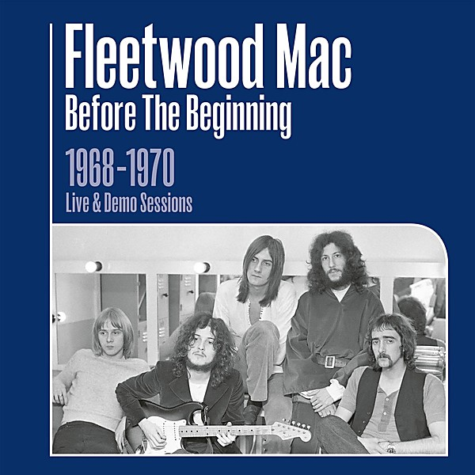

# Madison Blues Live

By **Fleetwood Mac**

## Album Data

- **Catalog:** Beets
- **Format:** Digital, Album
- **Album:** Madison Blues Live
- **Artist:** Fleetwood Mac
- **Albumartist:** Fleetwood Mac
- **Genre:** Soft Rock
- **MusicBrainz Album Artist ID:** [bd13909f-1c29-4c27-a874-d4aaf27c5b1a](https://musicbrainz.org/artist/bd13909f-1c29-4c27-a874-d4aaf27c5b1a)
- **MusicBrainz Album ID:** [8ddec25f-ddc0-4c63-9f35-71d63cdc4ab7](https://musicbrainz.org/release/8ddec25f-ddc0-4c63-9f35-71d63cdc4ab7)
- **MusicBrainz Release Group ID:** [360c2ee2-05c1-3ff8-bccb-e4b350cf301b](https://musicbrainz.org/release-group/360c2ee2-05c1-3ff8-bccb-e4b350cf301b)
- **Year:** 1994
- **Catalog #:** 
- **Label:** Rhino
- **Total Tracks:** 12

## Album Tracks

### Track 01 - Emerald Eyes

- **Artist:** Fleetwood Mac
- **Format:** ALAC
- **Genre:** Rock
- **Length:** 3:34
- **MusicBrainz Track ID:** [6c3c90db-e173-463c-b75d-45883a872c8f](https://musicbrainz.org/recording/6c3c90db-e173-463c-b75d-45883a872c8f)
- **Title:** Emerald Eyes
- **Track:** 01
- **Year:** 2017

### Track 02 - Believe Me

- **Artist:** Fleetwood Mac
- **Format:** ALAC
- **Genre:** Rock
- **Length:** 4:11
- **MusicBrainz Track ID:** [f7e6e064-cc71-42da-9859-02bc589bd2bd](https://musicbrainz.org/recording/f7e6e064-cc71-42da-9859-02bc589bd2bd)
- **Title:** Believe Me
- **Track:** 02
- **Year:** 2017

### Track 03 - Just Crazy Love

- **Artist:** Fleetwood Mac
- **Format:** ALAC
- **Genre:** Rock
- **Length:** 3:26
- **MusicBrainz Track ID:** [45532de4-5531-472b-92d9-e925403a2298](https://musicbrainz.org/recording/45532de4-5531-472b-92d9-e925403a2298)
- **Title:** Just Crazy Love
- **Track:** 03
- **Year:** 2017

### Track 04 - Hypnotized

- **Artist:** Fleetwood Mac
- **Format:** ALAC
- **Genre:** Soft Rock
- **Length:** 4:49
- **MusicBrainz Track ID:** [590edda9-c00a-41a7-8940-fff72573137b](https://musicbrainz.org/recording/590edda9-c00a-41a7-8940-fff72573137b)
- **Title:** Hypnotized
- **Track:** 04
- **Year:** 2017

### Track 05 - Forever

- **Artist:** Fleetwood Mac
- **Format:** ALAC
- **Genre:** Rock
- **Length:** 4:07
- **MusicBrainz Track ID:** [bb22b32c-009c-4e01-bf15-c763f1201638](https://musicbrainz.org/recording/bb22b32c-009c-4e01-bf15-c763f1201638)
- **Title:** Forever
- **Track:** 05
- **Year:** 2017

### Track 06 - Keep On Going

- **Artist:** Fleetwood Mac
- **Format:** ALAC
- **Genre:** Rock
- **Length:** 4:04
- **MusicBrainz Track ID:** [1f5c93ee-0c23-46f2-937d-dfd05c741651](https://musicbrainz.org/recording/1f5c93ee-0c23-46f2-937d-dfd05c741651)
- **Title:** Keep On Going
- **Track:** 06
- **Year:** 2017

### Track 07 - The City

- **Artist:** Fleetwood Mac
- **Format:** ALAC
- **Genre:** Rock
- **Length:** 3:36
- **MusicBrainz Track ID:** [d83c521f-c385-469b-9dcb-10a279840523](https://musicbrainz.org/recording/d83c521f-c385-469b-9dcb-10a279840523)
- **Title:** The City
- **Track:** 07
- **Year:** 2017

### Track 08 - Miles Away

- **Artist:** Fleetwood Mac
- **Format:** ALAC
- **Genre:** Rock
- **Length:** 3:49
- **MusicBrainz Track ID:** [9a9b9a7e-7ada-4ae2-b324-d580015ad089](https://musicbrainz.org/recording/9a9b9a7e-7ada-4ae2-b324-d580015ad089)
- **Title:** Miles Away
- **Track:** 08
- **Year:** 2017

### Track 09 - Somebody

- **Artist:** Fleetwood Mac
- **Format:** ALAC
- **Genre:** Rock
- **Length:** 5:04
- **MusicBrainz Track ID:** [3ac960d6-1318-4978-b965-3c5747ac7c17](https://musicbrainz.org/recording/3ac960d6-1318-4978-b965-3c5747ac7c17)
- **Title:** Somebody
- **Track:** 09
- **Year:** 2017

### Track 10 - The Way I Feel

- **Artist:** Fleetwood Mac
- **Format:** ALAC
- **Genre:** Rock
- **Length:** 2:43
- **MusicBrainz Track ID:** [55affa17-3998-4b0f-8bca-80e07d71abcf](https://musicbrainz.org/recording/55affa17-3998-4b0f-8bca-80e07d71abcf)
- **Title:** The Way I Feel
- **Track:** 10
- **Year:** 2017

### Track 11 - For Your Love

- **Artist:** Fleetwood Mac
- **Format:** ALAC
- **Genre:** Rock
- **Length:** 3:46
- **MusicBrainz Track ID:** [8cbac726-9c66-42bf-80cf-8e3ffb6caa08](https://musicbrainz.org/recording/8cbac726-9c66-42bf-80cf-8e3ffb6caa08)
- **Title:** For Your Love
- **Track:** 11
- **Year:** 2017

### Track 12 - Why

- **Artist:** Fleetwood Mac
- **Format:** ALAC
- **Genre:** Rock
- **Length:** 4:55
- **MusicBrainz Track ID:** [c021896b-67e1-4b85-b8ca-5563e92816db](https://musicbrainz.org/recording/c021896b-67e1-4b85-b8ca-5563e92816db)
- **Title:** Why
- **Track:** 12
- **Year:** 2017

