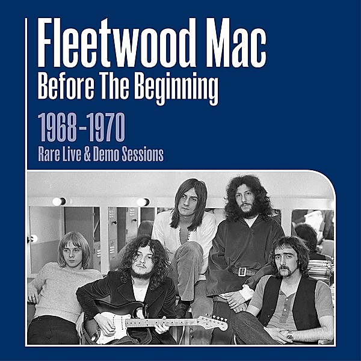

# Madison Blues [Disc 2]

By **Fleetwood Mac**

## Album Data

- **Catalog:** Beets
- **Format:** Digital, Album
- **Album:** Madison Blues [Disc 2]
- **Artist:** Fleetwood Mac
- **Albumartist:** Fleetwood Mac
- **Genre:** Soft Rock
- **MusicBrainz Album Artist ID:** 
- **MusicBrainz Album ID:** 
- **MusicBrainz Release Group ID:** 
- **Year:** 0000
- **Catalog #:** MBSCD 431/1
- **Label:** Castle Communications
- **Total Tracks:** 12

## Album Tracks

### Track 01 - Black Magic Woman

- **Artist:** Fleetwood Mac
- **Format:** ALAC
- **Genre:** Rock
- **Length:** 6:26
- **MusicBrainz Track ID:** [7b650c15-c039-4d7a-bdb7-9e2b6df91e5c](https://musicbrainz.org/recording/7b650c15-c039-4d7a-bdb7-9e2b6df91e5c)
- **Title:** Black Magic Woman
- **Track:** 01
- **Year:** 1994

### Track 02 - Can't Hold On

- **Artist:** Fleetwood Mac
- **Format:** ALAC
- **Genre:** Rock
- **Length:** 7:01
- **MusicBrainz Track ID:** [9418c3f3-0cea-4ebe-bea4-cacc56cd3044](https://musicbrainz.org/recording/9418c3f3-0cea-4ebe-bea4-cacc56cd3044)
- **Title:** Can't Hold On
- **Track:** 02
- **Year:** 1994

### Track 03 - Got to Move

- **Artist:** Fleetwood Mac
- **Format:** ALAC
- **Genre:** Hard Rock
- **Length:** 3:50
- **MusicBrainz Track ID:** [de51f675-6ba7-4498-8e4c-df041ed08789](https://musicbrainz.org/recording/de51f675-6ba7-4498-8e4c-df041ed08789)
- **Title:** Got to Move
- **Track:** 03
- **Year:** 1994

### Track 04 - Green Manalishi

- **Artist:** Fleetwood Mac
- **Format:** ALAC
- **Genre:** Psychedelic Rock
- **Length:** 7:31
- **MusicBrainz Track ID:** [e21dc0e8-1231-4349-8d1b-874fee398d9c](https://musicbrainz.org/recording/e21dc0e8-1231-4349-8d1b-874fee398d9c)
- **Title:** Green Manalishi
- **Track:** 04
- **Year:** 1994

### Track 05 - Like It This Way

- **Artist:** Fleetwood Mac
- **Format:** ALAC
- **Genre:** Hard Rock
- **Length:** 4:20
- **MusicBrainz Track ID:** [f6393d63-44bd-47e1-acb9-a42cc7d1f4d0](https://musicbrainz.org/recording/f6393d63-44bd-47e1-acb9-a42cc7d1f4d0)
- **Title:** Like It This Way
- **Track:** 05
- **Year:** 1994

### Track 06 - Madison Blues

- **Artist:** Fleetwood Mac
- **Format:** ALAC
- **Genre:** Rock
- **Length:** 4:50
- **MusicBrainz Track ID:** [f7fdff4d-badd-4c33-a660-f369a9da6215](https://musicbrainz.org/recording/f7fdff4d-badd-4c33-a660-f369a9da6215)
- **Title:** Madison Blues
- **Track:** 06
- **Year:** 1994

### Track 07 - Oh Well

- **Artist:** Fleetwood Mac
- **Format:** ALAC
- **Genre:** Progressive Rock
- **Length:** 3:12
- **MusicBrainz Track ID:** [8d3c3010-7845-40ba-ab9b-98bee35505e5](https://musicbrainz.org/recording/8d3c3010-7845-40ba-ab9b-98bee35505e5)
- **Title:** Oh Well
- **Track:** 07
- **Year:** 1994

### Track 08 - Only You

- **Artist:** Fleetwood Mac
- **Format:** ALAC
- **Genre:** Rock
- **Length:** 4:25
- **MusicBrainz Track ID:** [d8108828-b8ab-4695-9b4f-76854d0434e9](https://musicbrainz.org/recording/d8108828-b8ab-4695-9b4f-76854d0434e9)
- **Title:** Only You
- **Track:** 08
- **Year:** 1994

### Track 09 - Red Hot Mama

- **Artist:** Fleetwood Mac
- **Format:** ALAC
- **Genre:** Blues
- **Length:** 4:11
- **MusicBrainz Track ID:** [6684d14e-dcf2-4deb-94d6-d3641de24c39](https://musicbrainz.org/recording/6684d14e-dcf2-4deb-94d6-d3641de24c39)
- **Title:** Red Hot Mama
- **Track:** 09
- **Year:** 1994

### Track 10 - Sandy Mary

- **Artist:** Fleetwood Mac
- **Format:** ALAC
- **Genre:** Hard Rock
- **Length:** 5:13
- **MusicBrainz Track ID:** [583a76fd-cc09-494e-9d09-09b9674adad2](https://musicbrainz.org/recording/583a76fd-cc09-494e-9d09-09b9674adad2)
- **Title:** Sandy Mary
- **Track:** 10
- **Year:** 1994

### Track 11 - Teenage Darling

- **Artist:** Fleetwood Mac
- **Format:** ALAC
- **Genre:** Rock
- **Length:** 4:21
- **MusicBrainz Track ID:** [652ce2ca-9102-4443-bc94-8dba29eff3e6](https://musicbrainz.org/recording/652ce2ca-9102-4443-bc94-8dba29eff3e6)
- **Title:** Teenage Darling
- **Track:** 11
- **Year:** 1994

### Track 12 - World in Harmony

- **Artist:** Fleetwood Mac
- **Format:** ALAC
- **Genre:** Soft Rock
- **Length:** 3:45
- **MusicBrainz Track ID:** [3b6a2015-a93c-4d6d-8217-bb3e88360ddb](https://musicbrainz.org/recording/3b6a2015-a93c-4d6d-8217-bb3e88360ddb)
- **Title:** World in Harmony
- **Track:** 12
- **Year:** 1994

