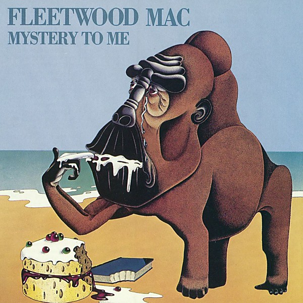

# Mystery to Me

By **Fleetwood Mac**

## Album Data

- **Catalog:** Beets
- **Format:** Digital, Album
- **Album:** Mystery to Me
- **Artist:** Fleetwood Mac
- **Albumartist:** Fleetwood Mac
- **Genre:** Rock
- **MusicBrainz Album Artist ID:** [bd13909f-1c29-4c27-a874-d4aaf27c5b1a](https://musicbrainz.org/artist/bd13909f-1c29-4c27-a874-d4aaf27c5b1a)
- **MusicBrainz Album ID:** [b5971683-f9dd-4595-a423-20ef5671084e](https://musicbrainz.org/release/b5971683-f9dd-4595-a423-20ef5671084e)
- **MusicBrainz Release Group ID:** [c7ffbb18-ced8-3fb3-bc77-72fc0cc3f14b](https://musicbrainz.org/release-group/c7ffbb18-ced8-3fb3-bc77-72fc0cc3f14b)
- **Year:** 2017
- **Catalog #:** BSK 3010
- **Label:** Warner Bros. Records
- **Total Tracks:** 11

## Album Tracks

### Track 01 - Second Hand News

- **Artist:** Fleetwood Mac
- **Format:** MP3
- **Genre:** Soft Rock
- **Length:** 2:51
- **MusicBrainz Track ID:** [18ca3bc6-b646-4a6b-82bc-07584bd28e95](https://musicbrainz.org/recording/18ca3bc6-b646-4a6b-82bc-07584bd28e95)
- **Title:** Second Hand News
- **Track:** 01
- **Year:** 1977

### Track 02 - Dreams

- **Artist:** Fleetwood Mac
- **Format:** MP3
- **Genre:** Soft Rock
- **Length:** 4:15
- **MusicBrainz Track ID:** [248cc9d1-97ea-493e-84d4-4c5ec718683b](https://musicbrainz.org/recording/248cc9d1-97ea-493e-84d4-4c5ec718683b)
- **Title:** Dreams
- **Track:** 02
- **Year:** 1977

### Track 03 - Never Going Back Again

- **Artist:** Fleetwood Mac
- **Format:** MP3
- **Genre:** Soft Rock
- **Length:** 2:13
- **MusicBrainz Track ID:** [d91d6ea4-a1a6-4945-b372-6b4fae18f6b6](https://musicbrainz.org/recording/d91d6ea4-a1a6-4945-b372-6b4fae18f6b6)
- **Title:** Never Going Back Again
- **Track:** 03
- **Year:** 1977

### Track 04 - Don’t Stop

- **Artist:** Fleetwood Mac
- **Format:** MP3
- **Genre:** Soft Rock
- **Length:** 3:11
- **MusicBrainz Track ID:** [1c0a78be-b883-4c5d-93f2-4f48405dbcb2](https://musicbrainz.org/recording/1c0a78be-b883-4c5d-93f2-4f48405dbcb2)
- **Title:** Don’t Stop
- **Track:** 04
- **Year:** 1977

### Track 05 - Go Your Own Way

- **Artist:** Fleetwood Mac
- **Format:** MP3
- **Genre:** Rock
- **Length:** 3:38
- **MusicBrainz Track ID:** [66908b7f-050f-4e8d-82b0-a768a3d80c63](https://musicbrainz.org/recording/66908b7f-050f-4e8d-82b0-a768a3d80c63)
- **Title:** Go Your Own Way
- **Track:** 05
- **Year:** 1977

### Track 06 - Songbird

- **Artist:** Fleetwood Mac
- **Format:** MP3
- **Genre:** Soft Rock
- **Length:** 3:16
- **MusicBrainz Track ID:** [70b64435-e956-4141-9149-789b19ebcf9f](https://musicbrainz.org/recording/70b64435-e956-4141-9149-789b19ebcf9f)
- **Title:** Songbird
- **Track:** 06
- **Year:** 1977

### Track 07 - The Chain

- **Artist:** Fleetwood Mac
- **Format:** MP3
- **Genre:** Soft Rock
- **Length:** 4:24
- **MusicBrainz Track ID:** [cd06c484-9319-4376-a104-504871e19756](https://musicbrainz.org/recording/cd06c484-9319-4376-a104-504871e19756)
- **Title:** The Chain
- **Track:** 07
- **Year:** 1977

### Track 08 - You Make Loving Fun

- **Artist:** Fleetwood Mac
- **Format:** MP3
- **Genre:** Soft Rock
- **Length:** 3:31
- **MusicBrainz Track ID:** [cce551a1-5a6c-494b-89fe-6dfac5e8aed1](https://musicbrainz.org/recording/cce551a1-5a6c-494b-89fe-6dfac5e8aed1)
- **Title:** You Make Loving Fun
- **Track:** 08
- **Year:** 1977

### Track 09 - I Don’t Want to Know

- **Artist:** Fleetwood Mac
- **Format:** MP3
- **Genre:** Soft Rock
- **Length:** 3:13
- **MusicBrainz Track ID:** [fc53705e-f3d6-4246-b0e3-23d1acc8f1d1](https://musicbrainz.org/recording/fc53705e-f3d6-4246-b0e3-23d1acc8f1d1)
- **Title:** I Don’t Want to Know
- **Track:** 09
- **Year:** 1977

### Track 10 - Oh Daddy

- **Artist:** Fleetwood Mac
- **Format:** MP3
- **Genre:** Soft Rock
- **Length:** 3:55
- **MusicBrainz Track ID:** [0c9684a3-1109-44cb-ac8c-808168ae8715](https://musicbrainz.org/recording/0c9684a3-1109-44cb-ac8c-808168ae8715)
- **Title:** Oh Daddy
- **Track:** 10
- **Year:** 1977

### Track 11 - Gold Dust Woman

- **Artist:** Fleetwood Mac
- **Format:** MP3
- **Genre:** Soft Rock
- **Length:** 4:51
- **MusicBrainz Track ID:** [924da25d-84bb-4b10-89e2-247975083e1d](https://musicbrainz.org/recording/924da25d-84bb-4b10-89e2-247975083e1d)
- **Title:** Gold Dust Woman
- **Track:** 11
- **Year:** 1977

