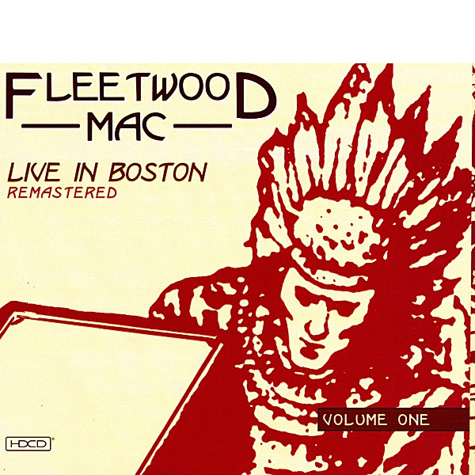

# The Best Of Peter Green`s Fleetwood Mac

By **Fleetwood Mac**

## Album Data

- **Catalog:** Beets
- **Format:** Digital, Album
- **Album:** The Best Of Peter Green`s Fleetwood Mac
- **Artist:** Fleetwood Mac
- **Albumartist:** Fleetwood Mac
- **Genre:** Hard Rock
- **MusicBrainz Album Artist ID:** 
- **MusicBrainz Album ID:** 
- **MusicBrainz Release Group ID:** 
- **Year:** 1968
- **Catalog #:** 
- **Label:** 
- **Total Tracks:** 20

## Album Tracks

### Track 01 - Albatross

- **Artist:** Fleetwood Mac
- **Format:** ALAC
- **Genre:** Rock
- **Length:** 3:12
- **MusicBrainz Track ID:** 
- **Title:** Albatross
- **Track:** 01
- **Year:** 1968

### Track 02 - Black Magic Woman

- **Artist:** Fleetwood Mac
- **Format:** ALAC
- **Genre:** Rock
- **Length:** 2:53
- **MusicBrainz Track ID:** 
- **Title:** Black Magic Woman
- **Track:** 02
- **Year:** 1968

### Track 03 - Need Your Love So Bad

- **Artist:** Fleetwood Mac
- **Format:** ALAC
- **Genre:** Rock
- **Length:** 6:15
- **MusicBrainz Track ID:** 
- **Title:** Need Your Love So Bad
- **Track:** 03
- **Year:** 2003

### Track 04 - My Heart Beat Like A Hammer

- **Artist:** Fleetwood Mac
- **Format:** ALAC
- **Genre:** Electric Blues
- **Length:** 2:58
- **MusicBrainz Track ID:** 
- **Title:** My Heart Beat Like A Hammer
- **Track:** 04
- **Year:** 1968

### Track 05 - Rollin' Man

- **Artist:** Fleetwood Mac
- **Format:** ALAC
- **Genre:** British Blues
- **Length:** 2:54
- **MusicBrainz Track ID:** 
- **Title:** Rollin' Man
- **Track:** 05
- **Year:** 1968

### Track 06 - The Green Manalishi (With The Two Pronged Crown)

- **Artist:** Fleetwood Mac
- **Format:** ALAC
- **Genre:** Hard Rock
- **Length:** 4:36
- **MusicBrainz Track ID:** 
- **Title:** The Green Manalishi (With The Two Pronged Crown)
- **Track:** 06
- **Year:** 1970

### Track 07 - Man Of The World

- **Artist:** Fleetwood Mac
- **Format:** ALAC
- **Genre:** Rock
- **Length:** 2:51
- **MusicBrainz Track ID:** 
- **Title:** Man Of The World
- **Track:** 07
- **Year:** 2003

### Track 08 - Something Inside Of Me

- **Artist:** Fleetwood Mac
- **Format:** ALAC
- **Genre:** British Blues
- **Length:** 3:56
- **MusicBrainz Track ID:** 
- **Title:** Something Inside Of Me
- **Track:** 08
- **Year:** 1971

### Track 09 - Looking For Somebody

- **Artist:** Fleetwood Mac
- **Format:** ALAC
- **Genre:** British Blues
- **Length:** 2:51
- **MusicBrainz Track ID:** 
- **Title:** Looking For Somebody
- **Track:** 09
- **Year:** 1968

### Track 10 - Oh Well - Part 1 & Part 2

- **Artist:** Fleetwood Mac
- **Format:** ALAC
- **Genre:** Rock
- **Length:** 9:05
- **MusicBrainz Track ID:** 
- **Title:** Oh Well - Part 1 & Part 2
- **Track:** 10
- **Year:** 2003

### Track 11 - Rattlesnake Shake

- **Artist:** Fleetwood Mac
- **Format:** ALAC
- **Genre:** Progressive Rock
- **Length:** 3:31
- **MusicBrainz Track ID:** 
- **Title:** Rattlesnake Shake
- **Track:** 11
- **Year:** 1969

### Track 12 - Merry Go Round

- **Artist:** Fleetwood Mac
- **Format:** ALAC
- **Genre:** Rock
- **Length:** 4:09
- **MusicBrainz Track ID:** 
- **Title:** Merry Go Round
- **Track:** 12
- **Year:** 2003

### Track 13 - I Loved Another Woman

- **Artist:** Fleetwood Mac
- **Format:** ALAC
- **Genre:** British Blues
- **Length:** 2:57
- **MusicBrainz Track ID:** 
- **Title:** I Loved Another Woman
- **Track:** 13
- **Year:** 1968

### Track 14 - Need Your Love Tonight

- **Artist:** Fleetwood Mac
- **Format:** ALAC
- **Genre:** Rock
- **Length:** 3:28
- **MusicBrainz Track ID:** 
- **Title:** Need Your Love Tonight
- **Track:** 14
- **Year:** 1968

### Track 15 - Worried Dream

- **Artist:** Fleetwood Mac
- **Format:** ALAC
- **Genre:** British Blues
- **Length:** 5:23
- **MusicBrainz Track ID:** 
- **Title:** Worried Dream
- **Track:** 15
- **Year:** 2003

### Track 16 - Dragonfly

- **Artist:** Fleetwood Mac
- **Format:** ALAC
- **Genre:** Rock
- **Length:** 2:47
- **MusicBrainz Track ID:** 
- **Title:** Dragonfly
- **Track:** 16
- **Year:** 1971

### Track 17 - Stop Messin' Round

- **Artist:** Fleetwood Mac
- **Format:** ALAC
- **Genre:** Rock
- **Length:** 2:21
- **MusicBrainz Track ID:** 
- **Title:** Stop Messin' Round
- **Track:** 17
- **Year:** 1968

### Track 18 - Shake Your Moneymaker

- **Artist:** Fleetwood Mac
- **Format:** ALAC
- **Genre:** British Blues
- **Length:** 2:56
- **MusicBrainz Track ID:** 
- **Title:** Shake Your Moneymaker
- **Track:** 18
- **Year:** 2003

### Track 19 - I'd Rather Go Blind (Chicken Shack)

- **Artist:** Fleetwood Mac
- **Format:** ALAC
- **Genre:** Rock
- **Length:** 3:15
- **MusicBrainz Track ID:** 
- **Title:** I'd Rather Go Blind (Chicken Shack)
- **Track:** 19
- **Year:** 1968

### Track 20 - Albatross (Chris Coco Featuring Peter Green)

- **Artist:** Fleetwood Mac
- **Format:** ALAC
- **Genre:** Blues
- **Length:** 5:26
- **MusicBrainz Track ID:** 
- **Title:** Albatross (Chris Coco Featuring Peter Green)
- **Track:** 20
- **Year:** 2003

## See also

- [Fillmore West 1.4.70](Fillmore_West_1470.md)
- [Fleetwood Mac - Live](Fleetwood_Mac_-_Live.md)
- [Fleetwood Mac](Fleetwood_Mac.md)
- [Live at the Boston Tea Party, Part One](Live_at_the_Boston_Tea_Party__Part_One.md)
- [Live at the Boston Tea Party, Part Two](Live_at_the_Boston_Tea_Party__Part_Two.md)
- [Live At The Boston Tea Party, Pt. 3](Live_At_The_Boston_Tea_Party__Pt_3.md)
- [Live at The Marquee](Live_at_The_Marquee.md)
- [Madison Blues [Disc 2]](Madison_Blues_[Disc_2].md)
- [Madison Blues Live](Madison_Blues_Live.md)
- [Mystery to Me](Mystery_to_Me.md)
- [Rumours](Rumours.md)
- [Shrine ’69](Shrine_’69.md)
- [CD: ](../../CD/Fleetwood_Mac/Fleetwood_Mac.md)
- [CD: Mystery To Me](../../CD/Fleetwood_Mac/Mystery_To_Me.md)
- [Roon: Bare Trees](../../Roon/Fleetwood_Mac/Bare_Trees.md)
- [Roon: Fleetwood Mac](../../Roon/Fleetwood_Mac/Fleetwood_Mac.md)
- [Roon: Mystery to Me](../../Roon/Fleetwood_Mac/Mystery_to_Me.md)
- [Roon: Rumours (2001 Remaster)](../../Roon/Fleetwood_Mac/Rumours_2001_Remaster.md)
- [Roon: The Dance (Live at Warner Brothers Studios in Burbank, CA 5/23/97)](../../Roon/Fleetwood_Mac/The_Dance_Live_at_Warner_Brothers_Studios_in_Burbank__CA_5-23-97.md)
- [Roon: Then Play On (2013 Remaster; Expanded Edition)](../../Roon/Fleetwood_Mac/Then_Play_On_2013_Remaster;_Expanded_Edition.md)
- [Roon: Tusk (2015 Remaster)](../../Roon/Fleetwood_Mac/Tusk_2015_Remaster.md)
- [Vinyl: Don't Stop / Never Going Back Again](../../Vinyl/Fleetwood_Mac/Dont_Stop_-_Never_Going_Back_Again.md)
- [Vinyl: ](../../Vinyl/Fleetwood_Mac/Fleetwood_Mac.md)
- [Vinyl: In Concert](../../Vinyl/Fleetwood_Mac/In_Concert.md)
- [Vinyl: Jumping At Shadows](../../Vinyl/Fleetwood_Mac/Jumping_At_Shadows.md)
- [Vinyl: Rumours](../../Vinyl/Fleetwood_Mac/Rumours.md)
