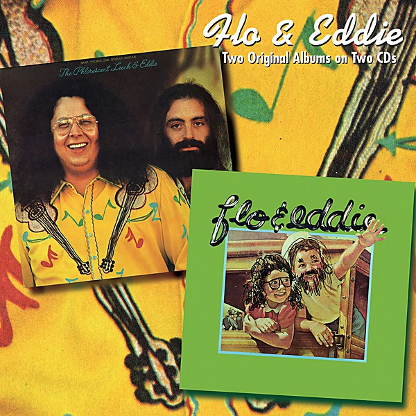

# Flo & Eddie

By **Flo & Eddie**

## Album Data

- **Catalog:** Beets
- **Format:** Digital, Album
- **Album:** Flo & Eddie
- **Artist:** Flo & Eddie
- **Albumartist:** Flo & Eddie
- **Genre:** Pop Rock
- **MusicBrainz Album Artist ID:** [e109348d-9b67-4421-8ff8-b2d95c5540a8](https://musicbrainz.org/artist/e109348d-9b67-4421-8ff8-b2d95c5540a8)
- **MusicBrainz Album ID:** [496b63d2-5e73-4d80-b9c3-0603d429388d](https://musicbrainz.org/release/496b63d2-5e73-4d80-b9c3-0603d429388d)
- **MusicBrainz Release Group ID:** [9f07cbe8-5083-4420-baa1-3ba7894de1d8](https://musicbrainz.org/release-group/9f07cbe8-5083-4420-baa1-3ba7894de1d8)
- **Year:** 1974
- **Catalog #:** 
- **Label:** 
- **Total Tracks:** 11

## Album Tracks

### Track 01 - Illegal, Immoral and Fattening

- **Artist:** Flo & Eddie
- **Format:** MP3
- **Genre:** Son
- **Length:** 3:14
- **MusicBrainz Track ID:** [82342bb9-3236-46d5-9184-4082ee6e2fac](https://musicbrainz.org/recording/82342bb9-3236-46d5-9184-4082ee6e2fac)
- **Title:** Illegal, Immoral and Fattening
- **Track:** 01
- **Year:** 1975

### Track 02 - Rebecca

- **Artist:** Flo & Eddie
- **Format:** MP3
- **Genre:** Son
- **Length:** 2:44
- **MusicBrainz Track ID:** [737a22e4-8056-4c0e-966f-005e82045a49](https://musicbrainz.org/recording/737a22e4-8056-4c0e-966f-005e82045a49)
- **Title:** Rebecca
- **Track:** 02
- **Year:** 1975

### Track 03 - Kama Sutra Time

- **Artist:** Flo & Eddie
- **Format:** MP3
- **Genre:** Indie Rock
- **Length:** 6:44
- **MusicBrainz Track ID:** [946fd7b8-0f08-4208-8c9a-8cd46eca960d](https://musicbrainz.org/recording/946fd7b8-0f08-4208-8c9a-8cd46eca960d)
- **Title:** Kama Sutra Time
- **Track:** 03
- **Year:** 1975

### Track 04 - The Sanzini Brothers Return

- **Artist:** Flo & Eddie
- **Format:** MP3
- **Genre:** Indie Rock
- **Length:** 2:54
- **MusicBrainz Track ID:** [d1359ebd-4393-4c4a-b4b1-4d775e6373d6](https://musicbrainz.org/recording/d1359ebd-4393-4c4a-b4b1-4d775e6373d6)
- **Title:** The Sanzini Brothers Return
- **Track:** 04
- **Year:** 1975

### Track 05 - Livin' In The Jungle

- **Artist:** Flo & Eddie
- **Format:** MP3
- **Genre:** Indie Rock
- **Length:** 3:46
- **MusicBrainz Track ID:** [9b24550f-d72f-4113-9c0f-73d956d98edd](https://musicbrainz.org/recording/9b24550f-d72f-4113-9c0f-73d956d98edd)
- **Title:** Livin' In The Jungle
- **Track:** 05
- **Year:** 1975

### Track 06 - Cheap

- **Artist:** Flo & Eddie
- **Format:** MP3
- **Genre:** Indie Rock
- **Length:** 2:40
- **MusicBrainz Track ID:** [c9c97abb-05d8-4b3e-bcc3-4f6e951df783](https://musicbrainz.org/recording/c9c97abb-05d8-4b3e-bcc3-4f6e951df783)
- **Title:** Cheap
- **Track:** 06
- **Year:** 1975

### Track 07 - The Kung Fu Killer

- **Artist:** Flo & Eddie
- **Format:** MP3
- **Genre:** Indie Rock
- **Length:** 3:03
- **MusicBrainz Track ID:** [daadaf78-b9e5-40a2-8b6e-edab5c21d34e](https://musicbrainz.org/recording/daadaf78-b9e5-40a2-8b6e-edab5c21d34e)
- **Title:** The Kung Fu Killer
- **Track:** 07
- **Year:** 1975

### Track 08 - Eddie, Are You Kidding?

- **Artist:** Flo & Eddie
- **Format:** MP3
- **Genre:** Indie Rock
- **Length:** 0:56
- **MusicBrainz Track ID:** [ed53f77e-43e6-45e4-9d29-f6fc6eccac5e](https://musicbrainz.org/recording/ed53f77e-43e6-45e4-9d29-f6fc6eccac5e)
- **Title:** Eddie, Are You Kidding?
- **Track:** 08
- **Year:** 1975

### Track 09 - The Pop Star Massage Unit

- **Artist:** Flo & Eddie
- **Format:** MP3
- **Genre:** Son
- **Length:** 6:24
- **MusicBrainz Track ID:** [12491882-b302-4ec1-bdb1-be1f206b0751](https://musicbrainz.org/recording/12491882-b302-4ec1-bdb1-be1f206b0751)
- **Title:** The Pop Star Massage Unit
- **Track:** 09
- **Year:** 1975

### Track 10 - Let Me Make Love to You

- **Artist:** Flo & Eddie
- **Format:** MP3
- **Genre:** Son
- **Length:** 2:21
- **MusicBrainz Track ID:** [d6b97532-f5af-4145-b201-e5e4b9b249eb](https://musicbrainz.org/recording/d6b97532-f5af-4145-b201-e5e4b9b249eb)
- **Title:** Let Me Make Love to You
- **Track:** 10
- **Year:** 1975

### Track 11 - There's No Business Like Show Business

- **Artist:** Flo & Eddie
- **Format:** MP3
- **Genre:** Son
- **Length:** 3:41
- **MusicBrainz Track ID:** [bc39d308-e79a-47ef-97be-8940e3f8929b](https://musicbrainz.org/recording/bc39d308-e79a-47ef-97be-8940e3f8929b)
- **Title:** There's No Business Like Show Business
- **Track:** 11
- **Year:** 1975

## See also

- [Illegal, Immoral and Fattening](Illegal__Immoral_and_Fattening.md)
- [Moving Targets](Moving_Targets.md)
- [The Phlorescent Leech & Eddie](The_Phlorescent_Leech_and_Eddie.md)
- [Roon: Illegal, Immoral and Fattening](../../Roon/Flo_and_Eddie/Illegal__Immoral_and_Fattening.md)
- [Roon: Moving Targets](../../Roon/Flo_and_Eddie/Moving_Targets.md)
- [Vinyl: ](../../Vinyl/Flo_and_Eddie/Flo_and_Eddie.md)
- [Vinyl: "Illegal, Immoral And Fattening"](../../Vinyl/Flo_and_Eddie/Illegal__Immoral_And_Fattening.md)
- [Vinyl: Moving Targets](../../Vinyl/Flo_and_Eddie/Moving_Targets.md)
