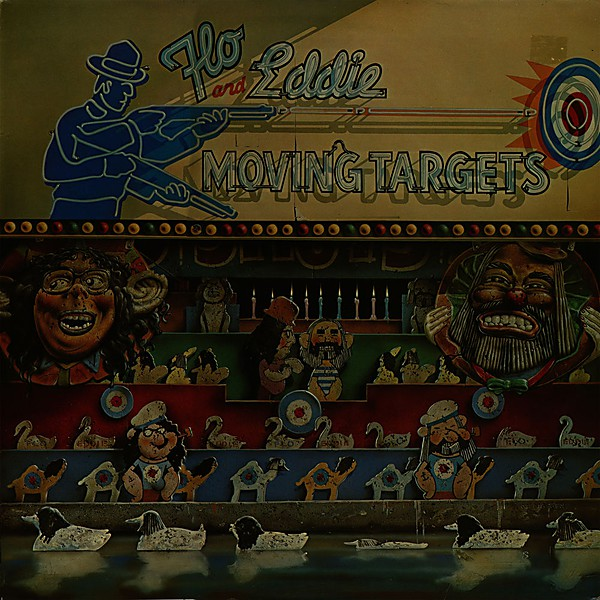

# Moving Targets

By **Flo & Eddie**

## Album Data

- **Catalog:** Beets
- **Format:** Digital, Album
- **Album:** Moving Targets
- **Artist:** Flo & Eddie
- **Albumartist:** Flo & Eddie
- **Genre:** Pop Rock
- **MusicBrainz Album Artist ID:** [e109348d-9b67-4421-8ff8-b2d95c5540a8](https://musicbrainz.org/artist/e109348d-9b67-4421-8ff8-b2d95c5540a8)
- **MusicBrainz Album ID:** [4181fc62-0241-4bbd-97ff-aa5c751573e9](https://musicbrainz.org/release/4181fc62-0241-4bbd-97ff-aa5c751573e9)
- **MusicBrainz Release Group ID:** [4932f181-61bc-4ade-807a-11c13703c481](https://musicbrainz.org/release-group/4932f181-61bc-4ade-807a-11c13703c481)
- **Year:** 1976
- **Catalog #:** 
- **Label:** 
- **Total Tracks:** 13

## Album Tracks

### Track 01 - Flo and Eddie Theme

- **Artist:** Flo & Eddie
- **Format:** ALAC
- **Genre:** Pop Rock
- **Length:** 0:57
- **MusicBrainz Track ID:** [d60e2eee-881f-4cb3-9ad6-e64110a4be6d](https://musicbrainz.org/recording/d60e2eee-881f-4cb3-9ad6-e64110a4be6d)
- **Title:** Flo and Eddie Theme
- **Track:** 01
- **Year:** 1972

### Track 02 - Thoughts Have Turned

- **Artist:** Flo & Eddie
- **Format:** ALAC
- **Genre:** Pop Rock
- **Length:** 3:07
- **MusicBrainz Track ID:** [8969dcba-7486-416a-bae5-5c577f96eb0e](https://musicbrainz.org/recording/8969dcba-7486-416a-bae5-5c577f96eb0e)
- **Title:** Thoughts Have Turned
- **Track:** 02
- **Year:** 1972

### Track 03 - It Never Happened

- **Artist:** Flo & Eddie
- **Format:** ALAC
- **Genre:** Pop Rock
- **Length:** 2:06
- **MusicBrainz Track ID:** [6f568611-4ca5-44a3-8eb7-5aead01ae98e](https://musicbrainz.org/recording/6f568611-4ca5-44a3-8eb7-5aead01ae98e)
- **Title:** It Never Happened
- **Track:** 03
- **Year:** 1972

### Track 04 - Burn the House

- **Artist:** Flo & Eddie
- **Format:** ALAC
- **Genre:** Pop Rock
- **Length:** 3:16
- **MusicBrainz Track ID:** [c84990c9-09a4-42bd-b795-62383c53db6f](https://musicbrainz.org/recording/c84990c9-09a4-42bd-b795-62383c53db6f)
- **Title:** Burn the House
- **Track:** 04
- **Year:** 1972

### Track 05 - Lady Blue

- **Artist:** Flo & Eddie
- **Format:** ALAC
- **Genre:** Pop Rock
- **Length:** 3:30
- **MusicBrainz Track ID:** [c59011ff-9b64-4436-afa4-ffbc3450c3b6](https://musicbrainz.org/recording/c59011ff-9b64-4436-afa4-ffbc3450c3b6)
- **Title:** Lady Blue
- **Track:** 05
- **Year:** 1972

### Track 06 - Strange Girl

- **Artist:** Flo & Eddie
- **Format:** ALAC
- **Genre:** Pop Rock
- **Length:** 3:15
- **MusicBrainz Track ID:** [7597db01-d026-41d7-a65c-b3afcee96be3](https://musicbrainz.org/recording/7597db01-d026-41d7-a65c-b3afcee96be3)
- **Title:** Strange Girl
- **Track:** 06
- **Year:** 1972

### Track 07 - Who but I

- **Artist:** Flo & Eddie
- **Format:** ALAC
- **Genre:** Pop Rock
- **Length:** 4:25
- **MusicBrainz Track ID:** [23d2b9f3-222e-4262-8780-52e190b5e7ec](https://musicbrainz.org/recording/23d2b9f3-222e-4262-8780-52e190b5e7ec)
- **Title:** Who but I
- **Track:** 07
- **Year:** 1972

### Track 08 - I Been Born Again

- **Artist:** Flo & Eddie
- **Format:** ALAC
- **Genre:** Pop Rock
- **Length:** 3:47
- **MusicBrainz Track ID:** [4b2d936b-8917-47a7-850f-45fe102e3fc3](https://musicbrainz.org/recording/4b2d936b-8917-47a7-850f-45fe102e3fc3)
- **Title:** I Been Born Again
- **Track:** 08
- **Year:** 1972

### Track 09 - Goodbye Surprise

- **Artist:** Flo & Eddie
- **Format:** ALAC
- **Genre:** Pop Rock
- **Length:** 2:55
- **MusicBrainz Track ID:** [06289cd7-f2e5-4fcf-9649-3ed0f258e9b6](https://musicbrainz.org/recording/06289cd7-f2e5-4fcf-9649-3ed0f258e9b6)
- **Title:** Goodbye Surprise
- **Track:** 09
- **Year:** 1972

### Track 10 - Nikki Hoi

- **Artist:** Flo & Eddie
- **Format:** ALAC
- **Genre:** Pop Rock
- **Length:** 1:59
- **MusicBrainz Track ID:** [61954222-806c-48c0-8d0c-c370bb6c7501](https://musicbrainz.org/recording/61954222-806c-48c0-8d0c-c370bb6c7501)
- **Title:** Nikki Hoi
- **Track:** 10
- **Year:** 1972

### Track 11 - Really Love

- **Artist:** Flo & Eddie
- **Format:** ALAC
- **Genre:** Pop Rock
- **Length:** 3:25
- **MusicBrainz Track ID:** [96b1b9ac-dbe4-4af3-90fa-6ece8d8315a0](https://musicbrainz.org/recording/96b1b9ac-dbe4-4af3-90fa-6ece8d8315a0)
- **Title:** Really Love
- **Track:** 11
- **Year:** 1972

### Track 12 - Feel Older Now

- **Artist:** Flo & Eddie
- **Format:** ALAC
- **Genre:** Acid Rock
- **Length:** 4:25
- **MusicBrainz Track ID:** [f3f52729-91bc-40a0-9d78-43bf4ae1a25e](https://musicbrainz.org/recording/f3f52729-91bc-40a0-9d78-43bf4ae1a25e)
- **Title:** Feel Older Now
- **Track:** 12
- **Year:** 1972

### Track 13 - There You Sit Lonely

- **Artist:** Flo & Eddie
- **Format:** ALAC
- **Genre:** Pop Rock
- **Length:** 3:35
- **MusicBrainz Track ID:** [249a4f48-b0bd-436b-a502-f330e6ce7350](https://musicbrainz.org/recording/249a4f48-b0bd-436b-a502-f330e6ce7350)
- **Title:** There You Sit Lonely
- **Track:** 13
- **Year:** 1972

## See also

- [Flo & Eddie](Flo_and_Eddie.md)
- [Illegal, Immoral and Fattening](Illegal__Immoral_and_Fattening.md)
- [The Phlorescent Leech & Eddie](The_Phlorescent_Leech_and_Eddie.md)
- [Roon: Illegal, Immoral and Fattening](../../Roon/Flo_and_Eddie/Illegal__Immoral_and_Fattening.md)
- [Roon: Moving Targets](../../Roon/Flo_and_Eddie/Moving_Targets.md)
- [Vinyl: ](../../Vinyl/Flo_and_Eddie/Flo_and_Eddie.md)
- [Vinyl: "Illegal, Immoral And Fattening"](../../Vinyl/Flo_and_Eddie/Illegal__Immoral_And_Fattening.md)
- [Vinyl: Moving Targets](../../Vinyl/Flo_and_Eddie/Moving_Targets.md)
