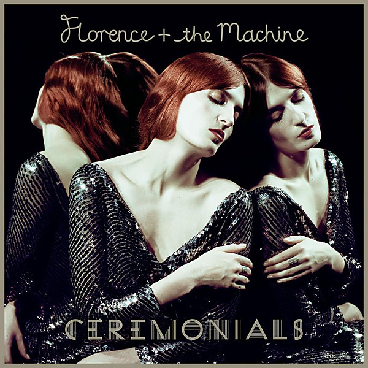

# Ceremonials

By **Florence + the Machine**

## Album Data

- **Catalog:** Beets
- **Format:** Digital, Album
- **Album:** Ceremonials
- **Artist:** Florence + The Machine
- **Albumartist:** Florence + the Machine
- **Genre:** Indie Pop
- **MusicBrainz Album Artist ID:** [5fee3020-513b-48c2-b1f7-4681b01db0c6](https://musicbrainz.org/artist/5fee3020-513b-48c2-b1f7-4681b01db0c6)
- **MusicBrainz Album ID:** [9c06e056-369b-4ca2-9365-dbcd00fc0e8a](https://musicbrainz.org/release/9c06e056-369b-4ca2-9365-dbcd00fc0e8a)
- **MusicBrainz Release Group ID:** [998f1bc8-6703-49fe-8aed-028ec04a14f2](https://musicbrainz.org/release-group/998f1bc8-6703-49fe-8aed-028ec04a14f2)
- **Year:** 2011
- **Catalog #:** 
- **Label:** Island
- **Total Tracks:** 12

## Album Tracks

### Track 01 - Only If for a Night

- **Artist:** Florence + the Machine
- **Format:** ALAC
- **Genre:** Indie Pop
- **Length:** 4:58
- **MusicBrainz Track ID:** [8e184a5e-eeb6-4d84-8944-830505ba75b5](https://musicbrainz.org/recording/8e184a5e-eeb6-4d84-8944-830505ba75b5)
- **Title:** Only If for a Night
- **Track:** 01
- **Year:** 2011

### Track 02 - Shake It Out

- **Artist:** Florence + the Machine
- **Format:** ALAC
- **Genre:** Indie Pop
- **Length:** 4:37
- **MusicBrainz Track ID:** [1a61223e-aa82-4019-9f7f-a1360cf9198c](https://musicbrainz.org/recording/1a61223e-aa82-4019-9f7f-a1360cf9198c)
- **Title:** Shake It Out
- **Track:** 02
- **Year:** 2011

### Track 03 - What the Water Gave Me

- **Artist:** Florence + the Machine
- **Format:** ALAC
- **Genre:** Indie Rock
- **Length:** 5:33
- **MusicBrainz Track ID:** [945fe670-a596-4d09-9bf6-bd2e39619e5c](https://musicbrainz.org/recording/945fe670-a596-4d09-9bf6-bd2e39619e5c)
- **Title:** What the Water Gave Me
- **Track:** 03
- **Year:** 2011

### Track 04 - Never Let Me Go

- **Artist:** Florence + the Machine
- **Format:** ALAC
- **Genre:** Indie Pop
- **Length:** 4:30
- **MusicBrainz Track ID:** [589b2eff-e541-475b-bbe7-ca778238e711](https://musicbrainz.org/recording/589b2eff-e541-475b-bbe7-ca778238e711)
- **Title:** Never Let Me Go
- **Track:** 04
- **Year:** 2011

### Track 05 - Breaking Down

- **Artist:** Florence + the Machine
- **Format:** ALAC
- **Genre:** Indie Rock
- **Length:** 3:49
- **MusicBrainz Track ID:** [be68ed11-98f8-48e0-9727-81e4262fff62](https://musicbrainz.org/recording/be68ed11-98f8-48e0-9727-81e4262fff62)
- **Title:** Breaking Down
- **Track:** 05
- **Year:** 2011

### Track 06 - Lover to Lover

- **Artist:** Florence + the Machine
- **Format:** ALAC
- **Genre:** Indie Rock
- **Length:** 4:02
- **MusicBrainz Track ID:** [144fd7a5-857f-412a-bf77-f5fd55dc8251](https://musicbrainz.org/recording/144fd7a5-857f-412a-bf77-f5fd55dc8251)
- **Title:** Lover to Lover
- **Track:** 06
- **Year:** 2011

### Track 07 - No Light, No Light

- **Artist:** Florence + the Machine
- **Format:** ALAC
- **Genre:** Indie Rock
- **Length:** 4:34
- **MusicBrainz Track ID:** [bcc63ec2-f2c3-4635-a408-47f6efdd589b](https://musicbrainz.org/recording/bcc63ec2-f2c3-4635-a408-47f6efdd589b)
- **Title:** No Light, No Light
- **Track:** 07
- **Year:** 2011

### Track 08 - Seven Devils

- **Artist:** Florence + the Machine
- **Format:** ALAC
- **Genre:** Indie Pop
- **Length:** 5:03
- **MusicBrainz Track ID:** [1d54aa88-5b2f-448a-ad8f-72f32fdf0f06](https://musicbrainz.org/recording/1d54aa88-5b2f-448a-ad8f-72f32fdf0f06)
- **Title:** Seven Devils
- **Track:** 08
- **Year:** 2011

### Track 09 - Heartlines

- **Artist:** Florence + the Machine
- **Format:** ALAC
- **Genre:** Indie Rock
- **Length:** 5:01
- **MusicBrainz Track ID:** [66d34eb1-8088-426a-8a5c-3cd2dbef907c](https://musicbrainz.org/recording/66d34eb1-8088-426a-8a5c-3cd2dbef907c)
- **Title:** Heartlines
- **Track:** 09
- **Year:** 2011

### Track 10 - Spectrum

- **Artist:** Florence + the Machine
- **Format:** ALAC
- **Genre:** Indie Pop
- **Length:** 5:11
- **MusicBrainz Track ID:** [2a4aba2f-115f-4891-a255-493dc31e1bff](https://musicbrainz.org/recording/2a4aba2f-115f-4891-a255-493dc31e1bff)
- **Title:** Spectrum
- **Track:** 10
- **Year:** 2011

### Track 11 - All This and Heaven Too

- **Artist:** Florence + the Machine
- **Format:** ALAC
- **Genre:** Indie Pop
- **Length:** 4:05
- **MusicBrainz Track ID:** [128fbf67-c9dc-428d-9c9d-b5efc5291027](https://musicbrainz.org/recording/128fbf67-c9dc-428d-9c9d-b5efc5291027)
- **Title:** All This and Heaven Too
- **Track:** 11
- **Year:** 2011

### Track 12 - Leave My Body

- **Artist:** Florence + the Machine
- **Format:** ALAC
- **Genre:** Indie Rock
- **Length:** 4:36
- **MusicBrainz Track ID:** [bc0a7cb0-b476-4edc-b174-fa92872d87f7](https://musicbrainz.org/recording/bc0a7cb0-b476-4edc-b174-fa92872d87f7)
- **Title:** Leave My Body
- **Track:** 12
- **Year:** 2011

