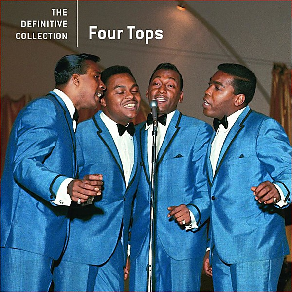

# The Definitive Collection

By **Four Tops**

## Album Data

- **Catalog:** Beets
- **Format:** Digital, Album
- **Album:** The Definitive Collection
- **Artist:** Four Tops
- **Albumartist:** Four Tops
- **Genre:** Soul
- **MusicBrainz Album Artist ID:** [0d21b01f-21f2-419b-8d98-4158ba0c0aa4](https://musicbrainz.org/artist/0d21b01f-21f2-419b-8d98-4158ba0c0aa4)
- **MusicBrainz Album ID:** [eed7685e-abde-465c-8cc6-13b83d5776fc](https://musicbrainz.org/release/eed7685e-abde-465c-8cc6-13b83d5776fc)
- **MusicBrainz Release Group ID:** [329c0708-ec9e-39cb-b582-7208aece0c10](https://musicbrainz.org/release-group/329c0708-ec9e-39cb-b582-7208aece0c10)
- **Year:** 2008
- **Catalog #:** B0011733-02
- **Label:** Motown
- **Total Tracks:** 18

## Album Tracks

### Track 01 - Reach Out I’ll Be There

- **Artist:** Four Tops
- **Format:** ALAC
- **Genre:** Soul
- **Length:** 3:00
- **MusicBrainz Track ID:** [1744a4ba-a8fd-4701-adce-39db6397491f](https://musicbrainz.org/recording/1744a4ba-a8fd-4701-adce-39db6397491f)
- **Title:** Reach Out I’ll Be There
- **Track:** 01
- **Year:** 2008

### Track 02 - Standing in the Shadows of Love

- **Artist:** Four Tops
- **Format:** ALAC
- **Genre:** Soul
- **Length:** 2:39
- **MusicBrainz Track ID:** [f4208446-57a7-484f-a060-1b30315b2022](https://musicbrainz.org/recording/f4208446-57a7-484f-a060-1b30315b2022)
- **Title:** Standing in the Shadows of Love
- **Track:** 02
- **Year:** 2008

### Track 03 - Bernadette

- **Artist:** Four Tops
- **Format:** ALAC
- **Genre:** Soul
- **Length:** 3:03
- **MusicBrainz Track ID:** [01ac4e0b-a94f-4cc9-9f60-8dab350c1ec9](https://musicbrainz.org/recording/01ac4e0b-a94f-4cc9-9f60-8dab350c1ec9)
- **Title:** Bernadette
- **Track:** 03
- **Year:** 2008

### Track 04 - Ask the Lonely

- **Artist:** Four Tops
- **Format:** ALAC
- **Genre:** Soul
- **Length:** 2:42
- **MusicBrainz Track ID:** [09a3a798-e62f-4d41-a229-f7f70a724a85](https://musicbrainz.org/recording/09a3a798-e62f-4d41-a229-f7f70a724a85)
- **Title:** Ask the Lonely
- **Track:** 04
- **Year:** 2008

### Track 05 - Baby I Need Your Loving

- **Artist:** Four Tops
- **Format:** ALAC
- **Genre:** Soul
- **Length:** 2:46
- **MusicBrainz Track ID:** [d3131a13-9773-465c-8fad-ecffe4f1047c](https://musicbrainz.org/recording/d3131a13-9773-465c-8fad-ecffe4f1047c)
- **Title:** Baby I Need Your Loving
- **Track:** 05
- **Year:** 2008

### Track 06 - Without the One You Love (Life’s Not Worthwhile)

- **Artist:** Four Tops
- **Format:** ALAC
- **Genre:** Soul
- **Length:** 2:45
- **MusicBrainz Track ID:** [02b23a78-dfd2-41f2-aaaa-0960adaca63c](https://musicbrainz.org/recording/02b23a78-dfd2-41f2-aaaa-0960adaca63c)
- **Title:** Without the One You Love (Life’s Not Worthwhile)
- **Track:** 06
- **Year:** 2008

### Track 07 - It’s the Same Old Song

- **Artist:** Four Tops
- **Format:** ALAC
- **Genre:** Soul
- **Length:** 2:47
- **MusicBrainz Track ID:** [e379583e-c853-4f11-a16a-302a98f8aeb2](https://musicbrainz.org/recording/e379583e-c853-4f11-a16a-302a98f8aeb2)
- **Title:** It’s the Same Old Song
- **Track:** 07
- **Year:** 2008

### Track 08 - Loving You Is Sweeter Than Ever

- **Artist:** Four Tops
- **Format:** ALAC
- **Genre:** Soul
- **Length:** 2:48
- **MusicBrainz Track ID:** [6d5790ae-a52e-46c6-a8c0-1ff36d596a6f](https://musicbrainz.org/recording/6d5790ae-a52e-46c6-a8c0-1ff36d596a6f)
- **Title:** Loving You Is Sweeter Than Ever
- **Track:** 08
- **Year:** 2008

### Track 09 - I Can’t Help Myself (Sugar Pie, Honey Bunch)

- **Artist:** Four Tops
- **Format:** ALAC
- **Genre:** Soul
- **Length:** 2:44
- **MusicBrainz Track ID:** [85323b77-8fce-47a1-ab0d-2366c5300115](https://musicbrainz.org/recording/85323b77-8fce-47a1-ab0d-2366c5300115)
- **Title:** I Can’t Help Myself (Sugar Pie, Honey Bunch)
- **Track:** 09
- **Year:** 2008

### Track 10 - Something About You

- **Artist:** Four Tops
- **Format:** ALAC
- **Genre:** Northern Soul
- **Length:** 2:42
- **MusicBrainz Track ID:** [1576cb64-b3c4-474b-ba75-7b832878e42b](https://musicbrainz.org/recording/1576cb64-b3c4-474b-ba75-7b832878e42b)
- **Title:** Something About You
- **Track:** 10
- **Year:** 2008

### Track 11 - I Got a Feeling

- **Artist:** Four Tops
- **Format:** ALAC
- **Genre:** Soul
- **Length:** 2:54
- **MusicBrainz Track ID:** [aec3cdaa-9595-4aa6-842a-3d0d5e44795e](https://musicbrainz.org/recording/aec3cdaa-9595-4aa6-842a-3d0d5e44795e)
- **Title:** I Got a Feeling
- **Track:** 11
- **Year:** 2008

### Track 12 - Walk Away Renee

- **Artist:** Four Tops
- **Format:** ALAC
- **Genre:** Soul
- **Length:** 2:44
- **MusicBrainz Track ID:** [bdce20f0-3a47-4bec-8d4a-f7c5cd97cb60](https://musicbrainz.org/recording/bdce20f0-3a47-4bec-8d4a-f7c5cd97cb60)
- **Title:** Walk Away Renee
- **Track:** 12
- **Year:** 2008

### Track 13 - Still Water (Love)

- **Artist:** Four Tops
- **Format:** ALAC
- **Genre:** Soul
- **Length:** 3:13
- **MusicBrainz Track ID:** [a1213a10-b8de-4d33-bc64-19764a831ab4](https://musicbrainz.org/recording/a1213a10-b8de-4d33-bc64-19764a831ab4)
- **Title:** Still Water (Love)
- **Track:** 13
- **Year:** 2008

### Track 14 - (It’s the Way) Nature Planned It

- **Artist:** Four Tops
- **Format:** ALAC
- **Genre:** Soul
- **Length:** 3:46
- **MusicBrainz Track ID:** [364d0b64-3674-4f4b-80cf-f76ce43699eb](https://musicbrainz.org/recording/364d0b64-3674-4f4b-80cf-f76ce43699eb)
- **Title:** (It’s the Way) Nature Planned It
- **Track:** 14
- **Year:** 2008

### Track 15 - It’s All in the Game

- **Artist:** Four Tops
- **Format:** ALAC
- **Genre:** Soul
- **Length:** 2:45
- **MusicBrainz Track ID:** [ff0d3a36-ab94-4f00-809b-6ebcc0e4143f](https://musicbrainz.org/recording/ff0d3a36-ab94-4f00-809b-6ebcc0e4143f)
- **Title:** It’s All in the Game
- **Track:** 15
- **Year:** 2008

### Track 16 - You Keep Running Away

- **Artist:** Four Tops
- **Format:** ALAC
- **Genre:** Northern Soul
- **Length:** 2:51
- **MusicBrainz Track ID:** [22706625-0386-464c-9916-55c695e51db5](https://musicbrainz.org/recording/22706625-0386-464c-9916-55c695e51db5)
- **Title:** You Keep Running Away
- **Track:** 16
- **Year:** 2008

### Track 17 - 7-Rooms of Gloom

- **Artist:** Four Tops
- **Format:** ALAC
- **Genre:** Soul
- **Length:** 2:35
- **MusicBrainz Track ID:** [0c1b6868-5d9f-4fea-8551-87bba1e6ce16](https://musicbrainz.org/recording/0c1b6868-5d9f-4fea-8551-87bba1e6ce16)
- **Title:** 7-Rooms of Gloom
- **Track:** 17
- **Year:** 2008

### Track 18 - Shake Me, Wake Me (When It’s Over)

- **Artist:** Four Tops
- **Format:** ALAC
- **Genre:** Soul
- **Length:** 2:39
- **MusicBrainz Track ID:** [79129d84-0f0e-4e0d-b9ad-de1a3a91c5ad](https://musicbrainz.org/recording/79129d84-0f0e-4e0d-b9ad-de1a3a91c5ad)
- **Title:** Shake Me, Wake Me (When It’s Over)
- **Track:** 18
- **Year:** 2008

## See also

- [Vinyl: Ain't No Woman (Like The One I've Got) / The Good Lord Knows](../../Vinyl/Four_Tops/Aint_No_Woman_Like_The_One_Ive_Got_-_The_Good_Lord_Knows.md)
- [Vinyl: ](../../Vinyl/Four_Tops/Four_Tops.md)
