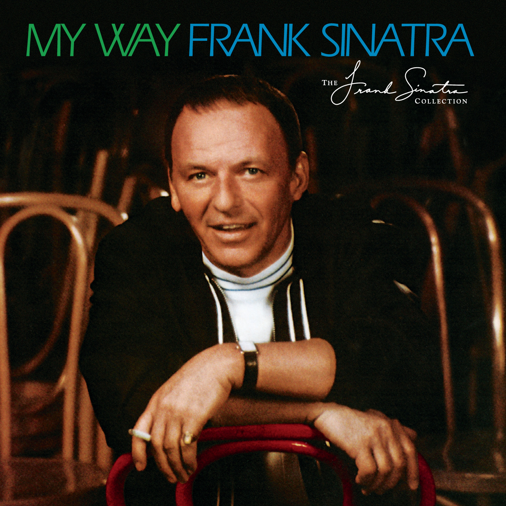

# My Way

By **Frank Sinatra**

## Album Data

- **Catalog:** Beets
- **Format:** Digital, Album
- **Album:** My Way
- **Artist:** Frank Sinatra
- **Albumartist:** Frank Sinatra
- **Genre:** Swing
- **MusicBrainz Album Artist ID:** [197450cd-0124-4164-b723-3c22dd16494d](https://musicbrainz.org/artist/197450cd-0124-4164-b723-3c22dd16494d)
- **MusicBrainz Album ID:** [f98ca562-daed-41b9-a421-450d43358f5e](https://musicbrainz.org/release/f98ca562-daed-41b9-a421-450d43358f5e)
- **MusicBrainz Release Group ID:** [8d09140c-21e9-31ea-be11-9201f9cce665](https://musicbrainz.org/release-group/8d09140c-21e9-31ea-be11-9201f9cce665)
- **Year:** 2013
- **Catalog #:** 
- **Label:** Frank Sinatra Digital Reprise
- **Total Tracks:** 12

## Album Tracks

### Track 01 - Watch What Happens

- **Artist:** Frank Sinatra
- **Format:** AAC
- **Genre:** Swing
- **Length:** 2:20
- **MusicBrainz Track ID:** [510acb74-5bb9-4df4-b7f9-3321eead4de9](https://musicbrainz.org/recording/510acb74-5bb9-4df4-b7f9-3321eead4de9)
- **Title:** Watch What Happens
- **Track:** 01
- **Year:** 2013

### Track 02 - Didn’t We

- **Artist:** Frank Sinatra
- **Format:** AAC
- **Genre:** Swing
- **Length:** 2:58
- **MusicBrainz Track ID:** [233d9135-ae28-485b-b867-cd2764ef58f5](https://musicbrainz.org/recording/233d9135-ae28-485b-b867-cd2764ef58f5)
- **Title:** Didn’t We
- **Track:** 02
- **Year:** 2013

### Track 03 - Hallelujah, I Love Her So

- **Artist:** Frank Sinatra
- **Format:** AAC
- **Genre:** Swing
- **Length:** 2:50
- **MusicBrainz Track ID:** [d70d167a-143b-4cf9-a788-fa39bee25409](https://musicbrainz.org/recording/d70d167a-143b-4cf9-a788-fa39bee25409)
- **Title:** Hallelujah, I Love Her So
- **Track:** 03
- **Year:** 2013

### Track 04 - Yesterday

- **Artist:** Frank Sinatra
- **Format:** AAC
- **Genre:** Swing
- **Length:** 3:59
- **MusicBrainz Track ID:** [1dad4568-b74e-4da7-aa1a-18547f0c876f](https://musicbrainz.org/recording/1dad4568-b74e-4da7-aa1a-18547f0c876f)
- **Title:** Yesterday
- **Track:** 04
- **Year:** 2013

### Track 05 - All My Tomorrows

- **Artist:** Frank Sinatra
- **Format:** AAC
- **Genre:** Vocal Jazz
- **Length:** 4:39
- **MusicBrainz Track ID:** [e5b0e771-b82d-4b24-81cf-38eab1585b69](https://musicbrainz.org/recording/e5b0e771-b82d-4b24-81cf-38eab1585b69)
- **Title:** All My Tomorrows
- **Track:** 05
- **Year:** 2013

### Track 06 - My Way

- **Artist:** Frank Sinatra
- **Format:** AAC
- **Genre:** Vocal Jazz
- **Length:** 4:36
- **MusicBrainz Track ID:** [7832eb58-20b3-4dee-b25f-19a2b5d76efa](https://musicbrainz.org/recording/7832eb58-20b3-4dee-b25f-19a2b5d76efa)
- **Title:** My Way
- **Track:** 06
- **Year:** 2013

### Track 07 - A Day in the Life of a Fool

- **Artist:** Frank Sinatra
- **Format:** AAC
- **Genre:** Smooth Jazz
- **Length:** 3:05
- **MusicBrainz Track ID:** [05759b79-5885-4b54-8543-27994b7612e3](https://musicbrainz.org/recording/05759b79-5885-4b54-8543-27994b7612e3)
- **Title:** A Day in the Life of a Fool
- **Track:** 07
- **Year:** 2013

### Track 08 - For Once in My Life

- **Artist:** Frank Sinatra
- **Format:** AAC
- **Genre:** Vocal Jazz
- **Length:** 2:51
- **MusicBrainz Track ID:** [36460aa6-55de-4138-ab08-a3124128ceca](https://musicbrainz.org/recording/36460aa6-55de-4138-ab08-a3124128ceca)
- **Title:** For Once in My Life
- **Track:** 08
- **Year:** 2013

### Track 09 - If You Go Away

- **Artist:** Frank Sinatra
- **Format:** AAC
- **Genre:** Jazz
- **Length:** 3:34
- **MusicBrainz Track ID:** [53d95564-d86e-4197-b78f-4158f7173914](https://musicbrainz.org/recording/53d95564-d86e-4197-b78f-4158f7173914)
- **Title:** If You Go Away
- **Track:** 09
- **Year:** 2013

### Track 10 - Mrs. Robinson

- **Artist:** Frank Sinatra
- **Format:** AAC
- **Genre:** Swing
- **Length:** 2:56
- **MusicBrainz Track ID:** [94983466-0fe4-4de6-8926-2121c0f0026c](https://musicbrainz.org/recording/94983466-0fe4-4de6-8926-2121c0f0026c)
- **Title:** Mrs. Robinson
- **Track:** 10
- **Year:** 2013

### Track 11 - For Once in My Life (rehearsal)

- **Artist:** Frank Sinatra
- **Format:** AAC
- **Genre:** Swing
- **Length:** 4:14
- **MusicBrainz Track ID:** [11379585-9391-418f-9a5b-f23a6c2d1da3](https://musicbrainz.org/recording/11379585-9391-418f-9a5b-f23a6c2d1da3)
- **Title:** For Once in My Life (rehearsal)
- **Track:** 11
- **Year:** 2013

### Track 12 - My Way (live at the Reunion Arena/1987)

- **Artist:** Frank Sinatra
- **Format:** AAC
- **Genre:** Swing
- **Length:** 3:16
- **MusicBrainz Track ID:** [863601a0-3043-492c-971b-49a3bae45cc2](https://musicbrainz.org/recording/863601a0-3043-492c-971b-49a3bae45cc2)
- **Title:** My Way (live at the Reunion Arena/1987)
- **Track:** 12
- **Year:** 2013

## See also

- [I'm In The Mood For Love - 25 Songs For Lovers](Im_In_The_Mood_For_Love_-_25_Songs_For_Lovers.md)
- [In the Wee Small Hours](In_the_Wee_Small_Hours.md)
- [Sinatra 80th](Sinatra_80th.md)
- [Roon: In The Wee Small Hours](../../Roon/Frank_Sinatra/In_The_Wee_Small_Hours.md)
- [Roon: It Might As Well Be Swing](../../Roon/Frank_Sinatra/It_Might_As_Well_Be_Swing.md)
- [Roon: Sinatra At The Sands (Live At The Sands Hotel And Casino/1966)](../../Roon/Frank_Sinatra/Sinatra_At_The_Sands_Live_At_The_Sands_Hotel_And_Casino-1966.md)
- [Vinyl: ](../../Vinyl/Frank_Sinatra/Frank_Sinatra.md)
- [Vinyl: In The Wee Small Hours](../../Vinyl/Frank_Sinatra/In_The_Wee_Small_Hours.md)
- [Vinyl: Learnin' The Blues / If I Had Three Wishes](../../Vinyl/Frank_Sinatra/Learnin_The_Blues_-_If_I_Had_Three_Wishes.md)
- [Vinyl: Love And Marriage / The Impatient Years](../../Vinyl/Frank_Sinatra/Love_And_Marriage_-_The_Impatient_Years.md)
