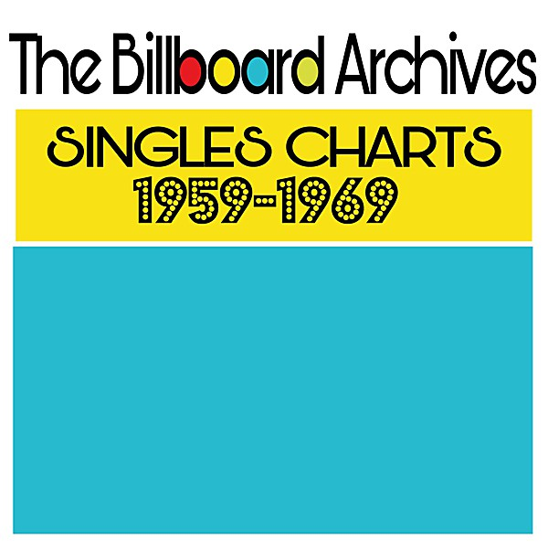

# Billboard Top Rock 'n' Roll Hi

By **Frank Wilson & The Cavaliers**

## Album Data

- **Catalog:** Beets
- **Format:** Digital, Album
- **Album:** Billboard Top Rock 'n' Roll Hi
- **Artist:** Frank Wilson & The Cavaliers
- **Albumartist:** Frank Wilson & The Cavaliers
- **Genre:** Rockabilly
- **MusicBrainz Album Artist ID:** 
- **MusicBrainz Album ID:** 
- **MusicBrainz Release Group ID:** 
- **Year:** 1999
- **Catalog #:** 
- **Label:** 
- **Total Tracks:** 00

## Album Tracks

### Track 01 - Last Kiss

- **Artist:** Frank Wilson & The Cavaliers
- **Format:** AAC
- **Genre:** Rock
- **Length:** 2:31
- **MusicBrainz Track ID:** 
- **Title:** Last Kiss
- **Track:** 01
- **Year:** 1999

