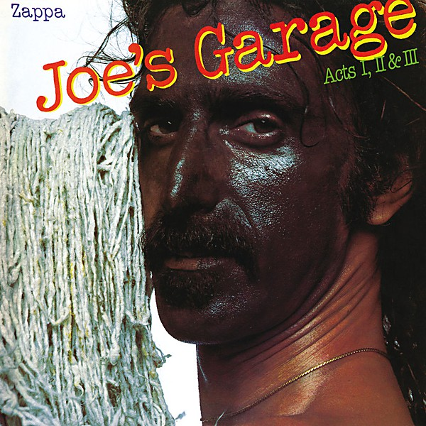

# Joe’s Garage

By **Frank Zappa**

## Album Data

- **Catalog:** Beets
- **Format:** Digital, Album
- **Album:** Joe’s Garage
- **Artist:** Frank Zappa
- **Albumartist:** Frank Zappa
- **Genre:** Progressive Rock
- **MusicBrainz Album Artist ID:** [e20747e7-55a4-452e-8766-7b985585082d](https://musicbrainz.org/artist/e20747e7-55a4-452e-8766-7b985585082d)
- **MusicBrainz Album ID:** [230631f6-860f-423c-b4f3-2134c6b35687](https://musicbrainz.org/release/230631f6-860f-423c-b4f3-2134c6b35687)
- **MusicBrainz Release Group ID:** [afbafae5-8f90-3acf-8cd7-1c54ffa21633](https://musicbrainz.org/release-group/afbafae5-8f90-3acf-8cd7-1c54ffa21633)
- **Year:** 2012
- **Catalog #:** RCD 40500
- **Label:** Rykodisc
- **Total Tracks:** 19

## Album Tracks

### Track 01 - Peaches en Regalia

- **Artist:** Frank Zappa
- **Format:** AAC
- **Genre:** Psychedelic Rock
- **Length:** 3:37
- **MusicBrainz Track ID:** [89100c1f-34b8-4a41-bebd-549653ef2355](https://musicbrainz.org/recording/89100c1f-34b8-4a41-bebd-549653ef2355)
- **Title:** Peaches en Regalia
- **Track:** 01
- **Year:** 1995

### Track 02 - Don’t Eat the Yellow Snow (single version)

- **Artist:** Frank Zappa
- **Format:** AAC
- **Genre:** Progressive Rock
- **Length:** 3:34
- **MusicBrainz Track ID:** [512879c9-2765-4eeb-82c8-4166ab434257](https://musicbrainz.org/recording/512879c9-2765-4eeb-82c8-4166ab434257)
- **Title:** Don’t Eat the Yellow Snow (single version)
- **Track:** 02
- **Year:** 1995

### Track 03 - Dancin’ Fool

- **Artist:** Frank Zappa
- **Format:** AAC
- **Genre:** Progressive Rock
- **Length:** 3:43
- **MusicBrainz Track ID:** [cd0584d6-cb56-45dc-aa48-03ef8cc3e895](https://musicbrainz.org/recording/cd0584d6-cb56-45dc-aa48-03ef8cc3e895)
- **Title:** Dancin’ Fool
- **Track:** 03
- **Year:** 1995

### Track 04 - San Ber’dino

- **Artist:** Frank Zappa
- **Format:** AAC
- **Genre:** Progressive Rock
- **Length:** 5:57
- **MusicBrainz Track ID:** [f613eaef-7233-4d19-980f-22ed082f4cb9](https://musicbrainz.org/recording/f613eaef-7233-4d19-980f-22ed082f4cb9)
- **Title:** San Ber’dino
- **Track:** 04
- **Year:** 1995

### Track 05 - Dirty Love

- **Artist:** Frank Zappa
- **Format:** AAC
- **Genre:** Psychedelic Rock
- **Length:** 2:57
- **MusicBrainz Track ID:** [c0387efb-4aea-4e9b-a9bd-e6cf491e2846](https://musicbrainz.org/recording/c0387efb-4aea-4e9b-a9bd-e6cf491e2846)
- **Title:** Dirty Love
- **Track:** 05
- **Year:** 1995

### Track 06 - My Guitar Wants to Kill Your Mama

- **Artist:** Frank Zappa
- **Format:** AAC
- **Genre:** Psychedelic Rock
- **Length:** 3:31
- **MusicBrainz Track ID:** [7d69be6e-38aa-4ad3-b8f8-a7c9b7761cf0](https://musicbrainz.org/recording/7d69be6e-38aa-4ad3-b8f8-a7c9b7761cf0)
- **Title:** My Guitar Wants to Kill Your Mama
- **Track:** 06
- **Year:** 1995

### Track 07 - Cosmik Debris

- **Artist:** Frank Zappa
- **Format:** AAC
- **Genre:** Psychedelic Rock
- **Length:** 4:14
- **MusicBrainz Track ID:** [cc7473e1-5ac1-4fb5-8d77-b0be66fc8cab](https://musicbrainz.org/recording/cc7473e1-5ac1-4fb5-8d77-b0be66fc8cab)
- **Title:** Cosmik Debris
- **Track:** 07
- **Year:** 1995

### Track 08 - Trouble Every Day

- **Artist:** Frank Zappa
- **Format:** AAC
- **Genre:** Psychedelic Rock
- **Length:** 5:49
- **MusicBrainz Track ID:** [2be94900-33b5-4a2a-bbed-e652fde7ada0](https://musicbrainz.org/recording/2be94900-33b5-4a2a-bbed-e652fde7ada0)
- **Title:** Trouble Every Day
- **Track:** 08
- **Year:** 1995

### Track 09 - Disco Boy

- **Artist:** Frank Zappa
- **Format:** AAC
- **Genre:** Progressive Rock
- **Length:** 5:08
- **MusicBrainz Track ID:** [bbe8f1a6-3417-4f65-afe4-3720636d0d2f](https://musicbrainz.org/recording/bbe8f1a6-3417-4f65-afe4-3720636d0d2f)
- **Title:** Disco Boy
- **Track:** 09
- **Year:** 1995

### Track 10 - Fine Girl

- **Artist:** Frank Zappa
- **Format:** AAC
- **Genre:** Progressive Rock
- **Length:** 3:29
- **MusicBrainz Track ID:** [14738195-e014-4300-a3ff-981d843cf7c9](https://musicbrainz.org/recording/14738195-e014-4300-a3ff-981d843cf7c9)
- **Title:** Fine Girl
- **Track:** 10
- **Year:** 1995

### Track 11 - Sexual Harassment in the Workplace

- **Artist:** Frank Zappa
- **Format:** AAC
- **Genre:** Psychedelic Rock
- **Length:** 3:42
- **MusicBrainz Track ID:** [5958bffa-71d2-4f25-993a-dd1bc351b911](https://musicbrainz.org/recording/5958bffa-71d2-4f25-993a-dd1bc351b911)
- **Title:** Sexual Harassment in the Workplace
- **Track:** 11
- **Year:** 1995

### Track 12 - Let’s Make the Water Turn Black

- **Artist:** Frank Zappa
- **Format:** AAC
- **Genre:** Progressive Rock
- **Length:** 2:01
- **MusicBrainz Track ID:** [259fbee9-49ac-4092-a08d-2fbdfc9450cf](https://musicbrainz.org/recording/259fbee9-49ac-4092-a08d-2fbdfc9450cf)
- **Title:** Let’s Make the Water Turn Black
- **Track:** 12
- **Year:** 1995

### Track 13 - I’m the Slime

- **Artist:** Frank Zappa
- **Format:** AAC
- **Genre:** Progressive Rock
- **Length:** 3:34
- **MusicBrainz Track ID:** [594d449f-805e-4fa4-bb58-2cebeb4e015e](https://musicbrainz.org/recording/594d449f-805e-4fa4-bb58-2cebeb4e015e)
- **Title:** I’m the Slime
- **Track:** 13
- **Year:** 1995

### Track 14 - Joe’s Garage (single version)

- **Artist:** Frank Zappa
- **Format:** AAC
- **Genre:** Progressive Rock
- **Length:** 4:09
- **MusicBrainz Track ID:** [b192db03-22ef-4a29-8062-fd8d52463978](https://musicbrainz.org/recording/b192db03-22ef-4a29-8062-fd8d52463978)
- **Title:** Joe’s Garage (single version)
- **Track:** 14
- **Year:** 1995

### Track 15 - Tell Me You Love Me

- **Artist:** Frank Zappa
- **Format:** AAC
- **Genre:** Psychedelic Rock
- **Length:** 2:33
- **MusicBrainz Track ID:** [6e61c7af-bad3-44be-a6ef-a42cff0cd567](https://musicbrainz.org/recording/6e61c7af-bad3-44be-a6ef-a42cff0cd567)
- **Title:** Tell Me You Love Me
- **Track:** 15
- **Year:** 1995

### Track 16 - Montana (single version)

- **Artist:** Frank Zappa
- **Format:** AAC
- **Genre:** Psychedelic Rock
- **Length:** 4:48
- **MusicBrainz Track ID:** [cf90059b-590b-4499-a075-cb932e41ded8](https://musicbrainz.org/recording/cf90059b-590b-4499-a075-cb932e41ded8)
- **Title:** Montana (single version)
- **Track:** 16
- **Year:** 1995

### Track 17 - Valley Girl

- **Artist:** Frank Zappa
- **Format:** AAC
- **Genre:** Progressive Rock
- **Length:** 4:50
- **MusicBrainz Track ID:** [dcff2480-b502-4d4b-8e91-d40c31250096](https://musicbrainz.org/recording/dcff2480-b502-4d4b-8e91-d40c31250096)
- **Title:** Valley Girl
- **Track:** 17
- **Year:** 1995

### Track 18 - Be in My Video

- **Artist:** Frank Zappa
- **Format:** AAC
- **Genre:** Progressive Rock
- **Length:** 3:39
- **MusicBrainz Track ID:** [94b94a20-69e0-4332-ae0b-e21f4bcce1d6](https://musicbrainz.org/recording/94b94a20-69e0-4332-ae0b-e21f4bcce1d6)
- **Title:** Be in My Video
- **Track:** 18
- **Year:** 1995

### Track 19 - Muffin Man

- **Artist:** Frank Zappa
- **Format:** AAC
- **Genre:** Psychedelic Rock
- **Length:** 5:33
- **MusicBrainz Track ID:** [10fd8ac9-4782-4188-9bf7-c429276b9968](https://musicbrainz.org/recording/10fd8ac9-4782-4188-9bf7-c429276b9968)
- **Title:** Muffin Man
- **Track:** 19
- **Year:** 1995

## See also

- [Just Another Band From L.A](Just_Another_Band_From_LA.md)
- [Strictly Commercial](Strictly_Commercial.md)
- [We're Only in It for the Money](Were_Only_in_It_for_the_Money.md)
- [You Are What You Is](You_Are_What_You_Is.md)
- [CD: ](../../CD/Frank_Zappa/Frank_Zappa.md)
- [CD: Strictly Commercial](../../CD/Frank_Zappa/Strictly_Commercial_-_The_Best_Of_Frank_Zappa.md)
- [Roon: Absolutely Free](../../Roon/Frank_Zappa/Absolutely_Free.md)
- [Roon: Apostrophe(')](../../Roon/Frank_Zappa/Apostrophe.md)
- [Roon: Bongo Fury (Live)](../../Roon/Frank_Zappa/Bongo_Fury_Live.md)
- [Roon: Fillmore East - June 1971](../../Roon/Frank_Zappa/Fillmore_East_-_June_1971.md)
- [Roon: Hot Rats](../../Roon/Frank_Zappa/Hot_Rats.md)
- [Roon: Jazz From Hell](../../Roon/Frank_Zappa/Jazz_From_Hell.md)
- [Roon: Joe's Garage Acts I, II & III](../../Roon/Frank_Zappa/Joes_Garage_Acts_I__II_and_III.md)
- [Roon: Just Another Band From L.A. (Live)](../../Roon/Frank_Zappa/Just_Another_Band_From_LA_Live.md)
- [Roon: One Size Fits All](../../Roon/Frank_Zappa/One_Size_Fits_All.md)
- [Roon: Orchestral Favorites (40th Anniversary)](../../Roon/Frank_Zappa/Orchestral_Favorites_40th_Anniversary.md)
- [Roon: Over-Nite Sensation](../../Roon/Frank_Zappa/Over-Nite_Sensation.md)
- [Roon: Sheik Yerbouti](../../Roon/Frank_Zappa/Sheik_Yerbouti.md)
- [Roon: Shut Up 'n Play Yer Guitar](../../Roon/Frank_Zappa/Shut_Up_n_Play_Yer_Guitar.md)
- [Roon: Weasels Ripped My Flesh](../../Roon/Frank_Zappa/Weasels_Ripped_My_Flesh.md)
- [Roon: We're Only In It For The Money](../../Roon/Frank_Zappa/Were_Only_In_It_For_The_Money.md)
- [Vinyl: ](../../Vinyl/Frank_Zappa/Frank_Zappa.md)
- [Vinyl: I Don't Wanna Get Drafted!](../../Vinyl/Frank_Zappa/I_Dont_Wanna_Get_Drafted!.md)
- [Vinyl: "Joe's Garage Acts 1, 2 & 3"](../../Vinyl/Frank_Zappa/Joes_Garage_Acts_1__2_and_3.md)
