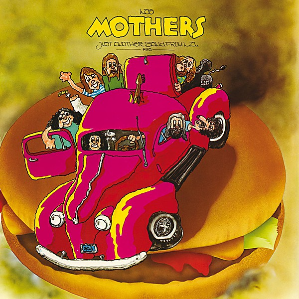

# Just Another Band From L.A

By **Frank Zappa**

## Album Data

- **Catalog:** Beets
- **Format:** Digital, Album
- **Album:** Just Another Band From L.A
- **Artist:** Frank Zappa
- **Albumartist:** Frank Zappa
- **Genre:** Progressive Rock
- **MusicBrainz Album Artist ID:** 
- **MusicBrainz Album ID:** 
- **MusicBrainz Release Group ID:** 
- **Year:** 0000
- **Catalog #:** 
- **Label:** Frank Zappa Catalog
- **Total Tracks:** 19

## Album Tracks

### Track 01 - The Central Scrutinizer

- **Artist:** Frank Zappa
- **Format:** MP3
- **Genre:** Progressive Rock
- **Length:** 3:28
- **MusicBrainz Track ID:** [b9bf271e-d783-4e4c-8f8b-7078d96232a1](https://musicbrainz.org/recording/b9bf271e-d783-4e4c-8f8b-7078d96232a1)
- **Title:** The Central Scrutinizer
- **Track:** 01
- **Year:** 2012

### Track 02 - Joe’s Garage

- **Artist:** Frank Zappa
- **Format:** MP3
- **Genre:** Progressive Rock
- **Length:** 6:09
- **MusicBrainz Track ID:** [f7b9d931-79ef-4f74-a701-3ee5c28ccb4c](https://musicbrainz.org/recording/f7b9d931-79ef-4f74-a701-3ee5c28ccb4c)
- **Title:** Joe’s Garage
- **Track:** 02
- **Year:** 2012

### Track 03 - Catholic Girls

- **Artist:** Frank Zappa
- **Format:** MP3
- **Genre:** Psychedelic Rock
- **Length:** 4:19
- **MusicBrainz Track ID:** [a5fe1655-f5a4-4a77-b7c6-d2c83bc8b415](https://musicbrainz.org/recording/a5fe1655-f5a4-4a77-b7c6-d2c83bc8b415)
- **Title:** Catholic Girls
- **Track:** 03
- **Year:** 2012

### Track 04 - Crew Slut

- **Artist:** Frank Zappa
- **Format:** MP3
- **Genre:** Progressive Rock
- **Length:** 6:40
- **MusicBrainz Track ID:** [0db0b080-a617-41d9-9b1f-0b6b47e04eb9](https://musicbrainz.org/recording/0db0b080-a617-41d9-9b1f-0b6b47e04eb9)
- **Title:** Crew Slut
- **Track:** 04
- **Year:** 2012

### Track 05 - Fembot in a Wet T‐Shirt

- **Artist:** Frank Zappa
- **Format:** MP3
- **Genre:** Progressive Rock
- **Length:** 4:44
- **MusicBrainz Track ID:** [5b54ba85-a5e3-440a-b81c-5c95e7352fd4](https://musicbrainz.org/recording/5b54ba85-a5e3-440a-b81c-5c95e7352fd4)
- **Title:** Fembot in a Wet T‐Shirt
- **Track:** 05
- **Year:** 2012

### Track 06 - On the Bus

- **Artist:** Frank Zappa
- **Format:** MP3
- **Genre:** Progressive Rock
- **Length:** 4:30
- **MusicBrainz Track ID:** [be6fc387-997d-477d-b51c-a60d9b24d07d](https://musicbrainz.org/recording/be6fc387-997d-477d-b51c-a60d9b24d07d)
- **Title:** On the Bus
- **Track:** 06
- **Year:** 2012

### Track 07 - Why Does It Hurt When I Pee?

- **Artist:** Frank Zappa
- **Format:** MP3
- **Genre:** Progressive Rock
- **Length:** 2:22
- **MusicBrainz Track ID:** [134387bb-6b38-4435-93b4-db5ed5dbdd25](https://musicbrainz.org/recording/134387bb-6b38-4435-93b4-db5ed5dbdd25)
- **Title:** Why Does It Hurt When I Pee?
- **Track:** 07
- **Year:** 2012

### Track 08 - Lucille Has Messed My Mind Up

- **Artist:** Frank Zappa
- **Format:** MP3
- **Genre:** Progressive Rock
- **Length:** 5:42
- **MusicBrainz Track ID:** [ce8651e7-2459-4f26-b560-d581fd81f930](https://musicbrainz.org/recording/ce8651e7-2459-4f26-b560-d581fd81f930)
- **Title:** Lucille Has Messed My Mind Up
- **Track:** 08
- **Year:** 2012

### Track 09 - Scrutinizer Postlude

- **Artist:** Frank Zappa
- **Format:** MP3
- **Genre:** Progressive Rock
- **Length:** 1:35
- **MusicBrainz Track ID:** [30507086-9f80-4e5a-a417-46decce73e1a](https://musicbrainz.org/recording/30507086-9f80-4e5a-a417-46decce73e1a)
- **Title:** Scrutinizer Postlude
- **Track:** 09
- **Year:** 2012

### Track 10 - A Token of My Extreme

- **Artist:** Frank Zappa
- **Format:** MP3
- **Genre:** Progressive Rock
- **Length:** 5:28
- **MusicBrainz Track ID:** [f5aa05df-3c1e-42ad-ad3e-9241eb8d9d54](https://musicbrainz.org/recording/f5aa05df-3c1e-42ad-ad3e-9241eb8d9d54)
- **Title:** A Token of My Extreme
- **Track:** 10
- **Year:** 2012

### Track 11 - Stick It Out

- **Artist:** Frank Zappa
- **Format:** MP3
- **Genre:** Progressive Rock
- **Length:** 4:33
- **MusicBrainz Track ID:** [5c8dc711-b5fe-495f-b429-152e9087f7ec](https://musicbrainz.org/recording/5c8dc711-b5fe-495f-b429-152e9087f7ec)
- **Title:** Stick It Out
- **Track:** 11
- **Year:** 2012

### Track 12 - Sy Borg

- **Artist:** Frank Zappa
- **Format:** MP3
- **Genre:** Progressive Rock
- **Length:** 8:54
- **MusicBrainz Track ID:** [b40b121d-ba85-4e41-b123-fa687662e8d5](https://musicbrainz.org/recording/b40b121d-ba85-4e41-b123-fa687662e8d5)
- **Title:** Sy Borg
- **Track:** 12
- **Year:** 2012

### Track 13 - Dong Work for Yuda

- **Artist:** Frank Zappa
- **Format:** MP3
- **Genre:** Progressive Rock
- **Length:** 5:03
- **MusicBrainz Track ID:** [a69f2d5e-c8e9-4922-8af1-8f7c5f72ee76](https://musicbrainz.org/recording/a69f2d5e-c8e9-4922-8af1-8f7c5f72ee76)
- **Title:** Dong Work for Yuda
- **Track:** 13
- **Year:** 2012

### Track 14 - Keep It Greasey

- **Artist:** Frank Zappa
- **Format:** MP3
- **Genre:** Progressive Rock
- **Length:** 8:20
- **MusicBrainz Track ID:** [c51cd593-545e-439e-8d72-93fc642cf9c6](https://musicbrainz.org/recording/c51cd593-545e-439e-8d72-93fc642cf9c6)
- **Title:** Keep It Greasey
- **Track:** 14
- **Year:** 2012

### Track 15 - Outside Now

- **Artist:** Frank Zappa
- **Format:** MP3
- **Genre:** Progressive Rock
- **Length:** 5:52
- **MusicBrainz Track ID:** [379d376f-847a-4530-80de-8bc893fa2e6c](https://musicbrainz.org/recording/379d376f-847a-4530-80de-8bc893fa2e6c)
- **Title:** Outside Now
- **Track:** 15
- **Year:** 2012

### Track 16 - He Used to Cut the Grass

- **Artist:** Frank Zappa
- **Format:** MP3
- **Genre:** Progressive Rock
- **Length:** 8:34
- **MusicBrainz Track ID:** [e30a251a-8264-406d-810e-cfbdb95a1535](https://musicbrainz.org/recording/e30a251a-8264-406d-810e-cfbdb95a1535)
- **Title:** He Used to Cut the Grass
- **Track:** 16
- **Year:** 2012

### Track 17 - Packard Goose

- **Artist:** Frank Zappa
- **Format:** MP3
- **Genre:** Progressive Rock
- **Length:** 11:34
- **MusicBrainz Track ID:** [48e9dafa-2b42-4790-b860-2edcd74c6bc8](https://musicbrainz.org/recording/48e9dafa-2b42-4790-b860-2edcd74c6bc8)
- **Title:** Packard Goose
- **Track:** 17
- **Year:** 2012

### Track 18 - Watermelon in Easter Hay

- **Artist:** Frank Zappa
- **Format:** MP3
- **Genre:** Progressive Rock
- **Length:** 9:07
- **MusicBrainz Track ID:** [e9a7290e-3c8a-4757-88e7-23cca5ee5af8](https://musicbrainz.org/recording/e9a7290e-3c8a-4757-88e7-23cca5ee5af8)
- **Title:** Watermelon in Easter Hay
- **Track:** 18
- **Year:** 2012

### Track 19 - A Little Green Rosetta

- **Artist:** Frank Zappa
- **Format:** MP3
- **Genre:** Humor
- **Length:** 8:16
- **MusicBrainz Track ID:** [bf85a821-3c58-462a-af9e-84be8ae801c7](https://musicbrainz.org/recording/bf85a821-3c58-462a-af9e-84be8ae801c7)
- **Title:** A Little Green Rosetta
- **Track:** 19
- **Year:** 2012

## See also

- [Joe’s Garage](Joe’s_Garage.md)
- [Strictly Commercial](Strictly_Commercial.md)
- [We're Only in It for the Money](Were_Only_in_It_for_the_Money.md)
- [You Are What You Is](You_Are_What_You_Is.md)
- [CD: ](../../CD/Frank_Zappa/Frank_Zappa.md)
- [CD: Strictly Commercial](../../CD/Frank_Zappa/Strictly_Commercial_-_The_Best_Of_Frank_Zappa.md)
- [Roon: Absolutely Free](../../Roon/Frank_Zappa/Absolutely_Free.md)
- [Roon: Apostrophe(')](../../Roon/Frank_Zappa/Apostrophe.md)
- [Roon: Bongo Fury (Live)](../../Roon/Frank_Zappa/Bongo_Fury_Live.md)
- [Roon: Fillmore East - June 1971](../../Roon/Frank_Zappa/Fillmore_East_-_June_1971.md)
- [Roon: Hot Rats](../../Roon/Frank_Zappa/Hot_Rats.md)
- [Roon: Jazz From Hell](../../Roon/Frank_Zappa/Jazz_From_Hell.md)
- [Roon: Joe's Garage Acts I, II & III](../../Roon/Frank_Zappa/Joes_Garage_Acts_I__II_and_III.md)
- [Roon: Just Another Band From L.A. (Live)](../../Roon/Frank_Zappa/Just_Another_Band_From_LA_Live.md)
- [Roon: One Size Fits All](../../Roon/Frank_Zappa/One_Size_Fits_All.md)
- [Roon: Orchestral Favorites (40th Anniversary)](../../Roon/Frank_Zappa/Orchestral_Favorites_40th_Anniversary.md)
- [Roon: Over-Nite Sensation](../../Roon/Frank_Zappa/Over-Nite_Sensation.md)
- [Roon: Sheik Yerbouti](../../Roon/Frank_Zappa/Sheik_Yerbouti.md)
- [Roon: Shut Up 'n Play Yer Guitar](../../Roon/Frank_Zappa/Shut_Up_n_Play_Yer_Guitar.md)
- [Roon: Weasels Ripped My Flesh](../../Roon/Frank_Zappa/Weasels_Ripped_My_Flesh.md)
- [Roon: We're Only In It For The Money](../../Roon/Frank_Zappa/Were_Only_In_It_For_The_Money.md)
- [Vinyl: ](../../Vinyl/Frank_Zappa/Frank_Zappa.md)
- [Vinyl: I Don't Wanna Get Drafted!](../../Vinyl/Frank_Zappa/I_Dont_Wanna_Get_Drafted!.md)
- [Vinyl: "Joe's Garage Acts 1, 2 & 3"](../../Vinyl/Frank_Zappa/Joes_Garage_Acts_1__2_and_3.md)
