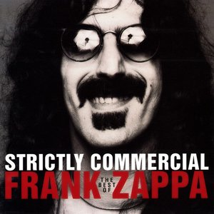

# Strictly Commercial

By **Frank Zappa**

## Album Data

- **Catalog:** Beets
- **Format:** Digital, Album
- **Album:** Strictly Commercial
- **Artist:** Frank Zappa
- **Albumartist:** Frank Zappa
- **Genre:** Progressive Rock
- **MusicBrainz Album Artist ID:** [e20747e7-55a4-452e-8766-7b985585082d](https://musicbrainz.org/artist/e20747e7-55a4-452e-8766-7b985585082d)
- **MusicBrainz Album ID:** [f4d5fc4b-2cd9-48ab-97fb-f9400924ab6b](https://musicbrainz.org/release/f4d5fc4b-2cd9-48ab-97fb-f9400924ab6b)
- **MusicBrainz Release Group ID:** [f3b3542a-8dbf-3a55-98ab-45e2e184c886](https://musicbrainz.org/release-group/f3b3542a-8dbf-3a55-98ab-45e2e184c886)
- **Year:** 1995
- **Catalog #:** RCD 40582/3
- **Label:** Rykodisc
- **Total Tracks:** 19

## Album Tracks

### Track 01 - Are You Hung Up?

- **Artist:** Frank Zappa
- **Format:** MP3
- **Genre:** Progressive Rock
- **Length:** 1:25
- **MusicBrainz Track ID:** [8b3dc1a3-417c-403c-b3ac-f54df1ba8dc9](https://musicbrainz.org/recording/8b3dc1a3-417c-403c-b3ac-f54df1ba8dc9)
- **Title:** Are You Hung Up?
- **Track:** 01
- **Year:** 1995

### Track 02 - Who Needs the Peace Corps?

- **Artist:** Frank Zappa
- **Format:** MP3
- **Genre:** Psychedelic Rock
- **Length:** 2:34
- **MusicBrainz Track ID:** [27085f9a-30d3-4dd9-a7f1-819921f7ca83](https://musicbrainz.org/recording/27085f9a-30d3-4dd9-a7f1-819921f7ca83)
- **Title:** Who Needs the Peace Corps?
- **Track:** 02
- **Year:** 1995

### Track 03 - Concentration Moon

- **Artist:** Frank Zappa
- **Format:** MP3
- **Genre:** Psychedelic Rock
- **Length:** 2:22
- **MusicBrainz Track ID:** [24a3e861-1509-45ce-b192-7102c95ebc4f](https://musicbrainz.org/recording/24a3e861-1509-45ce-b192-7102c95ebc4f)
- **Title:** Concentration Moon
- **Track:** 03
- **Year:** 1995

### Track 04 - Mom & Dad

- **Artist:** Frank Zappa
- **Format:** MP3
- **Genre:** Psychedelic Rock
- **Length:** 2:16
- **MusicBrainz Track ID:** [22cc6110-1983-419b-97ea-35cccae25cd8](https://musicbrainz.org/recording/22cc6110-1983-419b-97ea-35cccae25cd8)
- **Title:** Mom & Dad
- **Track:** 04
- **Year:** 1995

### Track 05 - Telephone Conversation

- **Artist:** Frank Zappa
- **Format:** MP3
- **Genre:** Psychedelic Rock
- **Length:** 0:48
- **MusicBrainz Track ID:** [d97581c7-a21f-4c22-ad08-b2f5a59a74f7](https://musicbrainz.org/recording/d97581c7-a21f-4c22-ad08-b2f5a59a74f7)
- **Title:** Telephone Conversation
- **Track:** 05
- **Year:** 1995

### Track 06 - Bow Tie Daddy

- **Artist:** Frank Zappa
- **Format:** MP3
- **Genre:** Progressive Rock
- **Length:** 0:33
- **MusicBrainz Track ID:** [252d3fe9-574e-49bf-bc20-272a528211f4](https://musicbrainz.org/recording/252d3fe9-574e-49bf-bc20-272a528211f4)
- **Title:** Bow Tie Daddy
- **Track:** 06
- **Year:** 1995

### Track 07 - Harry, You’re a Beast

- **Artist:** Frank Zappa
- **Format:** MP3
- **Genre:** Psychedelic Rock
- **Length:** 1:21
- **MusicBrainz Track ID:** [625904dc-3917-4cfa-a7f5-ef79b4df674c](https://musicbrainz.org/recording/625904dc-3917-4cfa-a7f5-ef79b4df674c)
- **Title:** Harry, You’re a Beast
- **Track:** 07
- **Year:** 1995

### Track 08 - What’s the Ugliest Part of Your Body?

- **Artist:** Frank Zappa
- **Format:** MP3
- **Genre:** Psychedelic Rock
- **Length:** 1:03
- **MusicBrainz Track ID:** [4ef636da-14ec-466c-9fee-9346be2860d0](https://musicbrainz.org/recording/4ef636da-14ec-466c-9fee-9346be2860d0)
- **Title:** What’s the Ugliest Part of Your Body?
- **Track:** 08
- **Year:** 1995

### Track 09 - Absolutely Free

- **Artist:** Frank Zappa
- **Format:** MP3
- **Genre:** Progressive Rock
- **Length:** 3:24
- **MusicBrainz Track ID:** [d93c8230-a0b1-4343-8a2a-816400c4462a](https://musicbrainz.org/recording/d93c8230-a0b1-4343-8a2a-816400c4462a)
- **Title:** Absolutely Free
- **Track:** 09
- **Year:** 1995

### Track 10 - Flower Punk

- **Artist:** Frank Zappa
- **Format:** MP3
- **Genre:** Psychedelic Rock
- **Length:** 3:03
- **MusicBrainz Track ID:** [067cf0f3-c390-4053-87bb-4c1ec4243d8b](https://musicbrainz.org/recording/067cf0f3-c390-4053-87bb-4c1ec4243d8b)
- **Title:** Flower Punk
- **Track:** 10
- **Year:** 1995

### Track 11 - Hot Poop

- **Artist:** Frank Zappa
- **Format:** MP3
- **Genre:** Experimental Rock
- **Length:** 0:26
- **MusicBrainz Track ID:** [3d5259a2-54b5-40bd-9cd6-a39f732e1d35](https://musicbrainz.org/recording/3d5259a2-54b5-40bd-9cd6-a39f732e1d35)
- **Title:** Hot Poop
- **Track:** 11
- **Year:** 1995

### Track 12 - Nasal Retentive Calliope Music

- **Artist:** Frank Zappa
- **Format:** MP3
- **Genre:** Psychedelic Rock
- **Length:** 2:02
- **MusicBrainz Track ID:** [13964664-04db-45e6-a3f6-33f6d8dd4977](https://musicbrainz.org/recording/13964664-04db-45e6-a3f6-33f6d8dd4977)
- **Title:** Nasal Retentive Calliope Music
- **Track:** 12
- **Year:** 1995

### Track 13 - Let’s Make the Water Turn Black

- **Artist:** Frank Zappa
- **Format:** MP3
- **Genre:** Progressive Rock
- **Length:** 2:01
- **MusicBrainz Track ID:** [0c38ea09-0124-4202-8e00-20fba62771ed](https://musicbrainz.org/recording/0c38ea09-0124-4202-8e00-20fba62771ed)
- **Title:** Let’s Make the Water Turn Black
- **Track:** 13
- **Year:** 1995

### Track 14 - The Idiot Bastard Son

- **Artist:** Frank Zappa
- **Format:** MP3
- **Genre:** Son
- **Length:** 3:18
- **MusicBrainz Track ID:** [f90d2a48-090c-4350-b842-f5a3987b0993](https://musicbrainz.org/recording/f90d2a48-090c-4350-b842-f5a3987b0993)
- **Title:** The Idiot Bastard Son
- **Track:** 14
- **Year:** 1995

### Track 15 - Lonely Little Girl

- **Artist:** Frank Zappa
- **Format:** MP3
- **Genre:** Psychedelic Rock
- **Length:** 1:09
- **MusicBrainz Track ID:** [c653d2b5-ef0e-4dd7-9def-a58f03f055c0](https://musicbrainz.org/recording/c653d2b5-ef0e-4dd7-9def-a58f03f055c0)
- **Title:** Lonely Little Girl
- **Track:** 15
- **Year:** 1995

### Track 16 - Take Your Clothes Off When You Dance

- **Artist:** Frank Zappa
- **Format:** MP3
- **Genre:** Psychedelic Rock
- **Length:** 1:32
- **MusicBrainz Track ID:** [2cad51fe-2849-45d8-9495-71ec82189b00](https://musicbrainz.org/recording/2cad51fe-2849-45d8-9495-71ec82189b00)
- **Title:** Take Your Clothes Off When You Dance
- **Track:** 16
- **Year:** 1995

### Track 17 - What’s the Ugliest Part of Your Body? (reprise)

- **Artist:** Frank Zappa
- **Format:** MP3
- **Genre:** Psychedelic Rock
- **Length:** 0:58
- **MusicBrainz Track ID:** [b2e4ec06-1884-43a2-8fd2-ee979d289dd5](https://musicbrainz.org/recording/b2e4ec06-1884-43a2-8fd2-ee979d289dd5)
- **Title:** What’s the Ugliest Part of Your Body? (reprise)
- **Track:** 17
- **Year:** 1995

### Track 18 - Mother People

- **Artist:** Frank Zappa
- **Format:** MP3
- **Genre:** Psychedelic Rock
- **Length:** 2:32
- **MusicBrainz Track ID:** [ab543b06-3a4f-4bfb-9648-0e218d79406f](https://musicbrainz.org/recording/ab543b06-3a4f-4bfb-9648-0e218d79406f)
- **Title:** Mother People
- **Track:** 18
- **Year:** 1995

### Track 19 - The Chrome Plated Megaphone of Destiny

- **Artist:** Frank Zappa
- **Format:** MP3
- **Genre:** Psychedelic Rock
- **Length:** 6:24
- **MusicBrainz Track ID:** [88d90600-0037-4dfc-9f2d-f99488e2d122](https://musicbrainz.org/recording/88d90600-0037-4dfc-9f2d-f99488e2d122)
- **Title:** The Chrome Plated Megaphone of Destiny
- **Track:** 19
- **Year:** 1995

## See also

- [Joe’s Garage](Joe’s_Garage.md)
- [Just Another Band From L.A](Just_Another_Band_From_LA.md)
- [We're Only in It for the Money](Were_Only_in_It_for_the_Money.md)
- [You Are What You Is](You_Are_What_You_Is.md)
- [CD: ](../../CD/Frank_Zappa/Frank_Zappa.md)
- [CD: Strictly Commercial](../../CD/Frank_Zappa/Strictly_Commercial_-_The_Best_Of_Frank_Zappa.md)
- [Roon: Absolutely Free](../../Roon/Frank_Zappa/Absolutely_Free.md)
- [Roon: Apostrophe(')](../../Roon/Frank_Zappa/Apostrophe.md)
- [Roon: Bongo Fury (Live)](../../Roon/Frank_Zappa/Bongo_Fury_Live.md)
- [Roon: Fillmore East - June 1971](../../Roon/Frank_Zappa/Fillmore_East_-_June_1971.md)
- [Roon: Hot Rats](../../Roon/Frank_Zappa/Hot_Rats.md)
- [Roon: Jazz From Hell](../../Roon/Frank_Zappa/Jazz_From_Hell.md)
- [Roon: Joe's Garage Acts I, II & III](../../Roon/Frank_Zappa/Joes_Garage_Acts_I__II_and_III.md)
- [Roon: Just Another Band From L.A. (Live)](../../Roon/Frank_Zappa/Just_Another_Band_From_LA_Live.md)
- [Roon: One Size Fits All](../../Roon/Frank_Zappa/One_Size_Fits_All.md)
- [Roon: Orchestral Favorites (40th Anniversary)](../../Roon/Frank_Zappa/Orchestral_Favorites_40th_Anniversary.md)
- [Roon: Over-Nite Sensation](../../Roon/Frank_Zappa/Over-Nite_Sensation.md)
- [Roon: Sheik Yerbouti](../../Roon/Frank_Zappa/Sheik_Yerbouti.md)
- [Roon: Shut Up 'n Play Yer Guitar](../../Roon/Frank_Zappa/Shut_Up_n_Play_Yer_Guitar.md)
- [Roon: Weasels Ripped My Flesh](../../Roon/Frank_Zappa/Weasels_Ripped_My_Flesh.md)
- [Roon: We're Only In It For The Money](../../Roon/Frank_Zappa/Were_Only_In_It_For_The_Money.md)
- [Vinyl: ](../../Vinyl/Frank_Zappa/Frank_Zappa.md)
- [Vinyl: I Don't Wanna Get Drafted!](../../Vinyl/Frank_Zappa/I_Dont_Wanna_Get_Drafted!.md)
- [Vinyl: "Joe's Garage Acts 1, 2 & 3"](../../Vinyl/Frank_Zappa/Joes_Garage_Acts_1__2_and_3.md)
