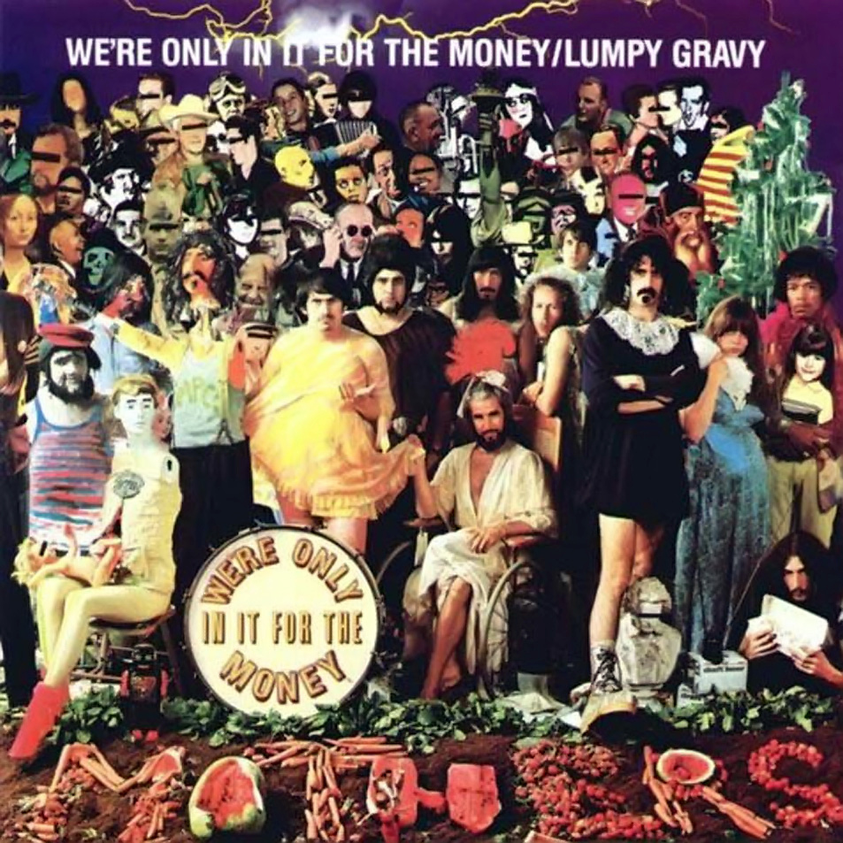

# We're Only in It for the Money

By **Frank Zappa**

## Album Data

- **Catalog:** Beets
- **Format:** Digital, Album
- **Album:** We're Only in It for the Money
- **Artist:** Frank Zappa
- **Albumartist:** Frank Zappa
- **Genre:** Psychedelic Rock
- **MusicBrainz Album Artist ID:** [e20747e7-55a4-452e-8766-7b985585082d](https://musicbrainz.org/artist/e20747e7-55a4-452e-8766-7b985585082d)
- **MusicBrainz Album ID:** [899b9fbb-f495-4b90-9d31-98750ef03192](https://musicbrainz.org/release/899b9fbb-f495-4b90-9d31-98750ef03192)
- **MusicBrainz Release Group ID:** [6bf4d078-7bc6-32a1-8edf-0ef1bcb7a5df](https://musicbrainz.org/release-group/6bf4d078-7bc6-32a1-8edf-0ef1bcb7a5df)
- **Year:** 1995
- **Catalog #:** RCD 10536
- **Label:** Rykodisc
- **Total Tracks:** 20

## Album Tracks

### Track 01 - Teen‐Age Wind

- **Artist:** Frank Zappa
- **Format:** AAC
- **Genre:** Progressive Rock
- **Length:** 3:07
- **MusicBrainz Track ID:** [dba5016e-dd4a-480b-815f-4d080035b399](https://musicbrainz.org/recording/dba5016e-dd4a-480b-815f-4d080035b399)
- **Title:** Teen‐Age Wind
- **Track:** 01
- **Year:** 1998

### Track 02 - Harder Than Your Husband

- **Artist:** Frank Zappa
- **Format:** AAC
- **Genre:** Progressive Rock
- **Length:** 2:32
- **MusicBrainz Track ID:** [6bc5333b-3164-4c5f-bb62-e776d9ff3c4a](https://musicbrainz.org/recording/6bc5333b-3164-4c5f-bb62-e776d9ff3c4a)
- **Title:** Harder Than Your Husband
- **Track:** 02
- **Year:** 1998

### Track 03 - Doreen

- **Artist:** Frank Zappa
- **Format:** AAC
- **Genre:** Progressive Rock
- **Length:** 4:47
- **MusicBrainz Track ID:** [63d5840e-0c9f-4489-a0cd-1419c08c0839](https://musicbrainz.org/recording/63d5840e-0c9f-4489-a0cd-1419c08c0839)
- **Title:** Doreen
- **Track:** 03
- **Year:** 1998

### Track 04 - Goblin Girl

- **Artist:** Frank Zappa
- **Format:** AAC
- **Genre:** Progressive Rock
- **Length:** 4:14
- **MusicBrainz Track ID:** [09cd9646-b7c0-406a-a5b6-dd9c1410fb41](https://musicbrainz.org/recording/09cd9646-b7c0-406a-a5b6-dd9c1410fb41)
- **Title:** Goblin Girl
- **Track:** 04
- **Year:** 1998

### Track 05 - Theme From the 3rd Movement of Sinister Footwear

- **Artist:** Frank Zappa
- **Format:** AAC
- **Genre:** Progressive Rock
- **Length:** 3:41
- **MusicBrainz Track ID:** [975996a0-245a-400b-97f0-d3312a20e1d2](https://musicbrainz.org/recording/975996a0-245a-400b-97f0-d3312a20e1d2)
- **Title:** Theme From the 3rd Movement of Sinister Footwear
- **Track:** 05
- **Year:** 1998

### Track 06 - Society Pages

- **Artist:** Frank Zappa
- **Format:** AAC
- **Genre:** Progressive Rock
- **Length:** 2:32
- **MusicBrainz Track ID:** [acd22c54-04f2-45b0-9c92-02b7e209c0af](https://musicbrainz.org/recording/acd22c54-04f2-45b0-9c92-02b7e209c0af)
- **Title:** Society Pages
- **Track:** 06
- **Year:** 1998

### Track 07 - I’m a Beautiful Guy

- **Artist:** Frank Zappa
- **Format:** AAC
- **Genre:** Progressive Rock
- **Length:** 1:58
- **MusicBrainz Track ID:** [683b1f7d-ddd8-4c0f-a8d9-566c832ab9d4](https://musicbrainz.org/recording/683b1f7d-ddd8-4c0f-a8d9-566c832ab9d4)
- **Title:** I’m a Beautiful Guy
- **Track:** 07
- **Year:** 1998

### Track 08 - Beauty Knows No Pain

- **Artist:** Frank Zappa
- **Format:** AAC
- **Genre:** Progressive Rock
- **Length:** 3:05
- **MusicBrainz Track ID:** [a70a30e1-ca02-4b82-bf63-aff8f346197a](https://musicbrainz.org/recording/a70a30e1-ca02-4b82-bf63-aff8f346197a)
- **Title:** Beauty Knows No Pain
- **Track:** 08
- **Year:** 1998

### Track 09 - Charlie’s Enormous Mouth

- **Artist:** Frank Zappa
- **Format:** AAC
- **Genre:** Progressive Rock
- **Length:** 3:41
- **MusicBrainz Track ID:** [6de6e795-3f9c-4e66-af83-c236b16e804a](https://musicbrainz.org/recording/6de6e795-3f9c-4e66-af83-c236b16e804a)
- **Title:** Charlie’s Enormous Mouth
- **Track:** 09
- **Year:** 1998

### Track 10 - Any Downers?

- **Artist:** Frank Zappa
- **Format:** AAC
- **Genre:** Psychedelic Rock
- **Length:** 2:11
- **MusicBrainz Track ID:** [dc73f56a-7f5f-41a6-a5a0-21c75b8c025c](https://musicbrainz.org/recording/dc73f56a-7f5f-41a6-a5a0-21c75b8c025c)
- **Title:** Any Downers?
- **Track:** 10
- **Year:** 1998

### Track 11 - Conehead

- **Artist:** Frank Zappa
- **Format:** AAC
- **Genre:** Progressive Rock
- **Length:** 4:21
- **MusicBrainz Track ID:** [35323c11-ff98-4917-871e-5e5cb2a8e5b9](https://musicbrainz.org/recording/35323c11-ff98-4917-871e-5e5cb2a8e5b9)
- **Title:** Conehead
- **Track:** 11
- **Year:** 1998

### Track 12 - You Are What You Is

- **Artist:** Frank Zappa
- **Format:** AAC
- **Genre:** Ska
- **Length:** 4:31
- **MusicBrainz Track ID:** [c8e6c8c8-e5d0-4314-afdd-82325e9e4073](https://musicbrainz.org/recording/c8e6c8c8-e5d0-4314-afdd-82325e9e4073)
- **Title:** You Are What You Is
- **Track:** 12
- **Year:** 1998

### Track 13 - Mudd Club

- **Artist:** Frank Zappa
- **Format:** AAC
- **Genre:** Progressive Rock
- **Length:** 3:28
- **MusicBrainz Track ID:** [8c5b0e40-0a4f-4abc-ae33-0341d7e500f3](https://musicbrainz.org/recording/8c5b0e40-0a4f-4abc-ae33-0341d7e500f3)
- **Title:** Mudd Club
- **Track:** 13
- **Year:** 1998

### Track 14 - The Meek Shall Inherit Nothing

- **Artist:** Frank Zappa
- **Format:** AAC
- **Genre:** Psychedelic Rock
- **Length:** 3:01
- **MusicBrainz Track ID:** [7991bbc2-6793-4bf1-b3ee-5dfcf5391d60](https://musicbrainz.org/recording/7991bbc2-6793-4bf1-b3ee-5dfcf5391d60)
- **Title:** The Meek Shall Inherit Nothing
- **Track:** 14
- **Year:** 1998

### Track 15 - Dumb All Over

- **Artist:** Frank Zappa
- **Format:** AAC
- **Genre:** Progressive Rock
- **Length:** 5:50
- **MusicBrainz Track ID:** [5633f64c-9336-4d67-8458-275f1aa1cc73](https://musicbrainz.org/recording/5633f64c-9336-4d67-8458-275f1aa1cc73)
- **Title:** Dumb All Over
- **Track:** 15
- **Year:** 1998

### Track 16 - Heavenly Bank Account

- **Artist:** Frank Zappa
- **Format:** AAC
- **Genre:** Progressive Rock
- **Length:** 4:10
- **MusicBrainz Track ID:** [e6874729-81b6-4641-bed3-db7bc136fd5f](https://musicbrainz.org/recording/e6874729-81b6-4641-bed3-db7bc136fd5f)
- **Title:** Heavenly Bank Account
- **Track:** 16
- **Year:** 1998

### Track 17 - Suicide Chump

- **Artist:** Frank Zappa
- **Format:** AAC
- **Genre:** Progressive Rock
- **Length:** 2:53
- **MusicBrainz Track ID:** [7308ddee-bba8-45f1-aeca-51d4a6dcd6dc](https://musicbrainz.org/recording/7308ddee-bba8-45f1-aeca-51d4a6dcd6dc)
- **Title:** Suicide Chump
- **Track:** 17
- **Year:** 1998

### Track 18 - Jumbo Go Away

- **Artist:** Frank Zappa
- **Format:** AAC
- **Genre:** Progressive Rock
- **Length:** 3:47
- **MusicBrainz Track ID:** [22fc00ac-82aa-4241-ade7-304874399a96](https://musicbrainz.org/recording/22fc00ac-82aa-4241-ade7-304874399a96)
- **Title:** Jumbo Go Away
- **Track:** 18
- **Year:** 1998

### Track 19 - If Only She Woulda

- **Artist:** Frank Zappa
- **Format:** AAC
- **Genre:** Progressive Rock
- **Length:** 3:52
- **MusicBrainz Track ID:** [684d8f3f-5112-4020-903c-c1179f512b07](https://musicbrainz.org/recording/684d8f3f-5112-4020-903c-c1179f512b07)
- **Title:** If Only She Woulda
- **Track:** 19
- **Year:** 1998

### Track 20 - Drafted Again

- **Artist:** Frank Zappa
- **Format:** AAC
- **Genre:** Progressive Rock
- **Length:** 3:10
- **MusicBrainz Track ID:** [b4fab99c-5903-4ced-88a2-a27603c25717](https://musicbrainz.org/recording/b4fab99c-5903-4ced-88a2-a27603c25717)
- **Title:** Drafted Again
- **Track:** 20
- **Year:** 1998

## See also

- [Joe’s Garage](Joe’s_Garage.md)
- [Just Another Band From L.A](Just_Another_Band_From_LA.md)
- [Strictly Commercial](Strictly_Commercial.md)
- [You Are What You Is](You_Are_What_You_Is.md)
- [CD: ](../../CD/Frank_Zappa/Frank_Zappa.md)
- [CD: Strictly Commercial](../../CD/Frank_Zappa/Strictly_Commercial_-_The_Best_Of_Frank_Zappa.md)
- [Roon: Absolutely Free](../../Roon/Frank_Zappa/Absolutely_Free.md)
- [Roon: Apostrophe(')](../../Roon/Frank_Zappa/Apostrophe.md)
- [Roon: Bongo Fury (Live)](../../Roon/Frank_Zappa/Bongo_Fury_Live.md)
- [Roon: Fillmore East - June 1971](../../Roon/Frank_Zappa/Fillmore_East_-_June_1971.md)
- [Roon: Hot Rats](../../Roon/Frank_Zappa/Hot_Rats.md)
- [Roon: Jazz From Hell](../../Roon/Frank_Zappa/Jazz_From_Hell.md)
- [Roon: Joe's Garage Acts I, II & III](../../Roon/Frank_Zappa/Joes_Garage_Acts_I__II_and_III.md)
- [Roon: Just Another Band From L.A. (Live)](../../Roon/Frank_Zappa/Just_Another_Band_From_LA_Live.md)
- [Roon: One Size Fits All](../../Roon/Frank_Zappa/One_Size_Fits_All.md)
- [Roon: Orchestral Favorites (40th Anniversary)](../../Roon/Frank_Zappa/Orchestral_Favorites_40th_Anniversary.md)
- [Roon: Over-Nite Sensation](../../Roon/Frank_Zappa/Over-Nite_Sensation.md)
- [Roon: Sheik Yerbouti](../../Roon/Frank_Zappa/Sheik_Yerbouti.md)
- [Roon: Shut Up 'n Play Yer Guitar](../../Roon/Frank_Zappa/Shut_Up_n_Play_Yer_Guitar.md)
- [Roon: Weasels Ripped My Flesh](../../Roon/Frank_Zappa/Weasels_Ripped_My_Flesh.md)
- [Roon: We're Only In It For The Money](../../Roon/Frank_Zappa/Were_Only_In_It_For_The_Money.md)
- [Vinyl: ](../../Vinyl/Frank_Zappa/Frank_Zappa.md)
- [Vinyl: I Don't Wanna Get Drafted!](../../Vinyl/Frank_Zappa/I_Dont_Wanna_Get_Drafted!.md)
- [Vinyl: "Joe's Garage Acts 1, 2 & 3"](../../Vinyl/Frank_Zappa/Joes_Garage_Acts_1__2_and_3.md)
