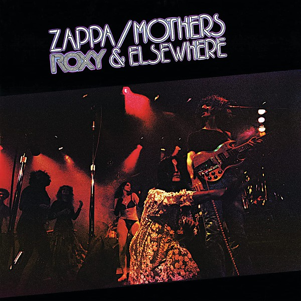

# Roxy The Movie

By **Frank Zappa & The Mothers**

## Album Data

- **Catalog:** Beets
- **Format:** Digital, Album
- **Album:** Roxy The Movie
- **Artist:** Frank Zappa & The Mothers
- **Albumartist:** Frank Zappa & The Mothers
- **Genre:** Progressive Rock
- **MusicBrainz Album Artist ID:** 
- **MusicBrainz Album ID:** 
- **MusicBrainz Release Group ID:** 
- **Year:** 2015
- **Catalog #:** 
- **Label:** 
- **Total Tracks:** 11

## Album Tracks

### Track 01 - "Something terrible has happened..." (Live) (Live)

- **Artist:** Frank Zappa & The Mothers
- **Format:** ALAC
- **Genre:** Progressive Rock
- **Length:** 1:19
- **MusicBrainz Track ID:** 
- **Title:** "Something terrible has happened..." (Live) (Live)
- **Track:** 01
- **Year:** 2015

### Track 02 - Cosmik Debris (Live) (Live)

- **Artist:** Frank Zappa & The Mothers
- **Format:** ALAC
- **Genre:** Progressive Rock
- **Length:** 9:54
- **MusicBrainz Track ID:** 
- **Title:** Cosmik Debris (Live) (Live)
- **Track:** 02
- **Year:** 2015

### Track 03 - Penguin In Bondage (Live) (Live)

- **Artist:** Frank Zappa & The Mothers
- **Format:** ALAC
- **Genre:** Progressive Rock
- **Length:** 8:22
- **MusicBrainz Track ID:** 
- **Title:** Penguin In Bondage (Live) (Live)
- **Track:** 03
- **Year:** 2015

### Track 04 - T'Mershi Duween (Live) (Live)

- **Artist:** Frank Zappa & The Mothers
- **Format:** ALAC
- **Genre:** Progressive Rock
- **Length:** 1:56
- **MusicBrainz Track ID:** 
- **Title:** T'Mershi Duween (Live) (Live)
- **Track:** 04
- **Year:** 2015

### Track 05 - Dog / Meat (Live) (Live)

- **Artist:** Frank Zappa & The Mothers
- **Format:** ALAC
- **Genre:** Progressive Rock
- **Length:** 4:14
- **MusicBrainz Track ID:** 
- **Title:** Dog / Meat (Live) (Live)
- **Track:** 05
- **Year:** 2015

### Track 06 - RDNZL (Live) (Live)

- **Artist:** Frank Zappa & The Mothers
- **Format:** ALAC
- **Genre:** Progressive Rock
- **Length:** 4:51
- **MusicBrainz Track ID:** 
- **Title:** RDNZL (Live) (Live)
- **Track:** 06
- **Year:** 2015

### Track 07 - Echidna's Arf (Of You) (Live) (Live)

- **Artist:** Frank Zappa & The Mothers
- **Format:** ALAC
- **Genre:** Progressive Rock
- **Length:** 3:54
- **MusicBrainz Track ID:** 
- **Title:** Echidna's Arf (Of You) (Live) (Live)
- **Track:** 07
- **Year:** 2015

### Track 08 - Don't You Ever Wash That Thing? (Live) (Live)

- **Artist:** Frank Zappa & The Mothers
- **Format:** ALAC
- **Genre:** Progressive Rock
- **Length:** 7:02
- **MusicBrainz Track ID:** 
- **Title:** Don't You Ever Wash That Thing? (Live) (Live)
- **Track:** 08
- **Year:** 2015

### Track 09 - Cheepnis - Percussion (Live) (Live)

- **Artist:** Frank Zappa & The Mothers
- **Format:** ALAC
- **Genre:** Progressive Rock
- **Length:** 4:08
- **MusicBrainz Track ID:** 
- **Title:** Cheepnis - Percussion (Live) (Live)
- **Track:** 09
- **Year:** 2015

### Track 10 - Cheepnis (Live) (Live)

- **Artist:** Frank Zappa & The Mothers
- **Format:** ALAC
- **Genre:** Progressive Rock
- **Length:** 5:40
- **MusicBrainz Track ID:** 
- **Title:** Cheepnis (Live) (Live)
- **Track:** 10
- **Year:** 2015

### Track 11 - Be-Bop Tango (Of The Old Jazzmen's Church) (Live) (Live)

- **Artist:** Frank Zappa & The Mothers
- **Format:** ALAC
- **Genre:** Progressive Rock
- **Length:** 17:32
- **MusicBrainz Track ID:** 
- **Title:** Be-Bop Tango (Of The Old Jazzmen's Church) (Live) (Live)
- **Track:** 11
- **Year:** 2015

