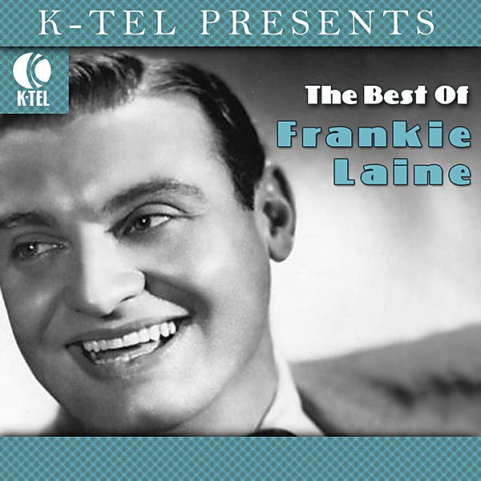

# Best of Frankie Laine

By **Frankie Laine**

## Album Data

- **Catalog:** Beets
- **Format:** Digital, Album
- **Album:** Best of Frankie Laine
- **Artist:** Frankie Laine
- **Albumartist:** Frankie Laine
- **Genre:** Jazz
- **MusicBrainz Album Artist ID:** 
- **MusicBrainz Album ID:** 
- **MusicBrainz Release Group ID:** 
- **Year:** 2000
- **Catalog #:** 
- **Label:** 
- **Total Tracks:** 00

## Album Tracks

### Track 06 - Mule Train

- **Artist:** Frankie Laine
- **Format:** AAC
- **Genre:** Pop
- **Length:** 2:37
- **MusicBrainz Track ID:** 
- **Title:** Mule Train
- **Track:** 06
- **Year:** 2000

## See also

- [Vinyl: ](../../Vinyl/Frankie_Laine/Frankie_Laine.md)
- [Vinyl: I'll Take Care Of Your Cares](../../Vinyl/Frankie_Laine/Ill_Take_Care_Of_Your_Cares.md)
