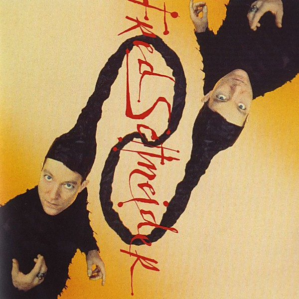

# Fred Schneider & The Shake Society

By **Fred Schneider**

## Album Data

- **Catalog:** Beets
- **Format:** Digital, Album
- **Album:** Fred Schneider & The Shake Society
- **Artist:** Fred Schneider
- **Albumartist:** Fred Schneider
- **Genre:** Synthpop
- **MusicBrainz Album Artist ID:** [43bcca8b-9edc-4997-8343-122350e790bf](https://musicbrainz.org/artist/43bcca8b-9edc-4997-8343-122350e790bf)
- **MusicBrainz Album ID:** [62d1c4ef-fc00-37af-8df7-485f6a31fcc4](https://musicbrainz.org/release/62d1c4ef-fc00-37af-8df7-485f6a31fcc4)
- **MusicBrainz Release Group ID:** [0ef97d52-3f00-31bf-8413-f83ccb362675](https://musicbrainz.org/release-group/0ef97d52-3f00-31bf-8413-f83ccb362675)
- **Year:** 1984
- **Catalog #:** 1-25158
- **Label:** Warner Bros. Records
- **Total Tracks:** 09

## Album Tracks

### Track 01 - Monster

- **Artist:** Fred Schneider
- **Format:** MP3
- **Genre:** Post-Punk
- **Length:** 3:55
- **MusicBrainz Track ID:** [05df1765-62c0-4977-8959-bea4465e7e93](https://musicbrainz.org/recording/05df1765-62c0-4977-8959-bea4465e7e93)
- **Title:** Monster
- **Track:** 01
- **Year:** 1984

### Track 02 - Cut the Concrete

- **Artist:** Fred Schneider
- **Format:** MP3
- **Genre:** Synthpop
- **Length:** 3:59
- **MusicBrainz Track ID:** [1a97da55-54be-42d2-99f8-5c0d125c61bc](https://musicbrainz.org/recording/1a97da55-54be-42d2-99f8-5c0d125c61bc)
- **Title:** Cut the Concrete
- **Track:** 02
- **Year:** 1984

### Track 03 - Summer in Hell

- **Artist:** Fred Schneider
- **Format:** MP3
- **Genre:** Synthpop
- **Length:** 4:20
- **MusicBrainz Track ID:** [b45cbc7b-abc2-43eb-a58a-65dfd15da1b4](https://musicbrainz.org/recording/b45cbc7b-abc2-43eb-a58a-65dfd15da1b4)
- **Title:** Summer in Hell
- **Track:** 03
- **Year:** 1984

### Track 04 - Orbit

- **Artist:** Fred Schneider
- **Format:** MP3
- **Genre:** Synthpop
- **Length:** 4:28
- **MusicBrainz Track ID:** [cfee0e3d-994f-4a85-a954-98c3e8f3d265](https://musicbrainz.org/recording/cfee0e3d-994f-4a85-a954-98c3e8f3d265)
- **Title:** Orbit
- **Track:** 04
- **Year:** 1984

### Track 05 - I’m Gonna Haunt You

- **Artist:** Fred Schneider
- **Format:** MP3
- **Genre:** Synthpop
- **Length:** 3:54
- **MusicBrainz Track ID:** [9607bc4c-8072-4d9e-93a5-ea52f32f9b8c](https://musicbrainz.org/recording/9607bc4c-8072-4d9e-93a5-ea52f32f9b8c)
- **Title:** I’m Gonna Haunt You
- **Track:** 05
- **Year:** 1984

### Track 06 - It’s Time to Kiss

- **Artist:** Fred Schneider
- **Format:** MP3
- **Genre:** Synthpop
- **Length:** 5:49
- **MusicBrainz Track ID:** [b02c5b3c-c085-4516-ab33-04492a434f95](https://musicbrainz.org/recording/b02c5b3c-c085-4516-ab33-04492a434f95)
- **Title:** It’s Time to Kiss
- **Track:** 06
- **Year:** 1984

### Track 07 - This Planet’s a Mess

- **Artist:** Fred Schneider
- **Format:** MP3
- **Genre:** Synthpop
- **Length:** 4:11
- **MusicBrainz Track ID:** [a1563c16-77c5-4f0a-b151-63cfdfbf25e8](https://musicbrainz.org/recording/a1563c16-77c5-4f0a-b151-63cfdfbf25e8)
- **Title:** This Planet’s a Mess
- **Track:** 07
- **Year:** 1984

### Track 08 - Wave

- **Artist:** Fred Schneider
- **Format:** MP3
- **Genre:** Synthpop
- **Length:** 4:30
- **MusicBrainz Track ID:** [983b876a-c940-4d93-a7e4-ea76c14eeccf](https://musicbrainz.org/recording/983b876a-c940-4d93-a7e4-ea76c14eeccf)
- **Title:** Wave
- **Track:** 08
- **Year:** 1984

### Track 09 - Boonga (The New Jersey Caveman)

- **Artist:** Fred Schneider
- **Format:** MP3
- **Genre:** Synthpop
- **Length:** 4:26
- **MusicBrainz Track ID:** [ff445f2e-b4c3-43ac-88aa-482d4bd136af](https://musicbrainz.org/recording/ff445f2e-b4c3-43ac-88aa-482d4bd136af)
- **Title:** Boonga (The New Jersey Caveman)
- **Track:** 09
- **Year:** 1984

