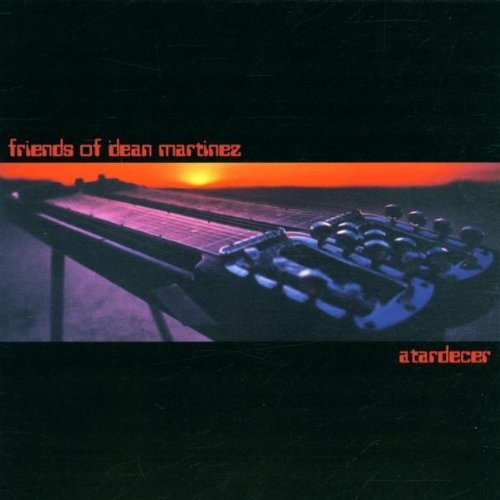

# Atardecer

By **Friends of Dean Martinez**

## Album Data

- **Catalog:** Beets
- **Format:** Digital, Album
- **Album:** Atardecer
- **Artist:** Friends Of Dean Martinez
- **Albumartist:** Friends of Dean Martinez
- **Genre:** Post-Rock
- **MusicBrainz Album Artist ID:** [51573fd2-0b3e-4434-9d8c-cf58ffad7fd7](https://musicbrainz.org/artist/51573fd2-0b3e-4434-9d8c-cf58ffad7fd7)
- **MusicBrainz Album ID:** [6f561caa-55a7-4975-9f2e-29fdc59ff280](https://musicbrainz.org/release/6f561caa-55a7-4975-9f2e-29fdc59ff280)
- **MusicBrainz Release Group ID:** [7a553708-8a28-395f-b0ee-187f63941404](https://musicbrainz.org/release-group/7a553708-8a28-395f-b0ee-187f63941404)
- **Year:** 1999
- **Catalog #:** KFR-234
- **Label:** Knitting Factory Records
- **Total Tracks:** 11

## Album Tracks

### Track 01 - Quickening

- **Artist:** Friends of Dean Martinez
- **Format:** ALAC
- **Genre:** Post-Rock
- **Length:** 1:33
- **MusicBrainz Track ID:** [58f62d9e-da89-464e-9388-a2935e697525](https://musicbrainz.org/recording/58f62d9e-da89-464e-9388-a2935e697525)
- **Title:** Quickening
- **Track:** 01
- **Year:** 1999

### Track 02 - Ethchlorvynol

- **Artist:** Friends of Dean Martinez
- **Format:** ALAC
- **Genre:** Rock And Roll
- **Length:** 2:15
- **MusicBrainz Track ID:** [0e8c633d-a6d8-40c8-a2ac-5f0334404485](https://musicbrainz.org/recording/0e8c633d-a6d8-40c8-a2ac-5f0334404485)
- **Title:** Ethchlorvynol
- **Track:** 02
- **Year:** 1999

### Track 03 - La Fin De L'Été

- **Artist:** Friends of Dean Martinez
- **Format:** ALAC
- **Genre:** Post-Rock
- **Length:** 3:06
- **MusicBrainz Track ID:** [ecd1fbf5-2030-4a56-8abc-b81dcb09dc5a](https://musicbrainz.org/recording/ecd1fbf5-2030-4a56-8abc-b81dcb09dc5a)
- **Title:** La Fin De L'Été
- **Track:** 03
- **Year:** 1999

### Track 04 - Otra Vez

- **Artist:** Friends of Dean Martinez
- **Format:** ALAC
- **Genre:** Post-Rock
- **Length:** 3:02
- **MusicBrainz Track ID:** [a31ccaa0-397f-4500-a7c1-32e2ec7686da](https://musicbrainz.org/recording/a31ccaa0-397f-4500-a7c1-32e2ec7686da)
- **Title:** Otra Vez
- **Track:** 04
- **Year:** 1999

### Track 05 - Inner Sanctum

- **Artist:** Friends of Dean Martinez
- **Format:** ALAC
- **Genre:** Post-Rock
- **Length:** 4:34
- **MusicBrainz Track ID:** [5aee47d1-3046-43e4-8fb0-f44610d280b3](https://musicbrainz.org/recording/5aee47d1-3046-43e4-8fb0-f44610d280b3)
- **Title:** Inner Sanctum
- **Track:** 05
- **Year:** 1999

### Track 06 - Casa Mila

- **Artist:** Friends of Dean Martinez
- **Format:** ALAC
- **Genre:** Post-Rock
- **Length:** 3:57
- **MusicBrainz Track ID:** [1232a8e6-51ce-4a90-9730-966aa994afeb](https://musicbrainz.org/recording/1232a8e6-51ce-4a90-9730-966aa994afeb)
- **Title:** Casa Mila
- **Track:** 06
- **Year:** 1999

### Track 07 - Atardecer

- **Artist:** Friends of Dean Martinez
- **Format:** ALAC
- **Genre:** Post-Rock
- **Length:** 3:29
- **MusicBrainz Track ID:** [2481bf9e-a324-43a2-a3d4-ad8a9cc0c7e8](https://musicbrainz.org/recording/2481bf9e-a324-43a2-a3d4-ad8a9cc0c7e8)
- **Title:** Atardecer
- **Track:** 07
- **Year:** 1999

### Track 08 - Twilight Sleep

- **Artist:** Friends of Dean Martinez
- **Format:** ALAC
- **Genre:** Post-Rock
- **Length:** 5:24
- **MusicBrainz Track ID:** [fdbd7c42-c5fe-4031-80a7-0fe51ba2bca1](https://musicbrainz.org/recording/fdbd7c42-c5fe-4031-80a7-0fe51ba2bca1)
- **Title:** Twilight Sleep
- **Track:** 08
- **Year:** 1999

### Track 09 - Contact

- **Artist:** Friends of Dean Martinez
- **Format:** ALAC
- **Genre:** Post-Rock
- **Length:** 3:21
- **MusicBrainz Track ID:** [191d9518-05b1-4afe-893d-a0a94a66b2e9](https://musicbrainz.org/recording/191d9518-05b1-4afe-893d-a0a94a66b2e9)
- **Title:** Contact
- **Track:** 09
- **Year:** 1999

### Track 10 - Spoonie (Dark Side of the Spoon)

- **Artist:** Friends of Dean Martinez
- **Format:** ALAC
- **Genre:** Post-Rock
- **Length:** 5:24
- **MusicBrainz Track ID:** [af3bf9c1-f362-4e74-8558-6625add26e95](https://musicbrainz.org/recording/af3bf9c1-f362-4e74-8558-6625add26e95)
- **Title:** Spoonie (Dark Side of the Spoon)
- **Track:** 10
- **Year:** 1999

### Track 11 - Coppertone

- **Artist:** Friends of Dean Martinez
- **Format:** ALAC
- **Genre:** Post-Rock
- **Length:** 2:04
- **MusicBrainz Track ID:** [9669929a-11dc-4795-8e65-3762ccfb573d](https://musicbrainz.org/recording/9669929a-11dc-4795-8e65-3762ccfb573d)
- **Title:** Coppertone
- **Track:** 11
- **Year:** 1999

