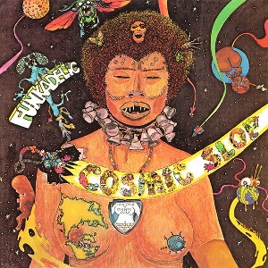

# Cosmic Slop

By **Funkadelic**

## Album Data

- **Catalog:** Beets
- **Format:** Digital, Album
- **Album:** Cosmic Slop
- **Artist:** Funkadelic
- **Albumartist:** Funkadelic
- **Genre:** Soul
- **MusicBrainz Album Artist ID:** [cf042013-3edd-46c4-9b0e-a62faac98d0b](https://musicbrainz.org/artist/cf042013-3edd-46c4-9b0e-a62faac98d0b)
- **MusicBrainz Album ID:** [478512a3-434b-410b-baa4-a2623fd17a6e](https://musicbrainz.org/release/478512a3-434b-410b-baa4-a2623fd17a6e)
- **MusicBrainz Release Group ID:** [3337c981-c416-3513-a02b-6d6065b9316b](https://musicbrainz.org/release-group/3337c981-c416-3513-a02b-6d6065b9316b)
- **Year:** 2005
- **Catalog #:** WBCD-772000
- **Label:** Westbound Records
- **Total Tracks:** 14

## Album Tracks

### Track 01 - Mommy, What's a Funkadelic?

- **Artist:** Funkadelic
- **Format:** MP3
- **Genre:** Funk
- **Length:** 9:06
- **MusicBrainz Track ID:** [497b9a7d-2e9c-4250-ae69-770aa4d5d074](https://musicbrainz.org/recording/497b9a7d-2e9c-4250-ae69-770aa4d5d074)
- **Title:** Mommy, What's a Funkadelic?
- **Track:** 01
- **Year:** 2005

### Track 02 - I'll Bet You

- **Artist:** Funkadelic
- **Format:** MP3
- **Genre:** P-Funk
- **Length:** 6:13
- **MusicBrainz Track ID:** [8ac4fa26-3017-4633-8b33-8285d962b997](https://musicbrainz.org/recording/8ac4fa26-3017-4633-8b33-8285d962b997)
- **Title:** I'll Bet You
- **Track:** 02
- **Year:** 2005

### Track 03 - Music for My Mother

- **Artist:** Funkadelic
- **Format:** MP3
- **Genre:** P-Funk
- **Length:** 5:39
- **MusicBrainz Track ID:** [7eef2fee-c62f-414f-b427-8f179a0e00e9](https://musicbrainz.org/recording/7eef2fee-c62f-414f-b427-8f179a0e00e9)
- **Title:** Music for My Mother
- **Track:** 03
- **Year:** 2005

### Track 04 - I Got a Thing, You Got a Thing, Everybody's Got a Thing

- **Artist:** Funkadelic
- **Format:** MP3
- **Genre:** P-Funk
- **Length:** 3:56
- **MusicBrainz Track ID:** [be4a95ad-e107-419e-a3cc-660c9095aa93](https://musicbrainz.org/recording/be4a95ad-e107-419e-a3cc-660c9095aa93)
- **Title:** I Got a Thing, You Got a Thing, Everybody's Got a Thing
- **Track:** 04
- **Year:** 2005

### Track 05 - Good Old Music

- **Artist:** Funkadelic
- **Format:** MP3
- **Genre:** P-Funk
- **Length:** 8:06
- **MusicBrainz Track ID:** [32078be9-c1e1-48dd-9e96-a721106d853a](https://musicbrainz.org/recording/32078be9-c1e1-48dd-9e96-a721106d853a)
- **Title:** Good Old Music
- **Track:** 05
- **Year:** 2005

### Track 06 - Qualify and Satisfy

- **Artist:** Funkadelic
- **Format:** MP3
- **Genre:** P-Funk
- **Length:** 6:21
- **MusicBrainz Track ID:** [bc95f970-066d-4ad2-94a3-718376175dd3](https://musicbrainz.org/recording/bc95f970-066d-4ad2-94a3-718376175dd3)
- **Title:** Qualify and Satisfy
- **Track:** 06
- **Year:** 2005

### Track 07 - What Is Soul

- **Artist:** Funkadelic
- **Format:** MP3
- **Genre:** P-Funk
- **Length:** 7:43
- **MusicBrainz Track ID:** [a724cb4e-ef34-4ab3-ad62-d1c394e82a01](https://musicbrainz.org/recording/a724cb4e-ef34-4ab3-ad62-d1c394e82a01)
- **Title:** What Is Soul
- **Track:** 07
- **Year:** 2005

### Track 08 - Can't Shake It Loose (1969)

- **Artist:** Funkadelic
- **Format:** MP3
- **Genre:** P-Funk
- **Length:** 2:24
- **MusicBrainz Track ID:** [058e86bd-fb4d-43c9-8b50-eec9925f904c](https://musicbrainz.org/recording/058e86bd-fb4d-43c9-8b50-eec9925f904c)
- **Title:** Can't Shake It Loose (1969)
- **Track:** 08
- **Year:** 2005

### Track 09 - I'll Bet You (1969)

- **Artist:** Funkadelic
- **Format:** MP3
- **Genre:** Soul
- **Length:** 4:13
- **MusicBrainz Track ID:** [c652e9a3-3433-4377-94f3-2b80bb8d6d86](https://musicbrainz.org/recording/c652e9a3-3433-4377-94f3-2b80bb8d6d86)
- **Title:** I'll Bet You (1969)
- **Track:** 09
- **Year:** 2005

### Track 10 - Music for My Mother (1969)

- **Artist:** Funkadelic
- **Format:** MP3
- **Genre:** Soul
- **Length:** 5:20
- **MusicBrainz Track ID:** [64faf79a-ff6a-4c37-8f1d-ddb12abc89cc](https://musicbrainz.org/recording/64faf79a-ff6a-4c37-8f1d-ddb12abc89cc)
- **Title:** Music for My Mother (1969)
- **Track:** 10
- **Year:** 2005

### Track 11 - As Good as I Can Feel (1969)

- **Artist:** Funkadelic
- **Format:** MP3
- **Genre:** P-Funk
- **Length:** 2:34
- **MusicBrainz Track ID:** [f852955a-be9b-4664-bcf9-1f7c1614b548](https://musicbrainz.org/recording/f852955a-be9b-4664-bcf9-1f7c1614b548)
- **Title:** As Good as I Can Feel (1969)
- **Track:** 11
- **Year:** 2005

### Track 12 - Open Our Eyes (1969)

- **Artist:** Funkadelic
- **Format:** MP3
- **Genre:** Soul
- **Length:** 4:01
- **MusicBrainz Track ID:** [aa2b158b-2424-411f-aaea-c84033825ff1](https://musicbrainz.org/recording/aa2b158b-2424-411f-aaea-c84033825ff1)
- **Title:** Open Our Eyes (1969)
- **Track:** 12
- **Year:** 2005

### Track 13 - Qualify and Satisfy (45 version)

- **Artist:** Funkadelic
- **Format:** MP3
- **Genre:** Soul
- **Length:** 3:02
- **MusicBrainz Track ID:** [c4cd1e32-40a8-4c64-98a2-44030f4fe85e](https://musicbrainz.org/recording/c4cd1e32-40a8-4c64-98a2-44030f4fe85e)
- **Title:** Qualify and Satisfy (45 version)
- **Track:** 13
- **Year:** 2005

### Track 14 - Music for My Mother (instrumental 45 version)

- **Artist:** Funkadelic
- **Format:** MP3
- **Genre:** Soul
- **Length:** 6:12
- **MusicBrainz Track ID:** [3884d59b-b775-441f-a9cd-74667bc52137](https://musicbrainz.org/recording/3884d59b-b775-441f-a9cd-74667bc52137)
- **Title:** Music for My Mother (instrumental 45 version)
- **Track:** 14
- **Year:** 2005

## See also

- [Funkadelic](Funkadelic.md)
- [Hardcore Jollies](Hardcore_Jollies.md)
- [Maggot Brain](Maggot_Brain.md)
- [Roon: Funkadelic](../../Roon/Funkadelic/Funkadelic.md)
- [Roon: Maggot Brain](../../Roon/Funkadelic/Maggot_Brain.md)
- [Vinyl: ](../../Vinyl/Funkadelic/Funkadelic.md)
- [Vinyl: Maggot Brain](../../Vinyl/Funkadelic/Maggot_Brain.md)
