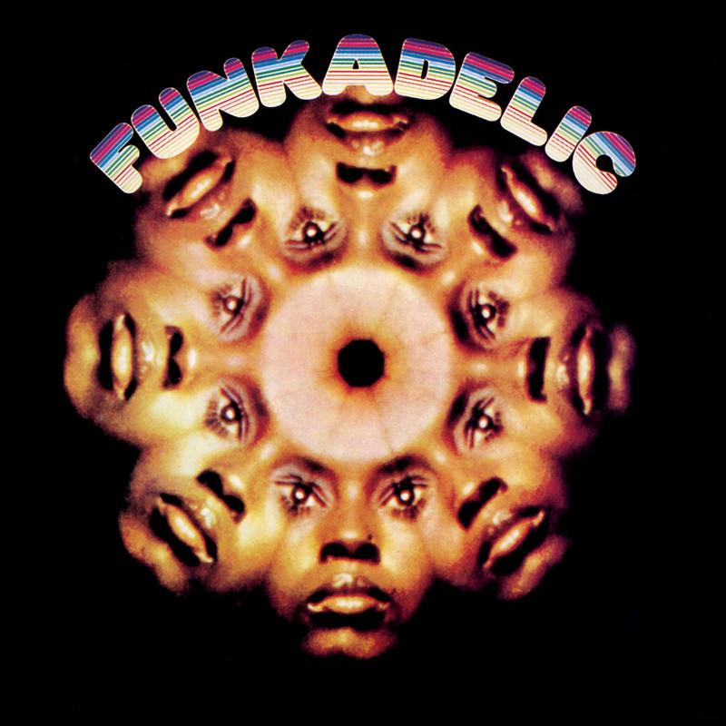

# Funkadelic

By **Funkadelic**

## Album Data

- **Catalog:** Beets
- **Format:** Digital, Album
- **Album:** Funkadelic
- **Artist:** Funkadelic
- **Albumartist:** Funkadelic
- **Genre:** Soul
- **MusicBrainz Album Artist ID:** [cf042013-3edd-46c4-9b0e-a62faac98d0b](https://musicbrainz.org/artist/cf042013-3edd-46c4-9b0e-a62faac98d0b)
- **MusicBrainz Album ID:** [c742783a-c41c-4803-95fc-7ce59bedac6a](https://musicbrainz.org/release/c742783a-c41c-4803-95fc-7ce59bedac6a)
- **MusicBrainz Release Group ID:** [ba6de9b7-828e-35d4-adc5-ea71bdab836b](https://musicbrainz.org/release-group/ba6de9b7-828e-35d4-adc5-ea71bdab836b)
- **Year:** 2005
- **Catalog #:** 72435-39377-2-0
- **Label:** Priority Records
- **Total Tracks:** 08

## Album Tracks

### Track 01 - Comin’ Round the Mountain

- **Artist:** Funkadelic
- **Format:** AAC
- **Genre:** P-Funk
- **Length:** 5:51
- **MusicBrainz Track ID:** [a738b6ff-4b7d-4540-8506-2490fb1b93fb](https://musicbrainz.org/recording/a738b6ff-4b7d-4540-8506-2490fb1b93fb)
- **Title:** Comin’ Round the Mountain
- **Track:** 01
- **Year:** 2002

### Track 02 - Smokey

- **Artist:** Funkadelic
- **Format:** AAC
- **Genre:** P-Funk
- **Length:** 6:08
- **MusicBrainz Track ID:** [0080aace-8464-42ad-b0e0-9cef55d0e9ff](https://musicbrainz.org/recording/0080aace-8464-42ad-b0e0-9cef55d0e9ff)
- **Title:** Smokey
- **Track:** 02
- **Year:** 2002

### Track 03 - If You Got Funk, You Got Style

- **Artist:** Funkadelic
- **Format:** AAC
- **Genre:** P-Funk
- **Length:** 3:05
- **MusicBrainz Track ID:** [015bbd0f-f86b-4337-8b27-bc70c6e69e3c](https://musicbrainz.org/recording/015bbd0f-f86b-4337-8b27-bc70c6e69e3c)
- **Title:** If You Got Funk, You Got Style
- **Track:** 03
- **Year:** 2002

### Track 04 - Hardcore Jollies

- **Artist:** Funkadelic
- **Format:** AAC
- **Genre:** P-Funk
- **Length:** 5:03
- **MusicBrainz Track ID:** [1806e55a-5716-4d9f-8748-e371f4dd29ab](https://musicbrainz.org/recording/1806e55a-5716-4d9f-8748-e371f4dd29ab)
- **Title:** Hardcore Jollies
- **Track:** 04
- **Year:** 2002

### Track 05 - Soul Mate

- **Artist:** Funkadelic
- **Format:** AAC
- **Genre:** P-Funk
- **Length:** 2:49
- **MusicBrainz Track ID:** [b1efa8d7-6659-4b81-9bee-f48e88fab393](https://musicbrainz.org/recording/b1efa8d7-6659-4b81-9bee-f48e88fab393)
- **Title:** Soul Mate
- **Track:** 05
- **Year:** 2002

### Track 07 - You Scared the Lovin’ Outta Me

- **Artist:** Funkadelic
- **Format:** AAC
- **Genre:** P-Funk
- **Length:** 6:22
- **MusicBrainz Track ID:** [ec3e4a2a-8380-4063-86a6-c4e175b66ba4](https://musicbrainz.org/recording/ec3e4a2a-8380-4063-86a6-c4e175b66ba4)
- **Title:** You Scared the Lovin’ Outta Me
- **Track:** 07
- **Year:** 2002

### Track 08 - Adolescent Funk

- **Artist:** Funkadelic
- **Format:** AAC
- **Genre:** P-Funk
- **Length:** 4:17
- **MusicBrainz Track ID:** [bf2b1b59-db86-4851-821b-affb1f62bbd7](https://musicbrainz.org/recording/bf2b1b59-db86-4851-821b-affb1f62bbd7)
- **Title:** Adolescent Funk
- **Track:** 08
- **Year:** 2002

## See also

- [Cosmic Slop](Cosmic_Slop.md)
- [Hardcore Jollies](Hardcore_Jollies.md)
- [Maggot Brain](Maggot_Brain.md)
- [Roon: Funkadelic](../../Roon/Funkadelic/Funkadelic.md)
- [Roon: Maggot Brain](../../Roon/Funkadelic/Maggot_Brain.md)
- [Vinyl: ](../../Vinyl/Funkadelic/Funkadelic.md)
- [Vinyl: Maggot Brain](../../Vinyl/Funkadelic/Maggot_Brain.md)
