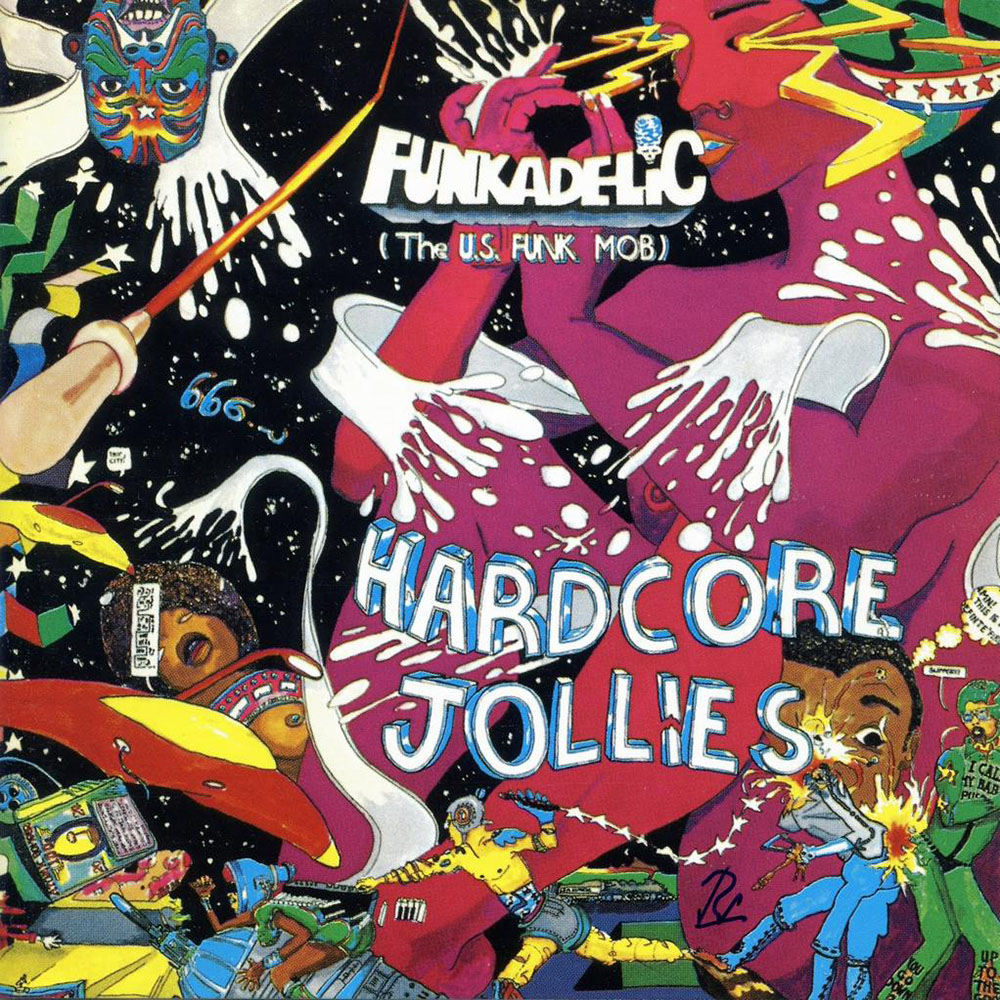

# Hardcore Jollies

By **Funkadelic**

## Album Data

- **Catalog:** Beets
- **Format:** Digital, Album
- **Album:** Hardcore Jollies
- **Artist:** Funkadelic
- **Albumartist:** Funkadelic
- **Genre:** P-Funk
- **MusicBrainz Album Artist ID:** [cf042013-3edd-46c4-9b0e-a62faac98d0b](https://musicbrainz.org/artist/cf042013-3edd-46c4-9b0e-a62faac98d0b)
- **MusicBrainz Album ID:** [bc6dd7e2-f27a-3d42-a0c9-54d50fc3bcad](https://musicbrainz.org/release/bc6dd7e2-f27a-3d42-a0c9-54d50fc3bcad)
- **MusicBrainz Release Group ID:** [022fea45-7d3e-3555-8f1d-6c81cfd6936c](https://musicbrainz.org/release-group/022fea45-7d3e-3555-8f1d-6c81cfd6936c)
- **Year:** 2002
- **Catalog #:** WBCD 772007
- **Label:** Westbound Records
- **Total Tracks:** 10

## Album Tracks

### Track 01 - Maggot Brain

- **Artist:** Funkadelic
- **Format:** ALAC
- **Genre:** P-Funk
- **Length:** 10:21
- **MusicBrainz Track ID:** [a8aa186d-21a8-44f3-a9a8-2a3d0f58e8c6](https://musicbrainz.org/recording/a8aa186d-21a8-44f3-a9a8-2a3d0f58e8c6)
- **Title:** Maggot Brain
- **Track:** 01
- **Year:** 2005

### Track 02 - Can You Get to That

- **Artist:** Funkadelic
- **Format:** ALAC
- **Genre:** P-Funk
- **Length:** 2:51
- **MusicBrainz Track ID:** [a493d71a-9f21-4a45-a4c9-67e4828045d7](https://musicbrainz.org/recording/a493d71a-9f21-4a45-a4c9-67e4828045d7)
- **Title:** Can You Get to That
- **Track:** 02
- **Year:** 2005

### Track 03 - Hit It and Quit It

- **Artist:** Funkadelic
- **Format:** ALAC
- **Genre:** P-Funk
- **Length:** 3:51
- **MusicBrainz Track ID:** [21679c29-7e7e-43a9-8d7a-703cffd67046](https://musicbrainz.org/recording/21679c29-7e7e-43a9-8d7a-703cffd67046)
- **Title:** Hit It and Quit It
- **Track:** 03
- **Year:** 2005

### Track 04 - You and Your Folks, Me and My Folks

- **Artist:** Funkadelic
- **Format:** ALAC
- **Genre:** P-Funk
- **Length:** 3:38
- **MusicBrainz Track ID:** [f7afef43-8db1-4d3b-b44b-2bfafaa4017d](https://musicbrainz.org/recording/f7afef43-8db1-4d3b-b44b-2bfafaa4017d)
- **Title:** You and Your Folks, Me and My Folks
- **Track:** 04
- **Year:** 2005

### Track 05 - Super Stupid

- **Artist:** Funkadelic
- **Format:** ALAC
- **Genre:** P-Funk
- **Length:** 4:01
- **MusicBrainz Track ID:** [2c6a9f38-f1db-44d6-803d-e4be4a452519](https://musicbrainz.org/recording/2c6a9f38-f1db-44d6-803d-e4be4a452519)
- **Title:** Super Stupid
- **Track:** 05
- **Year:** 2005

### Track 06 - Back in Our Minds

- **Artist:** Funkadelic
- **Format:** ALAC
- **Genre:** P-Funk
- **Length:** 2:40
- **MusicBrainz Track ID:** [f958dea6-61cb-45d1-8cea-6e8623383bfc](https://musicbrainz.org/recording/f958dea6-61cb-45d1-8cea-6e8623383bfc)
- **Title:** Back in Our Minds
- **Track:** 06
- **Year:** 2005

### Track 07 - Wars of Armageddon

- **Artist:** Funkadelic
- **Format:** ALAC
- **Genre:** P-Funk
- **Length:** 9:47
- **MusicBrainz Track ID:** [e59d1457-74e3-4ad3-be3d-1646e02500e8](https://musicbrainz.org/recording/e59d1457-74e3-4ad3-be3d-1646e02500e8)
- **Title:** Wars of Armageddon
- **Track:** 07
- **Year:** 2005

### Track 08 - Whole Lot of BS

- **Artist:** Funkadelic
- **Format:** ALAC
- **Genre:** P-Funk
- **Length:** 2:13
- **MusicBrainz Track ID:** [2d49f70d-8024-4985-93a2-a142337421aa](https://musicbrainz.org/recording/2d49f70d-8024-4985-93a2-a142337421aa)
- **Title:** Whole Lot of BS
- **Track:** 08
- **Year:** 2005

### Track 10 - Maggot Brain (alternate mix)

- **Artist:** Funkadelic
- **Format:** ALAC
- **Genre:** P-Funk
- **Length:** 9:35
- **MusicBrainz Track ID:** [41f8b830-de76-41da-ae6a-4e6854cf722f](https://musicbrainz.org/recording/41f8b830-de76-41da-ae6a-4e6854cf722f)
- **Title:** Maggot Brain (alternate mix)
- **Track:** 10
- **Year:** 2005

### Track 09 - I Miss My Baby

- **Artist:** U.S. Music With Funkadelic
- **Format:** ALAC
- **Genre:** P-Funk
- **Length:** 5:05
- **MusicBrainz Track ID:** [d35c282c-ae1d-4369-b884-4d1934283ee5](https://musicbrainz.org/recording/d35c282c-ae1d-4369-b884-4d1934283ee5)
- **Title:** I Miss My Baby
- **Track:** 09
- **Year:** 2005

## See also

- [Cosmic Slop](Cosmic_Slop.md)
- [Funkadelic](Funkadelic.md)
- [Maggot Brain](Maggot_Brain.md)
- [Roon: Funkadelic](../../Roon/Funkadelic/Funkadelic.md)
- [Roon: Maggot Brain](../../Roon/Funkadelic/Maggot_Brain.md)
- [Vinyl: ](../../Vinyl/Funkadelic/Funkadelic.md)
- [Vinyl: Maggot Brain](../../Vinyl/Funkadelic/Maggot_Brain.md)
