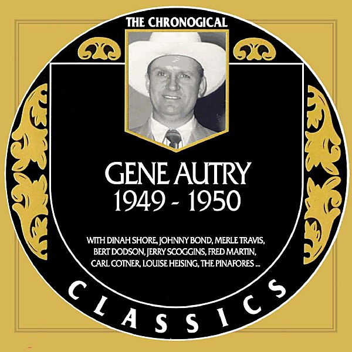

# 1950

By **Gene Autry**

## Album Data

- **Catalog:** Beets
- **Format:** Digital, Album
- **Album:** 1950
- **Artist:** Gene Autry
- **Albumartist:** Gene Autry
- **Genre:** Classic Country
- **MusicBrainz Album Artist ID:** 
- **MusicBrainz Album ID:** 
- **MusicBrainz Release Group ID:** 
- **Year:** 1950
- **Catalog #:** 
- **Label:** 
- **Total Tracks:** 00

## Album Tracks

### Track 00 - Rudolph The Red Nosed Reindeer

- **Artist:** Gene Autry
- **Format:** AAC
- **Genre:** Classic Country
- **Length:** 3:07
- **MusicBrainz Track ID:** 
- **Title:** Rudolph The Red Nosed Reindeer
- **Track:** 00
- **Year:** 1950

