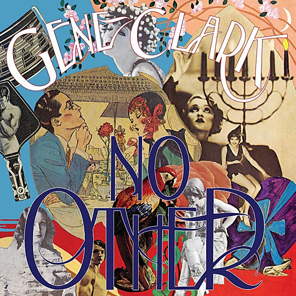

# No Other

By **Gene Clark**

## Album Data

- **Catalog:** Beets
- **Format:** Digital, Album
- **Album:** No Other
- **Artist:** Gene Clark
- **Albumartist:** Gene Clark
- **Genre:** Soul
- **MusicBrainz Album Artist ID:** [2b6f3780-6fb6-42c2-95bb-5e080772e38c](https://musicbrainz.org/artist/2b6f3780-6fb6-42c2-95bb-5e080772e38c)
- **MusicBrainz Album ID:** [28c03324-af63-4582-8b83-c60d497591e4](https://musicbrainz.org/release/28c03324-af63-4582-8b83-c60d497591e4)
- **MusicBrainz Release Group ID:** [1a8984d7-503a-3a06-b02c-dad5e01b0d10](https://musicbrainz.org/release-group/1a8984d7-503a-3a06-b02c-dad5e01b0d10)
- **Year:** 1989
- **Catalog #:** 
- **Label:** 
- **Total Tracks:** 21

## Album Tracks

### Track 01 - Life's Greatest Fool

- **Artist:** Gene Clark
- **Format:** ALAC
- **Genre:** Psychedelic Rock
- **Length:** 4:11
- **MusicBrainz Track ID:** 
- **Title:** Life's Greatest Fool
- **Track:** 01
- **Year:** 0000

### Track 02 - The True One

- **Artist:** Gene Clark
- **Format:** ALAC
- **Genre:** Country Rock
- **Length:** 3:16
- **MusicBrainz Track ID:** 
- **Title:** The True One
- **Track:** 02
- **Year:** 0000

### Track 03 - The Radio Song

- **Artist:** Gene Clark
- **Format:** ALAC
- **Genre:** Americana
- **Length:** 4:00
- **MusicBrainz Track ID:** 
- **Title:** The Radio Song
- **Track:** 03
- **Year:** 0000

### Track 04 - No Other

- **Artist:** Gene Clark
- **Format:** ALAC
- **Genre:** Country Rock
- **Length:** 3:21
- **MusicBrainz Track ID:** 
- **Title:** No Other
- **Track:** 04
- **Year:** 0000

### Track 05 - Silver Raven

- **Artist:** Gene Clark
- **Format:** ALAC
- **Genre:** Folk Rock
- **Length:** 5:25
- **MusicBrainz Track ID:** 
- **Title:** Silver Raven
- **Track:** 05
- **Year:** 0000

### Track 06 - In The Pines

- **Artist:** Gene Clark
- **Format:** ALAC
- **Genre:** Folk Rock
- **Length:** 3:47
- **MusicBrainz Track ID:** 
- **Title:** In The Pines
- **Track:** 06
- **Year:** 0000

### Track 07 - Hear The Wind

- **Artist:** Gene Clark
- **Format:** ALAC
- **Genre:** Rock
- **Length:** 4:28
- **MusicBrainz Track ID:** 
- **Title:** Hear The Wind
- **Track:** 07
- **Year:** 0000

### Track 08 - I'll Feel A Whole Lot Better

- **Artist:** Gene Clark
- **Format:** ALAC
- **Genre:** Folk Rock
- **Length:** 3:04
- **MusicBrainz Track ID:** 
- **Title:** I'll Feel A Whole Lot Better
- **Track:** 08
- **Year:** 0000

### Track 09 - I'll Be Back

- **Artist:** Gene Clark
- **Format:** ALAC
- **Genre:** Folk Rock
- **Length:** 3:28
- **MusicBrainz Track ID:** 
- **Title:** I'll Be Back
- **Track:** 09
- **Year:** 0000

### Track 10 - She Darked The Sun

- **Artist:** Gene Clark
- **Format:** ALAC
- **Genre:** Folk Rock
- **Length:** 3:28
- **MusicBrainz Track ID:** 
- **Title:** She Darked The Sun
- **Track:** 10
- **Year:** 0000

### Track 11 - Kansas City Southern

- **Artist:** Gene Clark
- **Format:** ALAC
- **Genre:** Folk Rock
- **Length:** 4:52
- **MusicBrainz Track ID:** 
- **Title:** Kansas City Southern
- **Track:** 11
- **Year:** 0000

### Track 12 - From A Silver Phial

- **Artist:** Gene Clark
- **Format:** ALAC
- **Genre:** Folk Rock
- **Length:** 4:45
- **MusicBrainz Track ID:** 
- **Title:** From A Silver Phial
- **Track:** 12
- **Year:** 0000

### Track 13 - Home Run King

- **Artist:** Gene Clark
- **Format:** ALAC
- **Genre:** Folk Rock
- **Length:** 3:06
- **MusicBrainz Track ID:** 
- **Title:** Home Run King
- **Track:** 13
- **Year:** 0000

### Track 14 - Sister Moon

- **Artist:** Gene Clark
- **Format:** ALAC
- **Genre:** Folk Rock
- **Length:** 5:02
- **MusicBrainz Track ID:** 
- **Title:** Sister Moon
- **Track:** 14
- **Year:** 0000

### Track 15 - Daylight Line

- **Artist:** Gene Clark
- **Format:** ALAC
- **Genre:** Folk Rock
- **Length:** 3:41
- **MusicBrainz Track ID:** 
- **Title:** Daylight Line
- **Track:** 15
- **Year:** 0000

### Track 16 - What Is Meant Will Be

- **Artist:** Gene Clark
- **Format:** ALAC
- **Genre:** Folk Rock
- **Length:** 4:25
- **MusicBrainz Track ID:** 
- **Title:** What Is Meant Will Be
- **Track:** 16
- **Year:** 0000

### Track 17 - Wheels Of Time

- **Artist:** Gene Clark
- **Format:** ALAC
- **Genre:** Folk Rock
- **Length:** 2:19
- **MusicBrainz Track ID:** 
- **Title:** Wheels Of Time
- **Track:** 17
- **Year:** 0000

### Track 18 - Some Misunderstanding

- **Artist:** Gene Clark
- **Format:** ALAC
- **Genre:** Folk Rock
- **Length:** 6:36
- **MusicBrainz Track ID:** 
- **Title:** Some Misunderstanding
- **Track:** 18
- **Year:** 0000

### Track 19 - She Don't Care About Time

- **Artist:** Gene Clark
- **Format:** ALAC
- **Genre:** Country Rock
- **Length:** 2:59
- **MusicBrainz Track ID:** 
- **Title:** She Don't Care About Time
- **Track:** 19
- **Year:** 0000

### Track 20 - I Saw A Dream Come True

- **Artist:** Gene Clark
- **Format:** ALAC
- **Genre:** Folk Rock
- **Length:** 4:30
- **MusicBrainz Track ID:** 
- **Title:** I Saw A Dream Come True
- **Track:** 20
- **Year:** 0000

### Track 21 - Gene Clark Interview

- **Artist:** Gene Clark
- **Format:** ALAC
- **Genre:** Folk Rock
- **Length:** 11:57
- **MusicBrainz Track ID:** 
- **Title:** Gene Clark Interview
- **Track:** 21
- **Year:** 0000

## See also

- [Two Sides To Every Story](Two_Sides_To_Every_Story.md)
- [Roon: No Other (Deluxe Edition)](../../Roon/Gene_Clark/No_Other_Deluxe_Edition.md)
- [Roon: White Light](../../Roon/Gene_Clark/White_Light.md)
- [Vinyl: ](../../Vinyl/Gene_Clark/Gene_Clark.md)
- [Vinyl: No Other](../../Vinyl/Gene_Clark/No_Other.md)
- [Vinyl: Two Sides To Every Story](../../Vinyl/Gene_Clark/Two_Sides_To_Every_Story.md)
