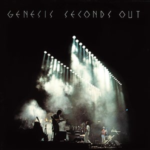

# Seconds Out

By **Genesis**

## Album Data

- **Catalog:** Beets
- **Format:** Digital, Album
- **Album:** Seconds Out
- **Artist:** Genesis
- **Albumartist:** Genesis
- **Genre:** Progressive Rock
- **MusicBrainz Album Artist ID:** [8e3fcd7d-bda1-4ca0-b987-b8528d2ee74e](https://musicbrainz.org/artist/8e3fcd7d-bda1-4ca0-b987-b8528d2ee74e)
- **MusicBrainz Album ID:** [b0ce139b-08b4-44e6-8e14-c7ac4f983260](https://musicbrainz.org/release/b0ce139b-08b4-44e6-8e14-c7ac4f983260)
- **MusicBrainz Release Group ID:** [e918abf6-2d91-303d-ac53-48fba52c9703](https://musicbrainz.org/release-group/e918abf6-2d91-303d-ac53-48fba52c9703)
- **Year:** 1977
- **Catalog #:** GE 2001
- **Label:** Charisma
- **Total Tracks:** 12

## Album Tracks

### Track 01 - Squonk

- **Artist:** Genesis
- **Format:** ALAC
- **Genre:** Progressive Rock
- **Length:** 6:37
- **MusicBrainz Track ID:** [500c70b6-c19f-4ebe-addd-b674ad1d3ad7](https://musicbrainz.org/recording/500c70b6-c19f-4ebe-addd-b674ad1d3ad7)
- **Title:** Squonk
- **Track:** 01
- **Year:** 1977

### Track 02 - The Carpet Crawl

- **Artist:** Genesis
- **Format:** ALAC
- **Genre:** Soft Rock
- **Length:** 5:20
- **MusicBrainz Track ID:** [5e17de25-4abf-4214-babf-5b8802fb1c4f](https://musicbrainz.org/recording/5e17de25-4abf-4214-babf-5b8802fb1c4f)
- **Title:** The Carpet Crawl
- **Track:** 02
- **Year:** 1977

### Track 03 - Robbery, Assault and Battery

- **Artist:** Genesis
- **Format:** ALAC
- **Genre:** Progressive Rock
- **Length:** 6:02
- **MusicBrainz Track ID:** [9a474209-d447-4136-aa1d-9ad1b3cec281](https://musicbrainz.org/recording/9a474209-d447-4136-aa1d-9ad1b3cec281)
- **Title:** Robbery, Assault and Battery
- **Track:** 03
- **Year:** 1977

### Track 04 - Afterglow

- **Artist:** Genesis
- **Format:** ALAC
- **Genre:** Progressive Rock
- **Length:** 4:25
- **MusicBrainz Track ID:** [8241be32-4f02-40ab-97c9-12a0e658d0f6](https://musicbrainz.org/recording/8241be32-4f02-40ab-97c9-12a0e658d0f6)
- **Title:** Afterglow
- **Track:** 04
- **Year:** 1977

### Track 05 - Firth of Fifth

- **Artist:** Genesis
- **Format:** ALAC
- **Genre:** Progressive Rock
- **Length:** 8:55
- **MusicBrainz Track ID:** [ced31b9e-0c70-43a8-959a-201340567e88](https://musicbrainz.org/recording/ced31b9e-0c70-43a8-959a-201340567e88)
- **Title:** Firth of Fifth
- **Track:** 05
- **Year:** 1977

### Track 06 - I Know What I Like (In Your Wardrobe)

- **Artist:** Genesis
- **Format:** ALAC
- **Genre:** Progressive Rock
- **Length:** 8:44
- **MusicBrainz Track ID:** [aae15ad6-d199-4b0a-a7bb-5049d982f526](https://musicbrainz.org/recording/aae15ad6-d199-4b0a-a7bb-5049d982f526)
- **Title:** I Know What I Like (In Your Wardrobe)
- **Track:** 06
- **Year:** 1977

### Track 07 - The Lamb Lies Down on Broadway

- **Artist:** Genesis
- **Format:** ALAC
- **Genre:** Progressive Rock
- **Length:** 4:58
- **MusicBrainz Track ID:** [dbac603b-786b-4b01-b7da-043321c0b11d](https://musicbrainz.org/recording/dbac603b-786b-4b01-b7da-043321c0b11d)
- **Title:** The Lamb Lies Down on Broadway
- **Track:** 07
- **Year:** 1977

### Track 08 - The Musical Box (closing section)

- **Artist:** Genesis
- **Format:** ALAC
- **Genre:** Progressive Rock
- **Length:** 3:18
- **MusicBrainz Track ID:** [6b817c9c-2025-45eb-8010-48c8c71129eb](https://musicbrainz.org/recording/6b817c9c-2025-45eb-8010-48c8c71129eb)
- **Title:** The Musical Box (closing section)
- **Track:** 08
- **Year:** 1977

### Track 09 - Supper’s Ready

- **Artist:** Genesis
- **Format:** ALAC
- **Genre:** Progressive Rock
- **Length:** 24:33
- **MusicBrainz Track ID:** [4db6bca8-393f-450b-8618-cf9902c1cc20](https://musicbrainz.org/recording/4db6bca8-393f-450b-8618-cf9902c1cc20)
- **Title:** Supper’s Ready
- **Track:** 09
- **Year:** 1977

### Track 10 - The Cinema Show

- **Artist:** Genesis
- **Format:** ALAC
- **Genre:** Progressive Rock
- **Length:** 10:58
- **MusicBrainz Track ID:** [2ec575ed-27e8-4766-9bda-c5b2467df47b](https://musicbrainz.org/recording/2ec575ed-27e8-4766-9bda-c5b2467df47b)
- **Title:** The Cinema Show
- **Track:** 10
- **Year:** 1977

### Track 11 - Dance on a Volcano

- **Artist:** Genesis
- **Format:** ALAC
- **Genre:** Progressive Rock
- **Length:** 8:25
- **MusicBrainz Track ID:** [b3594dcb-cdd9-4015-bea2-f08c46d18a64](https://musicbrainz.org/recording/b3594dcb-cdd9-4015-bea2-f08c46d18a64)
- **Title:** Dance on a Volcano
- **Track:** 11
- **Year:** 1977

### Track 12 - Los Endos

- **Artist:** Genesis
- **Format:** ALAC
- **Genre:** Progressive Rock
- **Length:** 3:13
- **MusicBrainz Track ID:** [9ada70d0-8bb8-45fa-b749-62997c35b1c3](https://musicbrainz.org/recording/9ada70d0-8bb8-45fa-b749-62997c35b1c3)
- **Title:** Los Endos
- **Track:** 12
- **Year:** 1977

## See also

- [Vinyl: A Trick Of The Tail](../../Vinyl/Genesis/A_Trick_Of_The_Tail.md)
- [Vinyl: ](../../Vinyl/Genesis/Genesis_index.md)
- [Vinyl: Genesis](../../Vinyl/Genesis/Genesis.md)
- [Vinyl: Selling England By The Pound](../../Vinyl/Genesis/Selling_England_By_The_Pound.md)
- [Vinyl: Trespass](../../Vinyl/Genesis/Trespass.md)
