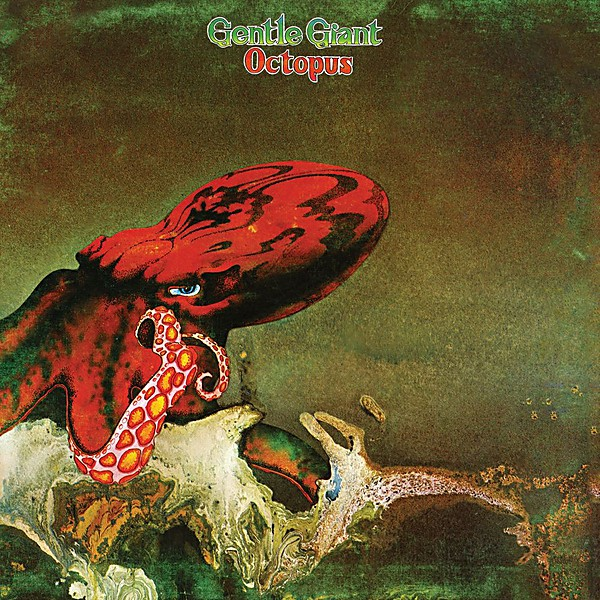

# Octopus

By **Gentle Giant**

## Album Data

- **Catalog:** Beets
- **Format:** Digital, Album
- **Album:** Octopus
- **Artist:** Gentle Giant
- **Albumartist:** Gentle Giant
- **Genre:** Progressive Rock
- **MusicBrainz Album Artist ID:** [f795c501-1c41-4be2-bc2a-875eba75aa31](https://musicbrainz.org/artist/f795c501-1c41-4be2-bc2a-875eba75aa31)
- **MusicBrainz Album ID:** [77636810-f06e-4c9d-898c-7e0c9db71e89](https://musicbrainz.org/release/77636810-f06e-4c9d-898c-7e0c9db71e89)
- **MusicBrainz Release Group ID:** [11d1c7a9-87d1-3f3f-90eb-8e0edb636085](https://musicbrainz.org/release-group/11d1c7a9-87d1-3f3f-90eb-8e0edb636085)
- **Year:** 2015
- **Catalog #:** RTE 00354
- **Label:** DRT Entertainment
- **Total Tracks:** 11

## Album Tracks

### Track 01 - Just the Same

- **Artist:** Gentle Giant
- **Format:** AAC
- **Genre:** Uk Garage
- **Length:** 5:57
- **MusicBrainz Track ID:** [0a9b14b7-2759-499a-afc2-0f6ccca25da8](https://musicbrainz.org/recording/0a9b14b7-2759-499a-afc2-0f6ccca25da8)
- **Title:** Just the Same
- **Track:** 01
- **Year:** 2005

### Track 02 - Proclamation

- **Artist:** Gentle Giant
- **Format:** AAC
- **Genre:** Progressive Rock
- **Length:** 5:18
- **MusicBrainz Track ID:** [d416ecd1-b283-4820-a81d-e87d50032654](https://musicbrainz.org/recording/d416ecd1-b283-4820-a81d-e87d50032654)
- **Title:** Proclamation
- **Track:** 02
- **Year:** 2005

### Track 03 - On Reflection

- **Artist:** Gentle Giant
- **Format:** AAC
- **Genre:** Progressive Rock
- **Length:** 6:21
- **MusicBrainz Track ID:** [df8e66b3-80f1-44da-9d6d-8cb6b02c76df](https://musicbrainz.org/recording/df8e66b3-80f1-44da-9d6d-8cb6b02c76df)
- **Title:** On Reflection
- **Track:** 03
- **Year:** 2005

### Track 04 - Excerpts From Octopus

- **Artist:** Gentle Giant
- **Format:** AAC
- **Genre:** Progressive Rock
- **Length:** 15:40
- **MusicBrainz Track ID:** [e6d51f49-e61b-4eb2-b30d-70390ee97e4e](https://musicbrainz.org/recording/e6d51f49-e61b-4eb2-b30d-70390ee97e4e)
- **Title:** Excerpts From Octopus
- **Track:** 04
- **Year:** 2005

### Track 05 - Funny Ways

- **Artist:** Gentle Giant
- **Format:** AAC
- **Genre:** Progressive Rock
- **Length:** 8:31
- **MusicBrainz Track ID:** [d4d7ced4-83f8-4a77-a53e-abe04b5b0cfa](https://musicbrainz.org/recording/d4d7ced4-83f8-4a77-a53e-abe04b5b0cfa)
- **Title:** Funny Ways
- **Track:** 05
- **Year:** 2005

### Track 06 - The Runaway

- **Artist:** Gentle Giant
- **Format:** AAC
- **Genre:** Progressive Rock
- **Length:** 3:56
- **MusicBrainz Track ID:** [cce3bfe4-cc33-4536-b26f-810d004282a2](https://musicbrainz.org/recording/cce3bfe4-cc33-4536-b26f-810d004282a2)
- **Title:** The Runaway
- **Track:** 06
- **Year:** 2005

### Track 07 - Experience

- **Artist:** Gentle Giant
- **Format:** AAC
- **Genre:** Progressive Rock
- **Length:** 5:36
- **MusicBrainz Track ID:** [1aee91a4-1b19-4cb5-8f65-9c5be7b4f7d4](https://musicbrainz.org/recording/1aee91a4-1b19-4cb5-8f65-9c5be7b4f7d4)
- **Title:** Experience
- **Track:** 07
- **Year:** 2005

### Track 08 - So Sincere

- **Artist:** Gentle Giant
- **Format:** AAC
- **Genre:** Progressive Rock
- **Length:** 10:20
- **MusicBrainz Track ID:** [fcaba7c8-14f9-4b61-b20d-1a2c56a60063](https://musicbrainz.org/recording/fcaba7c8-14f9-4b61-b20d-1a2c56a60063)
- **Title:** So Sincere
- **Track:** 08
- **Year:** 2005

### Track 09 - Free Hand

- **Artist:** Gentle Giant
- **Format:** AAC
- **Genre:** Progressive Rock
- **Length:** 7:39
- **MusicBrainz Track ID:** [f5444da0-61e0-4b7d-990c-2b14464f08f2](https://musicbrainz.org/recording/f5444da0-61e0-4b7d-990c-2b14464f08f2)
- **Title:** Free Hand
- **Track:** 09
- **Year:** 2005

### Track 10 - Sweet Georgia Brown (Breakdown in Brussels)

- **Artist:** Gentle Giant
- **Format:** AAC
- **Genre:** Progressive Rock
- **Length:** 1:19
- **MusicBrainz Track ID:** [28e62311-9a9f-431f-a8be-60649ad138ed](https://musicbrainz.org/recording/28e62311-9a9f-431f-a8be-60649ad138ed)
- **Title:** Sweet Georgia Brown (Breakdown in Brussels)
- **Track:** 10
- **Year:** 2005

### Track 11 - Peel the Paint / I Lost My Head (medley)

- **Artist:** Gentle Giant
- **Format:** AAC
- **Genre:** Progressive Rock
- **Length:** 7:15
- **MusicBrainz Track ID:** [ab9f56fc-3ab7-4f9b-8801-e719e617f300](https://musicbrainz.org/recording/ab9f56fc-3ab7-4f9b-8801-e719e617f300)
- **Title:** Peel the Paint / I Lost My Head (medley)
- **Track:** 11
- **Year:** 2005

## See also

- [Playing the Fool](Playing_the_Fool.md)
- [The Power and the Glory](The_Power_and_the_Glory.md)
- [Roon: Octopus (Steven Wilson Mix)](../../Roon/Gentle_Giant/Octopus_Steven_Wilson_Mix.md)
- [Roon: The Power and the Glory (Mixed by Steven Wilson)](../../Roon/Gentle_Giant/The_Power_and_the_Glory_Mixed_by_Steven_Wilson.md)
- [Roon: Three Piece Suite (Steven Wilson Mix)](../../Roon/Gentle_Giant/Three_Piece_Suite_Steven_Wilson_Mix.md)
