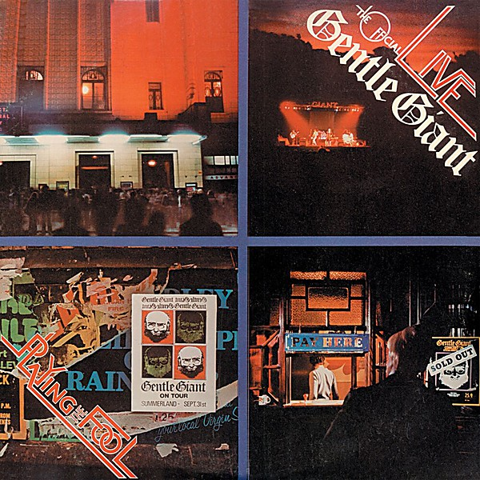

# Playing the Fool

By **Gentle Giant**

## Album Data

- **Catalog:** Beets
- **Format:** Digital, Album
- **Album:** Playing the Fool
- **Artist:** Gentle Giant
- **Albumartist:** Gentle Giant
- **Genre:** Progressive Rock
- **MusicBrainz Album Artist ID:** [f795c501-1c41-4be2-bc2a-875eba75aa31](https://musicbrainz.org/artist/f795c501-1c41-4be2-bc2a-875eba75aa31)
- **MusicBrainz Album ID:** [05cd2e91-1974-3a7c-8c4e-438d565c3224](https://musicbrainz.org/release/05cd2e91-1974-3a7c-8c4e-438d565c3224)
- **MusicBrainz Release Group ID:** [4bee42c1-c325-4516-a2ce-c3eb2506fbdc](https://musicbrainz.org/release-group/4bee42c1-c325-4516-a2ce-c3eb2506fbdc)
- **Year:** 2005
- **Catalog #:** ALUGG042
- **Label:** Alucard Publishing Limited
- **Total Tracks:** 10

## Album Tracks

### Track 01 - Proclamation

- **Artist:** Gentle Giant
- **Format:** ALAC
- **Genre:** Progressive Rock
- **Length:** 6:56
- **MusicBrainz Track ID:** [8ff7d217-f7f8-4b6d-9a01-3b80aa5b25d7](https://musicbrainz.org/recording/8ff7d217-f7f8-4b6d-9a01-3b80aa5b25d7)
- **Title:** Proclamation
- **Track:** 01
- **Year:** 2014

### Track 02 - So Sincere

- **Artist:** Gentle Giant
- **Format:** ALAC
- **Genre:** Progressive Rock
- **Length:** 3:52
- **MusicBrainz Track ID:** [a47993f4-3b9a-4c9c-8895-102847751646](https://musicbrainz.org/recording/a47993f4-3b9a-4c9c-8895-102847751646)
- **Title:** So Sincere
- **Track:** 02
- **Year:** 2014

### Track 03 - Aspirations

- **Artist:** Gentle Giant
- **Format:** ALAC
- **Genre:** Progressive Rock
- **Length:** 5:21
- **MusicBrainz Track ID:** [28232974-cd06-463a-a535-2eda3e574da5](https://musicbrainz.org/recording/28232974-cd06-463a-a535-2eda3e574da5)
- **Title:** Aspirations
- **Track:** 03
- **Year:** 2014

### Track 04 - Playing the Game

- **Artist:** Gentle Giant
- **Format:** ALAC
- **Genre:** Psychedelic Rock
- **Length:** 6:45
- **MusicBrainz Track ID:** [fa692199-ef88-45ca-b910-b644be8d7be2](https://musicbrainz.org/recording/fa692199-ef88-45ca-b910-b644be8d7be2)
- **Title:** Playing the Game
- **Track:** 04
- **Year:** 2014

### Track 05 - Cogs in Cogs

- **Artist:** Gentle Giant
- **Format:** ALAC
- **Genre:** Progressive Rock
- **Length:** 3:08
- **MusicBrainz Track ID:** [f096f60b-a662-4746-ab40-622585ac2bdb](https://musicbrainz.org/recording/f096f60b-a662-4746-ab40-622585ac2bdb)
- **Title:** Cogs in Cogs
- **Track:** 05
- **Year:** 2014

### Track 06 - No God’s a Man

- **Artist:** Gentle Giant
- **Format:** ALAC
- **Genre:** Progressive Rock
- **Length:** 4:26
- **MusicBrainz Track ID:** [fa0c10c5-552e-47b6-936a-bd2ba3bfff3d](https://musicbrainz.org/recording/fa0c10c5-552e-47b6-936a-bd2ba3bfff3d)
- **Title:** No God’s a Man
- **Track:** 06
- **Year:** 2014

### Track 07 - The Face

- **Artist:** Gentle Giant
- **Format:** ALAC
- **Genre:** Uk Garage
- **Length:** 4:13
- **MusicBrainz Track ID:** [571444e9-a6c0-4e3b-a177-094b2a14ddb5](https://musicbrainz.org/recording/571444e9-a6c0-4e3b-a177-094b2a14ddb5)
- **Title:** The Face
- **Track:** 07
- **Year:** 2014

### Track 08 - Valedictory

- **Artist:** Gentle Giant
- **Format:** ALAC
- **Genre:** Progressive Rock
- **Length:** 3:26
- **MusicBrainz Track ID:** [6ad44c73-bab4-4eb1-918b-db4da01e698e](https://musicbrainz.org/recording/6ad44c73-bab4-4eb1-918b-db4da01e698e)
- **Title:** Valedictory
- **Track:** 08
- **Year:** 2014

### Track 09 - The Power and the Glory

- **Artist:** Gentle Giant
- **Format:** ALAC
- **Genre:** Progressive Rock
- **Length:** 2:59
- **MusicBrainz Track ID:** [68888971-928d-45c5-b457-a0e56ee2268f](https://musicbrainz.org/recording/68888971-928d-45c5-b457-a0e56ee2268f)
- **Title:** The Power and the Glory
- **Track:** 09
- **Year:** 2014

### Track 10 - Aspirations (instrumental out-take)

- **Artist:** Gentle Giant
- **Format:** ALAC
- **Genre:** Progressive Rock
- **Length:** 5:17
- **MusicBrainz Track ID:** [36635915-3dc7-44ab-ab50-bbe8323c5ff9](https://musicbrainz.org/recording/36635915-3dc7-44ab-ab50-bbe8323c5ff9)
- **Title:** Aspirations (instrumental out-take)
- **Track:** 10
- **Year:** 2014

## See also

- [Octopus](Octopus.md)
- [The Power and the Glory](The_Power_and_the_Glory.md)
- [Roon: Octopus (Steven Wilson Mix)](../../Roon/Gentle_Giant/Octopus_Steven_Wilson_Mix.md)
- [Roon: The Power and the Glory (Mixed by Steven Wilson)](../../Roon/Gentle_Giant/The_Power_and_the_Glory_Mixed_by_Steven_Wilson.md)
- [Roon: Three Piece Suite (Steven Wilson Mix)](../../Roon/Gentle_Giant/Three_Piece_Suite_Steven_Wilson_Mix.md)
