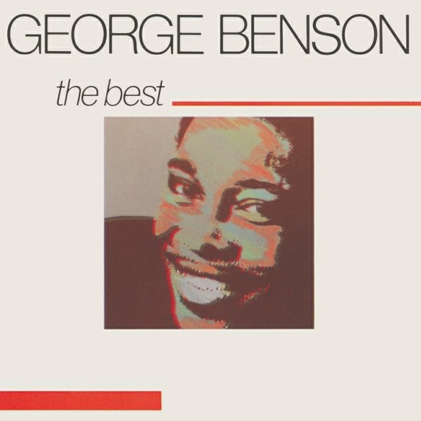

# The Best

By **George Benson**

## Album Data

- **Catalog:** Beets
- **Format:** Digital, Album
- **Album:** The Best
- **Artist:** George Benson
- **Albumartist:** George Benson
- **Genre:** Soul
- **MusicBrainz Album Artist ID:** 
- **MusicBrainz Album ID:** 
- **MusicBrainz Release Group ID:** 
- **Year:** 1976
- **Catalog #:** 
- **Label:** 
- **Total Tracks:** 00

## Album Tracks

### Track 17 - Golden Slumbers / You Never Give Me Your Money

- **Artist:** George Benson
- **Format:** AAC
- **Genre:** Jazz
- **Length:** 4:47
- **MusicBrainz Track ID:** 
- **Title:** Golden Slumbers / You Never Give Me Your Money
- **Track:** 17
- **Year:** 1969

## See also

- [The Other Side Of Abbey Road](The_Other_Side_Of_Abbey_Road.md)
- [Vinyl: ](../../Vinyl/George_Benson/George_Benson.md)
- [Vinyl: On Broadway](../../Vinyl/George_Benson/On_Broadway.md)
