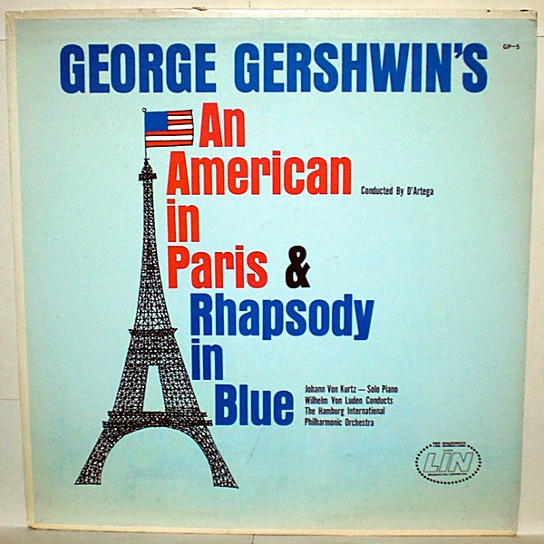

# An American In Paris Rhapsody In Blue

By **George Gershwin**

## Album Data

- **Catalog:** Beets
- **Format:** Digital, Album
- **Album:** An American In Paris Rhapsody In Blue
- **Artist:** George Gershwin
- **Albumartist:** George Gershwin
- **Genre:** Jazz
- **MusicBrainz Album Artist ID:** 
- **MusicBrainz Album ID:** 
- **MusicBrainz Release Group ID:** 
- **Year:** 2014
- **Catalog #:** 
- **Label:** 
- **Total Tracks:** 00

## Album Tracks

### Track 01 - An American In Paris

- **Artist:** George Gershwin
- **Format:** MP3
- **Genre:** Jazz
- **Length:** 18:27
- **MusicBrainz Track ID:** 
- **Title:** An American In Paris
- **Track:** 01
- **Year:** 2014

### Track 02 - Rhapsody In Blue

- **Artist:** George Gershwin
- **Format:** MP3
- **Genre:** Jazz
- **Length:** 16:29
- **MusicBrainz Track ID:** 
- **Title:** Rhapsody In Blue
- **Track:** 02
- **Year:** 2014

## See also

- [Roon: An American in Paris / Rhapsody in Blue](../../Roon/George_Gershwin/An_American_in_Paris_-_Rhapsody_in_Blue.md)
