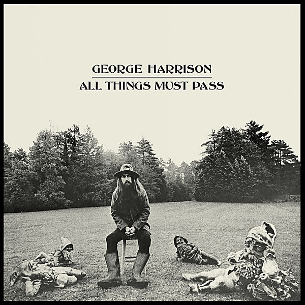

# All Things Must Pass

By **George Harrison**

## Album Data

- **Catalog:** Beets
- **Format:** Digital, Album
- **Album:** All Things Must Pass
- **Artist:** George Harrison
- **Albumartist:** George Harrison
- **Genre:** Folk Rock
- **MusicBrainz Album Artist ID:** 
- **MusicBrainz Album ID:** 
- **MusicBrainz Release Group ID:** 
- **Year:** 1970
- **Catalog #:** 
- **Label:** 
- **Total Tracks:** 00

## Album Tracks

### Track 01 - I'd Have You Anytime

- **Artist:** George Harrison
- **Format:** AAC
- **Genre:** Folk Rock
- **Length:** 3:00
- **MusicBrainz Track ID:** 
- **Title:** I'd Have You Anytime
- **Track:** 01
- **Year:** 2001

## See also

- [All Things Must Pass (cd 1)](All_Things_Must_Pass_cd_1.md)
- [All Things Must Pass (Disc 1)](All_Things_Must_Pass_Disc_1.md)
- [Cloud 9](Cloud_9.md)
- [George Harrison](George_Harrison.md)
- [The Best of Dark Horse (1976-1989)](The_Best_of_Dark_Horse_1976-1989.md)
- [Roon: All Things Must Pass (50th Anniversary / Super Deluxe)](../../Roon/George_Harrison/All_Things_Must_Pass_50th_Anniversary_-_Super_Deluxe.md)
- [Roon: Living In The Material World (Remastered 2014)](../../Roon/George_Harrison/Living_In_The_Material_World_Remastered_2014.md)
