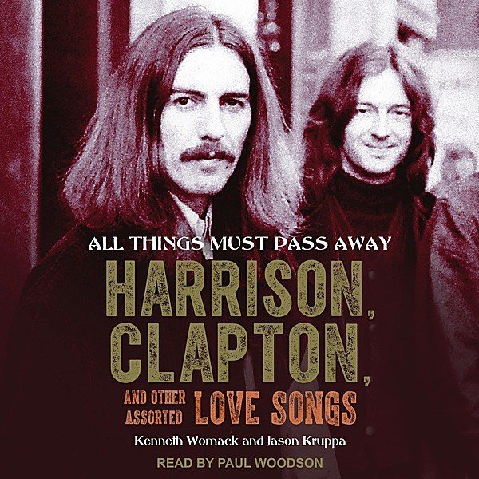

# All Things Must Pass (cd 1)

By **George Harrison**

## Album Data

- **Catalog:** Beets
- **Format:** Digital, Album
- **Album:** All Things Must Pass (cd 1)
- **Artist:** George Harrison
- **Albumartist:** George Harrison
- **Genre:** Rock
- **MusicBrainz Album Artist ID:** 
- **MusicBrainz Album ID:** 
- **MusicBrainz Release Group ID:** 
- **Year:** 2001
- **Catalog #:** 
- **Label:** 
- **Total Tracks:** 00

## Album Tracks

### Track 12 - Ballad Of Sir Frankie Crisp (L

- **Artist:** George Harrison
- **Format:** AAC
- **Genre:** Rock
- **Length:** 3:52
- **MusicBrainz Track ID:** 
- **Title:** Ballad Of Sir Frankie Crisp (L
- **Track:** 12
- **Year:** 2000

