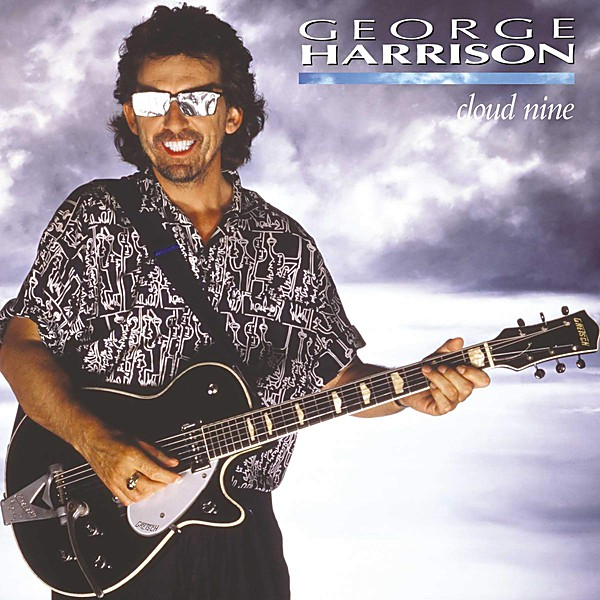

# Cloud 9

By **George Harrison**

## Album Data

- **Catalog:** Beets
- **Format:** Digital, Album
- **Album:** Cloud 9
- **Artist:** George Harrison
- **Albumartist:** George Harrison
- **Genre:** Soft Rock
- **MusicBrainz Album Artist ID:** 
- **MusicBrainz Album ID:** 
- **MusicBrainz Release Group ID:** 
- **Year:** 1987
- **Catalog #:** 
- **Label:** 
- **Total Tracks:** 00

## Album Tracks

### Track 32 - Blow Away

- **Artist:** George Harrison
- **Format:** AAC
- **Genre:** Soft Rock
- **Length:** 3:59
- **MusicBrainz Track ID:** 
- **Title:** Blow Away
- **Track:** 32
- **Year:** 1979

