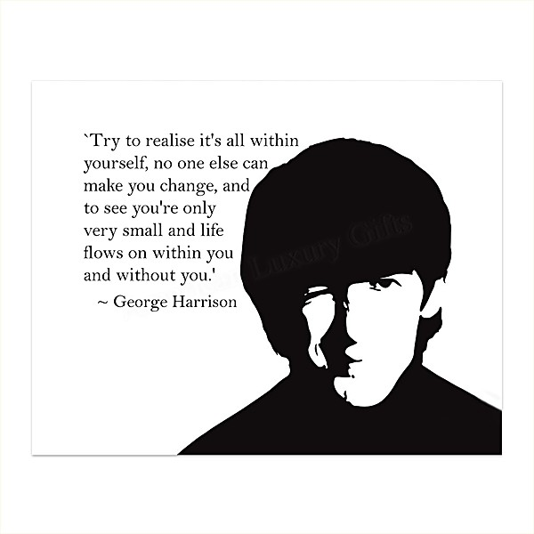

# The Best of Dark Horse (1976-1989)

By **George Harrison**

## Album Data

- **Catalog:** Beets
- **Format:** Digital, Album
- **Album:** The Best of Dark Horse (1976-1989)
- **Artist:** George Harrison
- **Albumartist:** George Harrison
- **Genre:** Pop Rock
- **MusicBrainz Album Artist ID:** 
- **MusicBrainz Album ID:** 
- **MusicBrainz Release Group ID:** 
- **Year:** 1989
- **Catalog #:** 
- **Label:** Dark Horse
- **Total Tracks:** 00

## Album Tracks

### Track 00 - All Those Years Ago

- **Artist:** George Harrison
- **Format:** MP3
- **Genre:** Soft Rock
- **Length:** 3:39
- **MusicBrainz Track ID:** 
- **Title:** All Those Years Ago
- **Track:** 00
- **Year:** 1989

