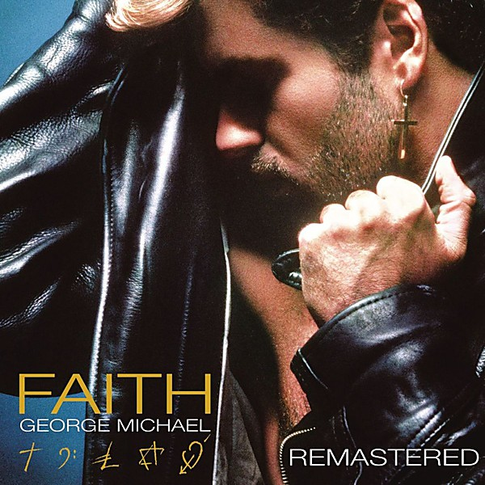

# Faith

By **George Michael**

## Album Data

- **Catalog:** Beets
- **Format:** Digital, Album
- **Album:** Faith
- **Artist:** George Michael
- **Albumartist:** George Michael
- **Genre:** Dance-Pop
- **MusicBrainz Album Artist ID:** [ccb8f30e-4d71-40c4-8b1d-846dafe73e2c](https://musicbrainz.org/artist/ccb8f30e-4d71-40c4-8b1d-846dafe73e2c)
- **MusicBrainz Album ID:** [8e10cfff-2220-32f8-bfe2-e21811dcfdeb](https://musicbrainz.org/release/8e10cfff-2220-32f8-bfe2-e21811dcfdeb)
- **MusicBrainz Release Group ID:** [4e61585f-f341-3174-85cf-afad8df46fbe](https://musicbrainz.org/release-group/4e61585f-f341-3174-85cf-afad8df46fbe)
- **Year:** 1987
- **Catalog #:** CK 46898
- **Label:** Columbia
- **Total Tracks:** 10

## Album Tracks

### Track 01 - Praying for Time

- **Artist:** George Michael
- **Format:** MP3
- **Genre:** Soul
- **Length:** 4:41
- **MusicBrainz Track ID:** [b317b495-8b2c-46aa-8e9b-feed0c9e0667](https://musicbrainz.org/recording/b317b495-8b2c-46aa-8e9b-feed0c9e0667)
- **Title:** Praying for Time
- **Track:** 01
- **Year:** 1990

### Track 02 - Freedom

- **Artist:** George Michael
- **Format:** MP3
- **Genre:** Pop
- **Length:** 6:30
- **MusicBrainz Track ID:** [e9ccfb0a-a516-4d25-99ff-699856090e56](https://musicbrainz.org/recording/e9ccfb0a-a516-4d25-99ff-699856090e56)
- **Title:** Freedom
- **Track:** 02
- **Year:** 1990

### Track 03 - They Won’t Go When I Go

- **Artist:** George Michael
- **Format:** MP3
- **Genre:** Pop
- **Length:** 5:05
- **MusicBrainz Track ID:** [88115ded-c270-4d6c-b900-a0f7dbd9c93f](https://musicbrainz.org/recording/88115ded-c270-4d6c-b900-a0f7dbd9c93f)
- **Title:** They Won’t Go When I Go
- **Track:** 03
- **Year:** 1990

### Track 04 - Something to Save

- **Artist:** George Michael
- **Format:** MP3
- **Genre:** Soul
- **Length:** 3:18
- **MusicBrainz Track ID:** [da5dda81-ad3a-45aa-b329-e87f02da7820](https://musicbrainz.org/recording/da5dda81-ad3a-45aa-b329-e87f02da7820)
- **Title:** Something to Save
- **Track:** 04
- **Year:** 1990

### Track 05 - Cowboys and Angels

- **Artist:** George Michael
- **Format:** MP3
- **Genre:** Soul
- **Length:** 7:15
- **MusicBrainz Track ID:** [25c5be40-4ce2-4ff7-8247-92f8dfec3456](https://musicbrainz.org/recording/25c5be40-4ce2-4ff7-8247-92f8dfec3456)
- **Title:** Cowboys and Angels
- **Track:** 05
- **Year:** 1990

### Track 06 - Waiting for That Day / You Can’t Always Get What You Want

- **Artist:** George Michael
- **Format:** MP3
- **Genre:** Pop
- **Length:** 4:49
- **MusicBrainz Track ID:** [19e80099-2d6a-44e3-bb6d-53b278aa86f4](https://musicbrainz.org/recording/19e80099-2d6a-44e3-bb6d-53b278aa86f4)
- **Title:** Waiting for That Day / You Can’t Always Get What You Want
- **Track:** 06
- **Year:** 1990

### Track 07 - Mothers Pride

- **Artist:** George Michael
- **Format:** MP3
- **Genre:** Pop
- **Length:** 3:58
- **MusicBrainz Track ID:** [e5ccfe0f-252e-4816-a102-561c59b635f8](https://musicbrainz.org/recording/e5ccfe0f-252e-4816-a102-561c59b635f8)
- **Title:** Mothers Pride
- **Track:** 07
- **Year:** 1990

### Track 08 - Heal the Pain

- **Artist:** George Michael
- **Format:** MP3
- **Genre:** Soul
- **Length:** 4:41
- **MusicBrainz Track ID:** [d55a96c0-c6bf-4fd1-90b0-bedccfa1e56e](https://musicbrainz.org/recording/d55a96c0-c6bf-4fd1-90b0-bedccfa1e56e)
- **Title:** Heal the Pain
- **Track:** 08
- **Year:** 1990

### Track 09 - Soul Free

- **Artist:** George Michael
- **Format:** MP3
- **Genre:** Soul
- **Length:** 5:28
- **MusicBrainz Track ID:** [c92473f9-37aa-487c-8ed6-7ea9b9366cba](https://musicbrainz.org/recording/c92473f9-37aa-487c-8ed6-7ea9b9366cba)
- **Title:** Soul Free
- **Track:** 09
- **Year:** 1990

### Track 10 - Waiting (reprise)

- **Artist:** George Michael
- **Format:** MP3
- **Genre:** Soul
- **Length:** 2:24
- **MusicBrainz Track ID:** [f9b965f7-eea8-4874-92e7-713e1a4cbbd4](https://musicbrainz.org/recording/f9b965f7-eea8-4874-92e7-713e1a4cbbd4)
- **Title:** Waiting (reprise)
- **Track:** 10
- **Year:** 1990

## See also

- [Listen Without Prejudice, Vol. 1](Listen_Without_Prejudice__Vol_1.md)
- [The Best of George Michael](The_Best_of_George_Michael.md)
- [Vinyl: Faith](../../Vinyl/George_Michael/Faith.md)
- [Vinyl: ](../../Vinyl/George_Michael/George_Michael.md)
