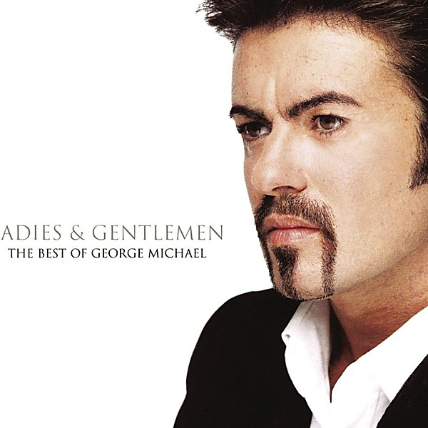

# The Best of George Michael

By **George Michael**

## Album Data

- **Catalog:** Beets
- **Format:** Digital, Album
- **Album:** The Best of George Michael
- **Artist:** George Michael
- **Albumartist:** George Michael
- **Genre:** Soul
- **MusicBrainz Album Artist ID:** 
- **MusicBrainz Album ID:** 
- **MusicBrainz Release Group ID:** 
- **Year:** 1998
- **Catalog #:** CK 40867
- **Label:** Columbia
- **Total Tracks:** 11

## Album Tracks

### Track 01 - Faith

- **Artist:** George Michael
- **Format:** ALAC
- **Genre:** Rock
- **Length:** 3:16
- **MusicBrainz Track ID:** [85bb9bbd-0e9a-4a20-a373-ab98f5a494ef](https://musicbrainz.org/recording/85bb9bbd-0e9a-4a20-a373-ab98f5a494ef)
- **Title:** Faith
- **Track:** 01
- **Year:** 1987

### Track 02 - Father Figure

- **Artist:** George Michael
- **Format:** ALAC
- **Genre:** Soul
- **Length:** 5:36
- **MusicBrainz Track ID:** [156aa7a4-35c7-41ed-8269-3675e2d00544](https://musicbrainz.org/recording/156aa7a4-35c7-41ed-8269-3675e2d00544)
- **Title:** Father Figure
- **Track:** 02
- **Year:** 1987

### Track 03 - I Want Your Sex, Parts 1 & 2

- **Artist:** George Michael
- **Format:** ALAC
- **Genre:** Pop Rock
- **Length:** 9:17
- **MusicBrainz Track ID:** [e3f89d9e-2273-40b2-ab21-df1945bac355](https://musicbrainz.org/recording/e3f89d9e-2273-40b2-ab21-df1945bac355)
- **Title:** I Want Your Sex, Parts 1 & 2
- **Track:** 03
- **Year:** 1987

### Track 04 - One More Try

- **Artist:** George Michael
- **Format:** ALAC
- **Genre:** Soul
- **Length:** 5:50
- **MusicBrainz Track ID:** [e0aff6c5-4898-4f14-8335-9485f01ff4c4](https://musicbrainz.org/recording/e0aff6c5-4898-4f14-8335-9485f01ff4c4)
- **Title:** One More Try
- **Track:** 04
- **Year:** 1987

### Track 05 - Hard Day

- **Artist:** George Michael
- **Format:** ALAC
- **Genre:** Soul
- **Length:** 4:48
- **MusicBrainz Track ID:** [9af1dc2d-4096-4c69-b489-92471e80952f](https://musicbrainz.org/recording/9af1dc2d-4096-4c69-b489-92471e80952f)
- **Title:** Hard Day
- **Track:** 05
- **Year:** 1987

### Track 06 - Hand to Mouth

- **Artist:** George Michael
- **Format:** ALAC
- **Genre:** Soul
- **Length:** 4:36
- **MusicBrainz Track ID:** [b23d9910-dae6-48f8-be4e-d3435296dd44](https://musicbrainz.org/recording/b23d9910-dae6-48f8-be4e-d3435296dd44)
- **Title:** Hand to Mouth
- **Track:** 06
- **Year:** 1987

### Track 07 - Look at Your Hands

- **Artist:** George Michael
- **Format:** ALAC
- **Genre:** Soul
- **Length:** 4:37
- **MusicBrainz Track ID:** [caec61a9-bb96-44f7-b86d-9cc4044c777d](https://musicbrainz.org/recording/caec61a9-bb96-44f7-b86d-9cc4044c777d)
- **Title:** Look at Your Hands
- **Track:** 07
- **Year:** 1987

### Track 08 - Monkey

- **Artist:** George Michael
- **Format:** ALAC
- **Genre:** Soul
- **Length:** 5:06
- **MusicBrainz Track ID:** [5b4dbd3a-cef3-4d55-aa49-83d2cb5df906](https://musicbrainz.org/recording/5b4dbd3a-cef3-4d55-aa49-83d2cb5df906)
- **Title:** Monkey
- **Track:** 08
- **Year:** 1987

### Track 09 - Kissing a Fool

- **Artist:** George Michael
- **Format:** ALAC
- **Genre:** Soul
- **Length:** 4:35
- **MusicBrainz Track ID:** [a7c90fec-20d3-411e-af44-143eae2784ad](https://musicbrainz.org/recording/a7c90fec-20d3-411e-af44-143eae2784ad)
- **Title:** Kissing a Fool
- **Track:** 09
- **Year:** 1987

### Track 10 - Hard Day (Shep Pettibone remix)

- **Artist:** George Michael
- **Format:** ALAC
- **Genre:** Soul
- **Length:** 6:29
- **MusicBrainz Track ID:** [1063be77-00e6-44bf-a96f-05ccd1a44b71](https://musicbrainz.org/recording/1063be77-00e6-44bf-a96f-05ccd1a44b71)
- **Title:** Hard Day (Shep Pettibone remix)
- **Track:** 10
- **Year:** 1987

### Track 11 - A Last Request (I Want Your Sex, Part 3)

- **Artist:** George Michael
- **Format:** ALAC
- **Genre:** Pop Rock
- **Length:** 3:47
- **MusicBrainz Track ID:** [c0ed4335-2de6-4082-af1c-4deece56b516](https://musicbrainz.org/recording/c0ed4335-2de6-4082-af1c-4deece56b516)
- **Title:** A Last Request (I Want Your Sex, Part 3)
- **Track:** 11
- **Year:** 1987

## See also

- [Faith](Faith.md)
- [Listen Without Prejudice, Vol. 1](Listen_Without_Prejudice__Vol_1.md)
- [Vinyl: Faith](../../Vinyl/George_Michael/Faith.md)
- [Vinyl: ](../../Vinyl/George_Michael/George_Michael.md)
