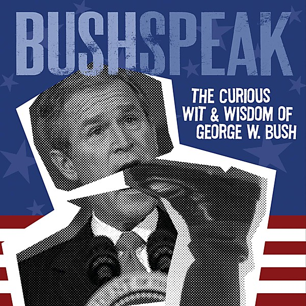

# Bushspeak

By **George W. Bush**

## Album Data

- **Catalog:** Beets
- **Format:** Digital, Album
- **Album:** Bushspeak
- **Artist:** George W. Bush
- **Albumartist:** George W. Bush
- **Genre:** Goregrind
- **MusicBrainz Album Artist ID:** [06564917-bdd2-4fb6-bcdc-be9e0c04f7ac](https://musicbrainz.org/artist/06564917-bdd2-4fb6-bcdc-be9e0c04f7ac)
- **MusicBrainz Album ID:** [c3091468-8e6a-4f8b-ad04-4abec0dafb11](https://musicbrainz.org/release/c3091468-8e6a-4f8b-ad04-4abec0dafb11)
- **MusicBrainz Release Group ID:** [1738ebbb-4106-35f8-8281-99da9c3d39e1](https://musicbrainz.org/release-group/1738ebbb-4106-35f8-8281-99da9c3d39e1)
- **Year:** 2004
- **Catalog #:** 
- **Label:** Shout Factory
- **Total Tracks:** 07

## Album Tracks

### Track 01 - Foreword

- **Artist:** George W. Bush
- **Format:** MP3
- **Genre:** Goregrind
- **Length:** 0:53
- **MusicBrainz Track ID:** [fb3261a8-675d-41ae-91e2-c9b8ae6bc533](https://musicbrainz.org/recording/fb3261a8-675d-41ae-91e2-c9b8ae6bc533)
- **Title:** Foreword
- **Track:** 01
- **Year:** 2004

### Track 02 - Bushspeak on Terrorism

- **Artist:** George W. Bush
- **Format:** MP3
- **Genre:** Goregrind
- **Length:** 1:50
- **MusicBrainz Track ID:** [4cb8b656-e0ba-4c0c-a499-68bd97b88c5c](https://musicbrainz.org/recording/4cb8b656-e0ba-4c0c-a499-68bd97b88c5c)
- **Title:** Bushspeak on Terrorism
- **Track:** 02
- **Year:** 2004

### Track 03 - Bushspeak on Education

- **Artist:** George W. Bush
- **Format:** MP3
- **Genre:** Goregrind
- **Length:** 1:45
- **MusicBrainz Track ID:** [1e8d6c2e-ee71-403d-80cb-c619c078c556](https://musicbrainz.org/recording/1e8d6c2e-ee71-403d-80cb-c619c078c556)
- **Title:** Bushspeak on Education
- **Track:** 03
- **Year:** 2004

### Track 04 - Bushspeak on the Environment

- **Artist:** George W. Bush
- **Format:** MP3
- **Genre:** Comedy
- **Length:** 1:47
- **MusicBrainz Track ID:** [4c806463-8595-4a69-91b4-214b054bd354](https://musicbrainz.org/recording/4c806463-8595-4a69-91b4-214b054bd354)
- **Title:** Bushspeak on the Environment
- **Track:** 04
- **Year:** 2004

### Track 05 - Bushspeak on the Economy

- **Artist:** George W. Bush
- **Format:** MP3
- **Genre:** Goregrind
- **Length:** 2:00
- **MusicBrainz Track ID:** [4101134c-697d-4f06-8f7e-c63e65d570a3](https://musicbrainz.org/recording/4101134c-697d-4f06-8f7e-c63e65d570a3)
- **Title:** Bushspeak on the Economy
- **Track:** 05
- **Year:** 2004

### Track 06 - Bushspeak on Governance & Compassion

- **Artist:** George W. Bush
- **Format:** MP3
- **Genre:** Goregrind
- **Length:** 1:43
- **MusicBrainz Track ID:** [ca4cbb9b-7990-4b02-93d4-de0a9066a8ca](https://musicbrainz.org/recording/ca4cbb9b-7990-4b02-93d4-de0a9066a8ca)
- **Title:** Bushspeak on Governance & Compassion
- **Track:** 06
- **Year:** 2004

### Track 07 - Afterword

- **Artist:** George W. Bush
- **Format:** MP3
- **Genre:** Goregrind
- **Length:** 8:13
- **MusicBrainz Track ID:** [a594f0ca-abac-436a-b17f-f36e5d2329c5](https://musicbrainz.org/recording/a594f0ca-abac-436a-b17f-f36e5d2329c5)
- **Title:** Afterword
- **Track:** 07
- **Year:** 2004

