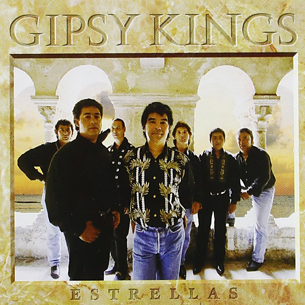

# Estrellas

By **Gipsy Kings**

## Album Data

- **Catalog:** Beets
- **Format:** Digital, Album
- **Album:** Estrellas
- **Artist:** Gipsy Kings
- **Albumartist:** Gipsy Kings
- **Genre:** Pop
- **MusicBrainz Album Artist ID:** [44a7f7d5-79df-4f44-8f5e-02dfc0626904](https://musicbrainz.org/artist/44a7f7d5-79df-4f44-8f5e-02dfc0626904)
- **MusicBrainz Album ID:** [6d4b3afb-8613-4c15-93be-8800b67a8d38](https://musicbrainz.org/release/6d4b3afb-8613-4c15-93be-8800b67a8d38)
- **MusicBrainz Release Group ID:** [20bb4ec1-d91e-3a2c-800b-e1bde390c887](https://musicbrainz.org/release-group/20bb4ec1-d91e-3a2c-800b-e1bde390c887)
- **Year:** 1995
- **Catalog #:** 481345 2
- **Label:** Columbia
- **Total Tracks:** 13

## Album Tracks

### Track 01 - La rumba de Nicolás

- **Artist:** Gipsy Kings
- **Format:** ALAC
- **Genre:** Pop
- **Length:** 3:58
- **MusicBrainz Track ID:** [1e48d4d6-8799-4d44-baa3-fc138c6e00a5](https://musicbrainz.org/recording/1e48d4d6-8799-4d44-baa3-fc138c6e00a5)
- **Title:** La rumba de Nicolás
- **Track:** 01
- **Year:** 1995

### Track 02 - A ti a ti

- **Artist:** Gipsy Kings
- **Format:** ALAC
- **Genre:** Pop
- **Length:** 3:46
- **MusicBrainz Track ID:** [f40b5661-08e4-4eb6-8c69-5709661e922c](https://musicbrainz.org/recording/f40b5661-08e4-4eb6-8c69-5709661e922c)
- **Title:** A ti a ti
- **Track:** 02
- **Year:** 1995

### Track 03 - Siempre acaba tu vida

- **Artist:** Gipsy Kings
- **Format:** ALAC
- **Genre:** Pop
- **Length:** 4:58
- **MusicBrainz Track ID:** [0efc15fa-41c8-439b-8789-4fb1554be4cb](https://musicbrainz.org/recording/0efc15fa-41c8-439b-8789-4fb1554be4cb)
- **Title:** Siempre acaba tu vida
- **Track:** 03
- **Year:** 1995

### Track 04 - Forever (instrumental)

- **Artist:** Gipsy Kings
- **Format:** ALAC
- **Genre:** Pop
- **Length:** 3:53
- **MusicBrainz Track ID:** [4cff61fc-d931-47af-87eb-0f01f8b937a6](https://musicbrainz.org/recording/4cff61fc-d931-47af-87eb-0f01f8b937a6)
- **Title:** Forever (instrumental)
- **Track:** 04
- **Year:** 1995

### Track 05 - Mujer

- **Artist:** Gipsy Kings
- **Format:** ALAC
- **Genre:** Pop
- **Length:** 4:17
- **MusicBrainz Track ID:** [d33799ac-e288-4107-b64a-75c1243638d7](https://musicbrainz.org/recording/d33799ac-e288-4107-b64a-75c1243638d7)
- **Title:** Mujer
- **Track:** 05
- **Year:** 1995

### Track 06 - Campesino

- **Artist:** Gipsy Kings
- **Format:** ALAC
- **Genre:** Pop
- **Length:** 3:32
- **MusicBrainz Track ID:** [de2a37d1-98ca-4906-9733-12a3bafe69e5](https://musicbrainz.org/recording/de2a37d1-98ca-4906-9733-12a3bafe69e5)
- **Title:** Campesino
- **Track:** 06
- **Year:** 1995

### Track 07 - Cataluña (instrumental)

- **Artist:** Gipsy Kings
- **Format:** ALAC
- **Genre:** Pop
- **Length:** 3:44
- **MusicBrainz Track ID:** [6a80b716-316b-464f-813a-e2039fad3b54](https://musicbrainz.org/recording/6a80b716-316b-464f-813a-e2039fad3b54)
- **Title:** Cataluña (instrumental)
- **Track:** 07
- **Year:** 1995

### Track 08 - Igual se entonces

- **Artist:** Gipsy Kings
- **Format:** ALAC
- **Genre:** Pop
- **Length:** 4:01
- **MusicBrainz Track ID:** [26ebe280-2c3d-4c94-abc2-ab4429056da5](https://musicbrainz.org/recording/26ebe280-2c3d-4c94-abc2-ab4429056da5)
- **Title:** Igual se entonces
- **Track:** 08
- **Year:** 1995

### Track 09 - Pajarito

- **Artist:** Gipsy Kings
- **Format:** ALAC
- **Genre:** Pop
- **Length:** 3:07
- **MusicBrainz Track ID:** [1a52e690-8512-4925-9f62-ddeffb8dc74e](https://musicbrainz.org/recording/1a52e690-8512-4925-9f62-ddeffb8dc74e)
- **Title:** Pajarito
- **Track:** 09
- **Year:** 1995

### Track 10 - Tierra gitana (instrumental)

- **Artist:** Gipsy Kings
- **Format:** ALAC
- **Genre:** Pop
- **Length:** 3:29
- **MusicBrainz Track ID:** [5363b3cf-6b59-4fc0-a0da-fadb441ca3d9](https://musicbrainz.org/recording/5363b3cf-6b59-4fc0-a0da-fadb441ca3d9)
- **Title:** Tierra gitana (instrumental)
- **Track:** 10
- **Year:** 1995

### Track 11 - A Tu a Vera

- **Artist:** Gipsy Kings
- **Format:** ALAC
- **Genre:** Pop
- **Length:** 3:12
- **MusicBrainz Track ID:** [950ec499-1e5a-470a-b53b-db64ef923e1e](https://musicbrainz.org/recording/950ec499-1e5a-470a-b53b-db64ef923e1e)
- **Title:** A Tu a Vera
- **Track:** 11
- **Year:** 1995

### Track 12 - Mi corazón

- **Artist:** Gipsy Kings
- **Format:** ALAC
- **Genre:** Pop
- **Length:** 4:30
- **MusicBrainz Track ID:** [ba9d945c-77f4-4cbf-bc4d-b7cbc13aef38](https://musicbrainz.org/recording/ba9d945c-77f4-4cbf-bc4d-b7cbc13aef38)
- **Title:** Mi corazón
- **Track:** 12
- **Year:** 1995

### Track 13 - Estrellas (instrumental)

- **Artist:** Gipsy Kings
- **Format:** ALAC
- **Genre:** Pop
- **Length:** 3:32
- **MusicBrainz Track ID:** [fb9511bb-f41d-469d-9544-6fe8b35a000c](https://musicbrainz.org/recording/fb9511bb-f41d-469d-9544-6fe8b35a000c)
- **Title:** Estrellas (instrumental)
- **Track:** 13
- **Year:** 1995

