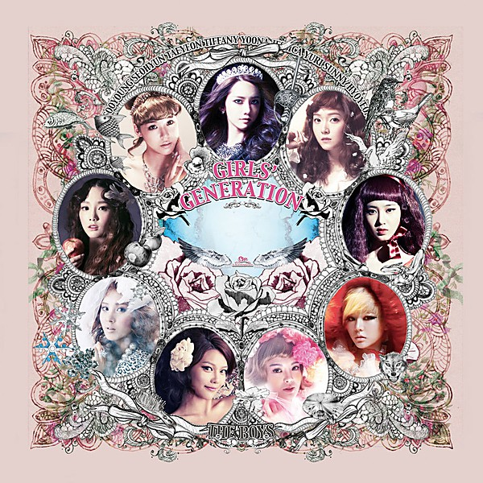

# The Boys

By **Girls’ Generation**

## Album Data

- **Catalog:** Beets
- **Format:** Digital, Album
- **Album:** The Boys
- **Artist:** Girls’ Generation
- **Albumartist:** Girls’ Generation
- **Genre:** K-Pop
- **MusicBrainz Album Artist ID:** [b7442f18-d9be-4185-8b51-482510046156](https://musicbrainz.org/artist/b7442f18-d9be-4185-8b51-482510046156)
- **MusicBrainz Album ID:** [f978502e-6940-4f54-8e6b-c4bb7d6eeca1](https://musicbrainz.org/release/f978502e-6940-4f54-8e6b-c4bb7d6eeca1)
- **MusicBrainz Release Group ID:** [bb623651-209f-406e-b13e-4b910ec632aa](https://musicbrainz.org/release-group/bb623651-209f-406e-b13e-4b910ec632aa)
- **Year:** 2012
- **Catalog #:** B0016474-02
- **Label:** Interscope Records
- **Total Tracks:** 17

## Album Tracks

### Track 01 - The Boys (English version)

- **Artist:** Girls’ Generation
- **Format:** AAC
- **Genre:** K-Pop
- **Length:** 3:46
- **MusicBrainz Track ID:** [52989cad-2fef-4fe6-9bcd-77b78c394835](https://musicbrainz.org/recording/52989cad-2fef-4fe6-9bcd-77b78c394835)
- **Title:** The Boys (English version)
- **Track:** 01
- **Year:** 2012

### Track 02 - 텔레파시 (Telepathy)

- **Artist:** Girls’ Generation
- **Format:** AAC
- **Genre:** K-Pop
- **Length:** 3:45
- **MusicBrainz Track ID:** [55c173f5-cac6-48d3-8c4a-e0704f5eca6a](https://musicbrainz.org/recording/55c173f5-cac6-48d3-8c4a-e0704f5eca6a)
- **Title:** 텔레파시 (Telepathy)
- **Track:** 02
- **Year:** 2012

### Track 03 - Say Yes

- **Artist:** Girls’ Generation
- **Format:** AAC
- **Genre:** K-Pop
- **Length:** 3:46
- **MusicBrainz Track ID:** [6129ffc5-c380-49c3-9fc5-6fdb1556ec93](https://musicbrainz.org/recording/6129ffc5-c380-49c3-9fc5-6fdb1556ec93)
- **Title:** Say Yes
- **Track:** 03
- **Year:** 2012

### Track 04 - Trick

- **Artist:** Girls’ Generation
- **Format:** AAC
- **Genre:** K-Pop
- **Length:** 3:15
- **MusicBrainz Track ID:** [e22c83e1-fb0b-4baa-8eb1-40a93251d2a3](https://musicbrainz.org/recording/e22c83e1-fb0b-4baa-8eb1-40a93251d2a3)
- **Title:** Trick
- **Track:** 04
- **Year:** 2012

### Track 05 - 봄날 (How Great Is Your Love)

- **Artist:** Girls’ Generation
- **Format:** AAC
- **Genre:** K-Pop
- **Length:** 3:54
- **MusicBrainz Track ID:** [0b690c6a-4b4d-4e62-b5c1-f7f37086f42b](https://musicbrainz.org/recording/0b690c6a-4b4d-4e62-b5c1-f7f37086f42b)
- **Title:** 봄날 (How Great Is Your Love)
- **Track:** 05
- **Year:** 2012

### Track 06 - My J

- **Artist:** Girls’ Generation
- **Format:** AAC
- **Genre:** K-Pop
- **Length:** 3:53
- **MusicBrainz Track ID:** [045d2112-c7d9-46c1-8a7f-b3dc75bf22b1](https://musicbrainz.org/recording/045d2112-c7d9-46c1-8a7f-b3dc75bf22b1)
- **Title:** My J
- **Track:** 06
- **Year:** 2012

### Track 07 - Oscar

- **Artist:** Girls’ Generation
- **Format:** AAC
- **Genre:** K-Pop
- **Length:** 3:23
- **MusicBrainz Track ID:** [290c7ba2-375d-4dc0-8f53-d2303538bf09](https://musicbrainz.org/recording/290c7ba2-375d-4dc0-8f53-d2303538bf09)
- **Title:** Oscar
- **Track:** 07
- **Year:** 2012

### Track 08 - Top Secret

- **Artist:** Girls’ Generation
- **Format:** AAC
- **Genre:** K-Pop
- **Length:** 2:59
- **MusicBrainz Track ID:** [f55be956-c56d-4736-bc60-c85e70a55870](https://musicbrainz.org/recording/f55be956-c56d-4736-bc60-c85e70a55870)
- **Title:** Top Secret
- **Track:** 08
- **Year:** 2012

### Track 09 - Lazy Girl (Dolce far niente)

- **Artist:** Girls’ Generation
- **Format:** AAC
- **Genre:** K-Pop
- **Length:** 3:05
- **MusicBrainz Track ID:** [b08d77b2-4774-4bfa-ade6-eea0c7f02233](https://musicbrainz.org/recording/b08d77b2-4774-4bfa-ade6-eea0c7f02233)
- **Title:** Lazy Girl (Dolce far niente)
- **Track:** 09
- **Year:** 2012

### Track 10 - 제자리걸음 (Sunflower)

- **Artist:** Girls’ Generation
- **Format:** AAC
- **Genre:** K-Pop
- **Length:** 3:50
- **MusicBrainz Track ID:** [7d927c83-84fb-4109-b901-3daf882784c0](https://musicbrainz.org/recording/7d927c83-84fb-4109-b901-3daf882784c0)
- **Title:** 제자리걸음 (Sunflower)
- **Track:** 10
- **Year:** 2012

### Track 11 - 비타민 (Vitamin)

- **Artist:** Girls’ Generation
- **Format:** AAC
- **Genre:** K-Pop
- **Length:** 3:09
- **MusicBrainz Track ID:** [629a25f0-8a98-452c-840e-e87e20bf90b8](https://musicbrainz.org/recording/629a25f0-8a98-452c-840e-e87e20bf90b8)
- **Title:** 비타민 (Vitamin)
- **Track:** 11
- **Year:** 2012

### Track 12 - Mr. Taxi (Korean version)

- **Artist:** Girls’ Generation
- **Format:** AAC
- **Genre:** K-Pop
- **Length:** 3:32
- **MusicBrainz Track ID:** [454f39d6-a5b3-4946-afca-0867a2ab0bcc](https://musicbrainz.org/recording/454f39d6-a5b3-4946-afca-0867a2ab0bcc)
- **Title:** Mr. Taxi (Korean version)
- **Track:** 12
- **Year:** 2012

### Track 13 - The Boys (Korean version)

- **Artist:** Girls’ Generation
- **Format:** AAC
- **Genre:** K-Pop
- **Length:** 3:46
- **MusicBrainz Track ID:** [f7598b36-7fd9-47b2-9663-6246318ca741](https://musicbrainz.org/recording/f7598b36-7fd9-47b2-9663-6246318ca741)
- **Title:** The Boys (Korean version)
- **Track:** 13
- **Year:** 2012

### Track 16 - The Boys "Bring the Boys Out" (David Anthony remix)

- **Artist:** Girls’ Generation
- **Format:** AAC
- **Genre:** K-Pop
- **Length:** 4:26
- **MusicBrainz Track ID:** [e9e6d7da-1ec3-4bed-9269-92d0e4278b22](https://musicbrainz.org/recording/e9e6d7da-1ec3-4bed-9269-92d0e4278b22)
- **Title:** The Boys "Bring the Boys Out" (David Anthony remix)
- **Track:** 16
- **Year:** 2012

### Track 17 - The Boys "Bring the Boys" (Teddy Riley remix)

- **Artist:** Girls’ Generation
- **Format:** AAC
- **Genre:** K-Pop
- **Length:** 4:03
- **MusicBrainz Track ID:** [7427483e-fd66-4275-b748-0ad28934d785](https://musicbrainz.org/recording/7427483e-fd66-4275-b748-0ad28934d785)
- **Title:** The Boys "Bring the Boys" (Teddy Riley remix)
- **Track:** 17
- **Year:** 2012

### Track 14 - The Boys (Clinton Sparks & Disco Fries remix)

- **Artist:** Girls’ Generation feat. Snoop Dogg
- **Format:** AAC
- **Genre:** K-Pop
- **Length:** 4:16
- **MusicBrainz Track ID:** [fa2881b0-905e-46cc-ac8c-6442daec89bb](https://musicbrainz.org/recording/fa2881b0-905e-46cc-ac8c-6442daec89bb)
- **Title:** The Boys (Clinton Sparks & Disco Fries remix)
- **Track:** 14
- **Year:** 2012

### Track 15 - The Boys "Bring Dem Boys" (Teddy Riley remix)

- **Artist:** Girls’ Generation feat. Suzi
- **Format:** AAC
- **Genre:** K-Pop
- **Length:** 3:38
- **MusicBrainz Track ID:** [1f4074f8-2613-4a4f-a40f-5c08f3d2f20e](https://musicbrainz.org/recording/1f4074f8-2613-4a4f-a40f-5c08f3d2f20e)
- **Title:** The Boys "Bring Dem Boys" (Teddy Riley remix)
- **Track:** 15
- **Year:** 2012

