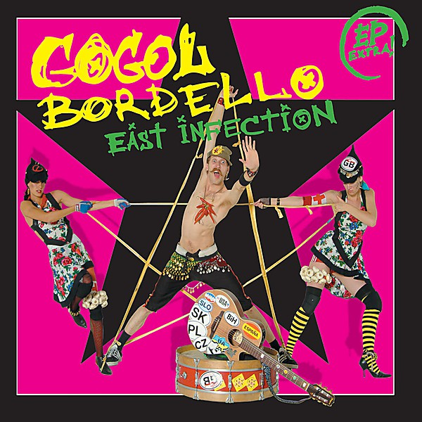

# East Infection

By **Gogol Bordello**

## Album Data

- **Catalog:** Beets
- **Format:** Digital, Album
- **Album:** East Infection
- **Artist:** Gogol Bordello
- **Albumartist:** Gogol Bordello
- **Genre:** Gypsy Punk
- **MusicBrainz Album Artist ID:** 
- **MusicBrainz Album ID:** 
- **MusicBrainz Release Group ID:** 
- **Year:** 2005
- **Catalog #:** 
- **Label:** SideOneDummy Records
- **Total Tracks:** 15

## Album Tracks

### Track 01 - Sally

- **Artist:** Gogol Bordello
- **Format:** ALAC
- **Genre:** Gypsy Punk
- **Length:** 3:02
- **MusicBrainz Track ID:** [https](https://musicbrainz.org/recording/https)
- **Title:** Sally
- **Track:** 01
- **Year:** 2005

### Track 02 - I Would Never Wanna Be Young Again

- **Artist:** Gogol Bordello
- **Format:** ALAC
- **Genre:** Gypsy Punk
- **Length:** 3:46
- **MusicBrainz Track ID:** [https](https://musicbrainz.org/recording/https)
- **Title:** I Would Never Wanna Be Young Again
- **Track:** 02
- **Year:** 2005

### Track 03 - Not A Crime

- **Artist:** Gogol Bordello
- **Format:** ALAC
- **Genre:** Gypsy Punk
- **Length:** 4:31
- **MusicBrainz Track ID:** [https](https://musicbrainz.org/recording/https)
- **Title:** Not A Crime
- **Track:** 03
- **Year:** 2005

### Track 04 - Immigrant Punk

- **Artist:** Gogol Bordello
- **Format:** ALAC
- **Genre:** Gypsy Punk
- **Length:** 3:45
- **MusicBrainz Track ID:** [https](https://musicbrainz.org/recording/https)
- **Title:** Immigrant Punk
- **Track:** 04
- **Year:** 2005

### Track 05 - 60 Revolutions

- **Artist:** Gogol Bordello
- **Format:** ALAC
- **Genre:** Gypsy Punk
- **Length:** 2:58
- **MusicBrainz Track ID:** [https](https://musicbrainz.org/recording/https)
- **Title:** 60 Revolutions
- **Track:** 05
- **Year:** 2005

### Track 06 - Avenue B

- **Artist:** Gogol Bordello
- **Format:** ALAC
- **Genre:** Gypsy Punk
- **Length:** 3:07
- **MusicBrainz Track ID:** [https](https://musicbrainz.org/recording/https)
- **Title:** Avenue B
- **Track:** 06
- **Year:** 2005

### Track 07 - Dogs Were Barking

- **Artist:** Gogol Bordello
- **Format:** ALAC
- **Genre:** Gypsy Punk
- **Length:** 4:53
- **MusicBrainz Track ID:** [https](https://musicbrainz.org/recording/https)
- **Title:** Dogs Were Barking
- **Track:** 07
- **Year:** 2005

### Track 08 - Oh No

- **Artist:** Gogol Bordello
- **Format:** ALAC
- **Genre:** Gypsy Punk
- **Length:** 2:59
- **MusicBrainz Track ID:** [https](https://musicbrainz.org/recording/https)
- **Title:** Oh No
- **Track:** 08
- **Year:** 2005

### Track 09 - Start Wearing Purple

- **Artist:** Gogol Bordello
- **Format:** ALAC
- **Genre:** Gypsy Punk
- **Length:** 3:42
- **MusicBrainz Track ID:** [https](https://musicbrainz.org/recording/https)
- **Title:** Start Wearing Purple
- **Track:** 09
- **Year:** 2005

### Track 10 - Think Locally, Fuck Globally

- **Artist:** Gogol Bordello
- **Format:** ALAC
- **Genre:** Gypsy Punk
- **Length:** 4:23
- **MusicBrainz Track ID:** [https](https://musicbrainz.org/recording/https)
- **Title:** Think Locally, Fuck Globally
- **Track:** 10
- **Year:** 2005

### Track 11 - Underdog World Strike

- **Artist:** Gogol Bordello
- **Format:** ALAC
- **Genre:** Gypsy Punk
- **Length:** 5:24
- **MusicBrainz Track ID:** [https](https://musicbrainz.org/recording/https)
- **Title:** Underdog World Strike
- **Track:** 11
- **Year:** 2005

### Track 12 - Illumination

- **Artist:** Gogol Bordello
- **Format:** ALAC
- **Genre:** Gypsy Punk
- **Length:** 3:52
- **MusicBrainz Track ID:** [https](https://musicbrainz.org/recording/https)
- **Title:** Illumination
- **Track:** 12
- **Year:** 2005

### Track 13 - Santa Marinella

- **Artist:** Gogol Bordello
- **Format:** ALAC
- **Genre:** Gypsy Punk
- **Length:** 5:28
- **MusicBrainz Track ID:** [https](https://musicbrainz.org/recording/https)
- **Title:** Santa Marinella
- **Track:** 13
- **Year:** 2005

### Track 14 - Undestructable

- **Artist:** Gogol Bordello
- **Format:** ALAC
- **Genre:** Gypsy Punk
- **Length:** 4:53
- **MusicBrainz Track ID:** [https](https://musicbrainz.org/recording/https)
- **Title:** Undestructable
- **Track:** 14
- **Year:** 2005

### Track 15 - Mishto

- **Artist:** Gogol Bordello
- **Format:** ALAC
- **Genre:** Gypsy Punk
- **Length:** 6:51
- **MusicBrainz Track ID:** [https](https://musicbrainz.org/recording/https)
- **Title:** Mishto
- **Track:** 15
- **Year:** 2005

## See also

- [Gypsy Punks](Gypsy_Punks_2.md)
- [Gypsy Punks](Gypsy_Punks.md)
- [Super Taranta!](Super_Taranta!.md)
- [Roon: East Infection](../../Roon/Gogol_Bordello/East_Infection.md)
- [Roon: Gypsy Punks](../../Roon/Gogol_Bordello/Gypsy_Punks-_Underdog_World_Strike.md)
- [Roon: Super Taranta!](../../Roon/Gogol_Bordello/Super_Taranta!.md)
