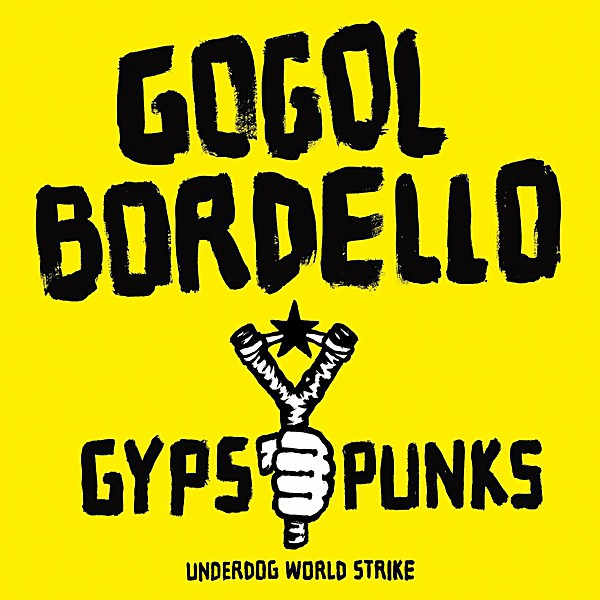

# Gypsy Punks

By **Gogol Bordello**

## Album Data

- **Catalog:** Beets
- **Format:** Digital, Album
- **Album:** Gypsy Punks
- **Artist:** Gogol Bordello
- **Albumartist:** Gogol Bordello
- **Genre:** Gypsy Punk
- **MusicBrainz Album Artist ID:** [https](https://musicbrainz.org/artist/https)
- **MusicBrainz Album ID:** [https](https://musicbrainz.org/release/https)
- **MusicBrainz Release Group ID:** 
- **Year:** 2005
- **Catalog #:** 
- **Label:** 
- **Total Tracks:** 15

## Album Tracks

### Track 03 - Not a Crime

- **Artist:** Gogol Bordello
- **Format:** AAC
- **Genre:** Gypsy Punk
- **Length:** 4:31
- **MusicBrainz Track ID:** [c5ddf36d-9f38-49a3-9727-87ff05362bd9](https://musicbrainz.org/recording/c5ddf36d-9f38-49a3-9727-87ff05362bd9)
- **Title:** Not a Crime
- **Track:** 03
- **Year:** 2007

### Track 15 - Mishto!

- **Artist:** Gogol Bordello
- **Format:** AAC
- **Genre:** Gypsy Punk
- **Length:** 6:51
- **MusicBrainz Track ID:** [74958d8e-59b7-4b45-9ad6-55bf03ed023e](https://musicbrainz.org/recording/74958d8e-59b7-4b45-9ad6-55bf03ed023e)
- **Title:** Mishto!
- **Track:** 15
- **Year:** 2007

## See also

- [East Infection](East_Infection.md)
- [Gypsy Punks](Gypsy_Punks_2.md)
- [Super Taranta!](Super_Taranta!.md)
- [Roon: East Infection](../../Roon/Gogol_Bordello/East_Infection.md)
- [Roon: Gypsy Punks](../../Roon/Gogol_Bordello/Gypsy_Punks-_Underdog_World_Strike.md)
- [Roon: Super Taranta!](../../Roon/Gogol_Bordello/Super_Taranta!.md)
