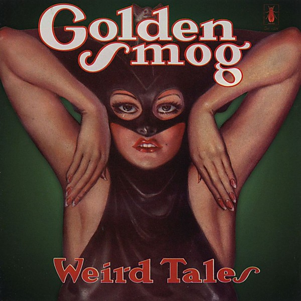

# Weird Tales

By **Golden Smog**

## Album Data

- **Catalog:** Beets
- **Format:** Digital, Album
- **Album:** Weird Tales
- **Artist:** Golden Smog
- **Albumartist:** Golden Smog
- **Genre:** Americana
- **MusicBrainz Album Artist ID:** [974b1bfe-dc7a-419a-94f4-f387a193e273](https://musicbrainz.org/artist/974b1bfe-dc7a-419a-94f4-f387a193e273)
- **MusicBrainz Album ID:** [a748a984-1790-48bf-9f92-15d5f8152fe2](https://musicbrainz.org/release/a748a984-1790-48bf-9f92-15d5f8152fe2)
- **MusicBrainz Release Group ID:** [b917b86e-825d-3ff1-8b7a-3a98a36ff372](https://musicbrainz.org/release-group/b917b86e-825d-3ff1-8b7a-3a98a36ff372)
- **Year:** 1998
- **Catalog #:** RCD 10446
- **Label:** Rykodisc
- **Total Tracks:** 15

## Album Tracks

### Track 01 - To Call My Own

- **Artist:** Golden Smog
- **Format:** ALAC
- **Genre:** Americana
- **Length:** 3:31
- **MusicBrainz Track ID:** [e1815c43-fbbc-4144-9269-6c97530b8766](https://musicbrainz.org/recording/e1815c43-fbbc-4144-9269-6c97530b8766)
- **Title:** To Call My Own
- **Track:** 01
- **Year:** 1998

### Track 02 - Looking Forward to Seeing You

- **Artist:** Golden Smog
- **Format:** ALAC
- **Genre:** Rock And Roll
- **Length:** 2:47
- **MusicBrainz Track ID:** [7a481f92-3f62-48dd-8f6a-6f3be75262a3](https://musicbrainz.org/recording/7a481f92-3f62-48dd-8f6a-6f3be75262a3)
- **Title:** Looking Forward to Seeing You
- **Track:** 02
- **Year:** 1998

### Track 03 - Until You Came Along

- **Artist:** Golden Smog
- **Format:** ALAC
- **Genre:** Americana
- **Length:** 4:59
- **MusicBrainz Track ID:** [7356d3cd-1093-41b0-9a4b-9bded5cbad25](https://musicbrainz.org/recording/7356d3cd-1093-41b0-9a4b-9bded5cbad25)
- **Title:** Until You Came Along
- **Track:** 03
- **Year:** 1998

### Track 04 - Lost Love

- **Artist:** Golden Smog
- **Format:** ALAC
- **Genre:** Rock And Roll
- **Length:** 3:00
- **MusicBrainz Track ID:** [45bf852c-815d-4dab-80c3-00fa2befee40](https://musicbrainz.org/recording/45bf852c-815d-4dab-80c3-00fa2befee40)
- **Title:** Lost Love
- **Track:** 04
- **Year:** 1998

### Track 05 - If I Only Had a Car

- **Artist:** Golden Smog
- **Format:** ALAC
- **Genre:** Americana
- **Length:** 4:03
- **MusicBrainz Track ID:** [9bf78f69-61a6-404e-908f-7e69711ae83a](https://musicbrainz.org/recording/9bf78f69-61a6-404e-908f-7e69711ae83a)
- **Title:** If I Only Had a Car
- **Track:** 05
- **Year:** 1998

### Track 06 - Jane

- **Artist:** Golden Smog
- **Format:** ALAC
- **Genre:** Rock
- **Length:** 4:29
- **MusicBrainz Track ID:** [f10fae58-6905-4e44-bffe-85028af9d2d4](https://musicbrainz.org/recording/f10fae58-6905-4e44-bffe-85028af9d2d4)
- **Title:** Jane
- **Track:** 06
- **Year:** 1998

### Track 07 - Keys

- **Artist:** Golden Smog
- **Format:** ALAC
- **Genre:** Americana
- **Length:** 3:28
- **MusicBrainz Track ID:** [5b39db87-6e8c-4d8a-9022-c82ec7465965](https://musicbrainz.org/recording/5b39db87-6e8c-4d8a-9022-c82ec7465965)
- **Title:** Keys
- **Track:** 07
- **Year:** 1998

### Track 08 - I Can't Keep From Talking

- **Artist:** Golden Smog
- **Format:** ALAC
- **Genre:** Americana
- **Length:** 3:49
- **MusicBrainz Track ID:** [15eb0f25-0ca3-4724-aa00-be50b59ebcda](https://musicbrainz.org/recording/15eb0f25-0ca3-4724-aa00-be50b59ebcda)
- **Title:** I Can't Keep From Talking
- **Track:** 08
- **Year:** 1998

### Track 09 - Reflections on Me

- **Artist:** Golden Smog
- **Format:** ALAC
- **Genre:** Rock
- **Length:** 2:52
- **MusicBrainz Track ID:** [15cb50d5-23c9-4c08-8bab-d49a2a894bd4](https://musicbrainz.org/recording/15cb50d5-23c9-4c08-8bab-d49a2a894bd4)
- **Title:** Reflections on Me
- **Track:** 09
- **Year:** 1998

### Track 10 - Making Waves

- **Artist:** Golden Smog
- **Format:** ALAC
- **Genre:** Close Harmony
- **Length:** 4:01
- **MusicBrainz Track ID:** [86fa68a2-4ac0-4d66-8628-64e66ceed0c2](https://musicbrainz.org/recording/86fa68a2-4ac0-4d66-8628-64e66ceed0c2)
- **Title:** Making Waves
- **Track:** 10
- **Year:** 1998

### Track 11 - White Shell Road

- **Artist:** Golden Smog
- **Format:** ALAC
- **Genre:** Rock
- **Length:** 4:14
- **MusicBrainz Track ID:** [acf3db6f-56e2-4012-b285-da97cf1abbc5](https://musicbrainz.org/recording/acf3db6f-56e2-4012-b285-da97cf1abbc5)
- **Title:** White Shell Road
- **Track:** 11
- **Year:** 1998

### Track 12 - Please Tell My Brother

- **Artist:** Golden Smog
- **Format:** ALAC
- **Genre:** Indie Rock
- **Length:** 2:10
- **MusicBrainz Track ID:** [7ae5555e-92db-4c5f-8347-4a5f774744b1](https://musicbrainz.org/recording/7ae5555e-92db-4c5f-8347-4a5f774744b1)
- **Title:** Please Tell My Brother
- **Track:** 12
- **Year:** 1998

### Track 13 - Fear of Falling

- **Artist:** Golden Smog
- **Format:** ALAC
- **Genre:** Americana
- **Length:** 3:31
- **MusicBrainz Track ID:** [d1997a62-4275-49e4-90b5-e896f1557b8e](https://musicbrainz.org/recording/d1997a62-4275-49e4-90b5-e896f1557b8e)
- **Title:** Fear of Falling
- **Track:** 13
- **Year:** 1998

### Track 14 - All the Same to Me

- **Artist:** Golden Smog
- **Format:** ALAC
- **Genre:** Americana
- **Length:** 3:05
- **MusicBrainz Track ID:** [1ad35c78-05b4-4eb1-8499-3f0cd176930b](https://musicbrainz.org/recording/1ad35c78-05b4-4eb1-8499-3f0cd176930b)
- **Title:** All the Same to Me
- **Track:** 14
- **Year:** 1998

### Track 15 - Jennifer Save Me

- **Artist:** Golden Smog
- **Format:** ALAC
- **Genre:** Americana
- **Length:** 4:48
- **MusicBrainz Track ID:** [52cd1335-321c-45ba-a583-1e0464a0891b](https://musicbrainz.org/recording/52cd1335-321c-45ba-a583-1e0464a0891b)
- **Title:** Jennifer Save Me
- **Track:** 15
- **Year:** 1998

## See also

- [Down by the Old Mainstream](Down_by_the_Old_Mainstream.md)
- [Roon: Down By The Old Mainstream](../../Roon/Golden_Smog/Down_By_The_Old_Mainstream.md)
- [Roon: On Golden Smog (EP)](../../Roon/Golden_Smog/On_Golden_Smog_EP.md)
- [Roon: Weird Tales](../../Roon/Golden_Smog/Weird_Tales.md)
