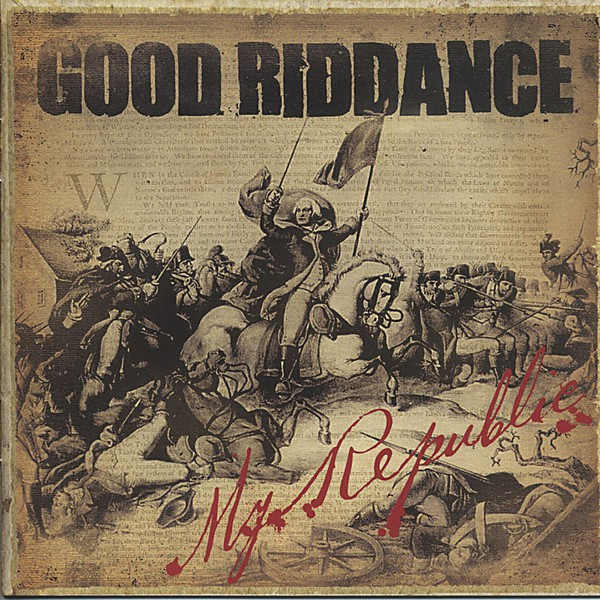

# My Republic

By **Good Riddance**

## Album Data

- **Catalog:** Beets
- **Format:** Digital, Album
- **Album:** My Republic
- **Artist:** Good Riddance
- **Albumartist:** Good Riddance
- **Genre:** punk rock
- **MusicBrainz Album Artist ID:** [https](https://musicbrainz.org/artist/https)
- **MusicBrainz Album ID:** [https](https://musicbrainz.org/release/https)
- **MusicBrainz Release Group ID:** 
- **Year:** 2006
- **Catalog #:** 
- **Label:** Fat Wreck Chords
- **Total Tracks:** 14

## Album Tracks

### Track 01 - Out Of Mind

- **Artist:** Good Riddance
- **Format:** ALAC
- **Genre:** punk rock
- **Length:** 2:24
- **MusicBrainz Track ID:** [https](https://musicbrainz.org/recording/https)
- **Title:** Out Of Mind
- **Track:** 01
- **Year:** 2006

### Track 02 - Texas

- **Artist:** Good Riddance
- **Format:** ALAC
- **Genre:** punk rock
- **Length:** 2:05
- **MusicBrainz Track ID:** [https](https://musicbrainz.org/recording/https)
- **Title:** Texas
- **Track:** 02
- **Year:** 2006

### Track 03 - Shame

- **Artist:** Good Riddance
- **Format:** ALAC
- **Genre:** punk rock
- **Length:** 1:50
- **MusicBrainz Track ID:** [https](https://musicbrainz.org/recording/https)
- **Title:** Shame
- **Track:** 03
- **Year:** 2006

### Track 04 - Tell Me Why

- **Artist:** Good Riddance
- **Format:** ALAC
- **Genre:** punk rock
- **Length:** 2:32
- **MusicBrainz Track ID:** [https](https://musicbrainz.org/recording/https)
- **Title:** Tell Me Why
- **Track:** 04
- **Year:** 2006

### Track 05 - Torches and Tragedies

- **Artist:** Good Riddance
- **Format:** ALAC
- **Genre:** punk rock
- **Length:** 1:29
- **MusicBrainz Track ID:** [https](https://musicbrainz.org/recording/https)
- **Title:** Torches and Tragedies
- **Track:** 05
- **Year:** 2006

### Track 06 - Darkest Days

- **Artist:** Good Riddance
- **Format:** ALAC
- **Genre:** punk rock
- **Length:** 2:42
- **MusicBrainz Track ID:** [https](https://musicbrainz.org/recording/https)
- **Title:** Darkest Days
- **Track:** 06
- **Year:** 2006

### Track 07 - Up to You

- **Artist:** Good Riddance
- **Format:** ALAC
- **Genre:** punk rock
- **Length:** 1:28
- **MusicBrainz Track ID:** [https](https://musicbrainz.org/recording/https)
- **Title:** Up to You
- **Track:** 07
- **Year:** 2006

### Track 08 - Regret

- **Artist:** Good Riddance
- **Format:** ALAC
- **Genre:** punk rock
- **Length:** 2:19
- **MusicBrainz Track ID:** [https](https://musicbrainz.org/recording/https)
- **Title:** Regret
- **Track:** 08
- **Year:** 2006

### Track 09 - Boise

- **Artist:** Good Riddance
- **Format:** ALAC
- **Genre:** punk rock
- **Length:** 3:07
- **MusicBrainz Track ID:** [https](https://musicbrainz.org/recording/https)
- **Title:** Boise
- **Track:** 09
- **Year:** 2006

### Track 10 - Rise and Fall

- **Artist:** Good Riddance
- **Format:** ALAC
- **Genre:** punk rock
- **Length:** 1:41
- **MusicBrainz Track ID:** [https](https://musicbrainz.org/recording/https)
- **Title:** Rise and Fall
- **Track:** 10
- **Year:** 2006

### Track 11 - Broken

- **Artist:** Good Riddance
- **Format:** ALAC
- **Genre:** punk rock
- **Length:** 2:32
- **MusicBrainz Track ID:** [https](https://musicbrainz.org/recording/https)
- **Title:** Broken
- **Track:** 11
- **Year:** 2006

### Track 12 - Save the Children

- **Artist:** Good Riddance
- **Format:** ALAC
- **Genre:** punk rock
- **Length:** 2:08
- **MusicBrainz Track ID:** [https](https://musicbrainz.org/recording/https)
- **Title:** Save the Children
- **Track:** 12
- **Year:** 2006

### Track 13 - This Beast is Dangerous

- **Artist:** Good Riddance
- **Format:** ALAC
- **Genre:** punk rock
- **Length:** 1:48
- **MusicBrainz Track ID:** [https](https://musicbrainz.org/recording/https)
- **Title:** This Beast is Dangerous
- **Track:** 13
- **Year:** 2006

### Track 14 - Uniform

- **Artist:** Good Riddance
- **Format:** ALAC
- **Genre:** punk rock
- **Length:** 2:54
- **MusicBrainz Track ID:** [https](https://musicbrainz.org/recording/https)
- **Title:** Uniform
- **Track:** 14
- **Year:** 2006

## See also

- [Roon: A Comprehensive Guide to Moderne Rebellion](../../Roon/Good_Riddance/A_Comprehensive_Guide_to_Moderne_Rebellion.md)
- [Roon: For God and Country](../../Roon/Good_Riddance/For_God_and_Country.md)
- [Roon: The Phenomenon of Craving](../../Roon/Good_Riddance/The_Phenomenon_of_Craving.md)
- [Roon: Thoughts and Prayers](../../Roon/Good_Riddance/Thoughts_and_Prayers.md)
